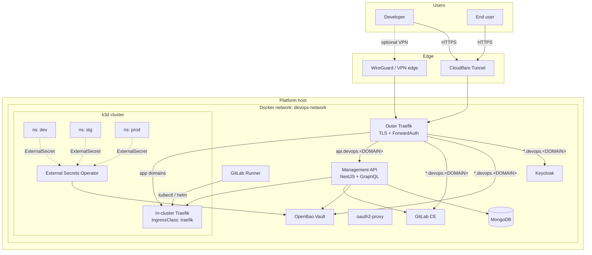
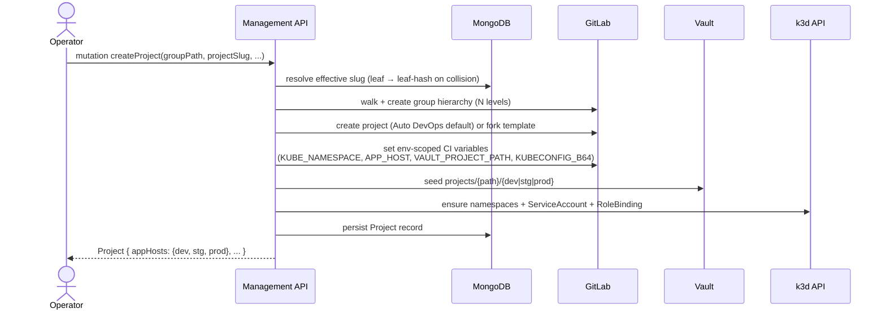
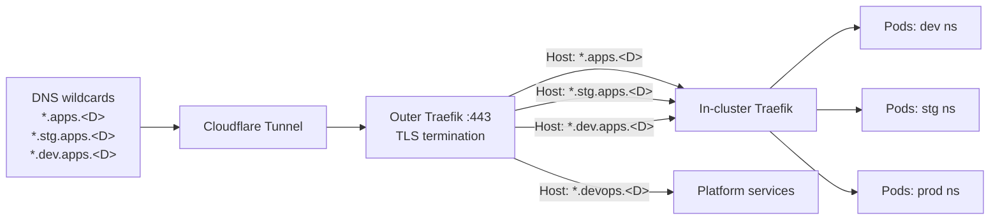
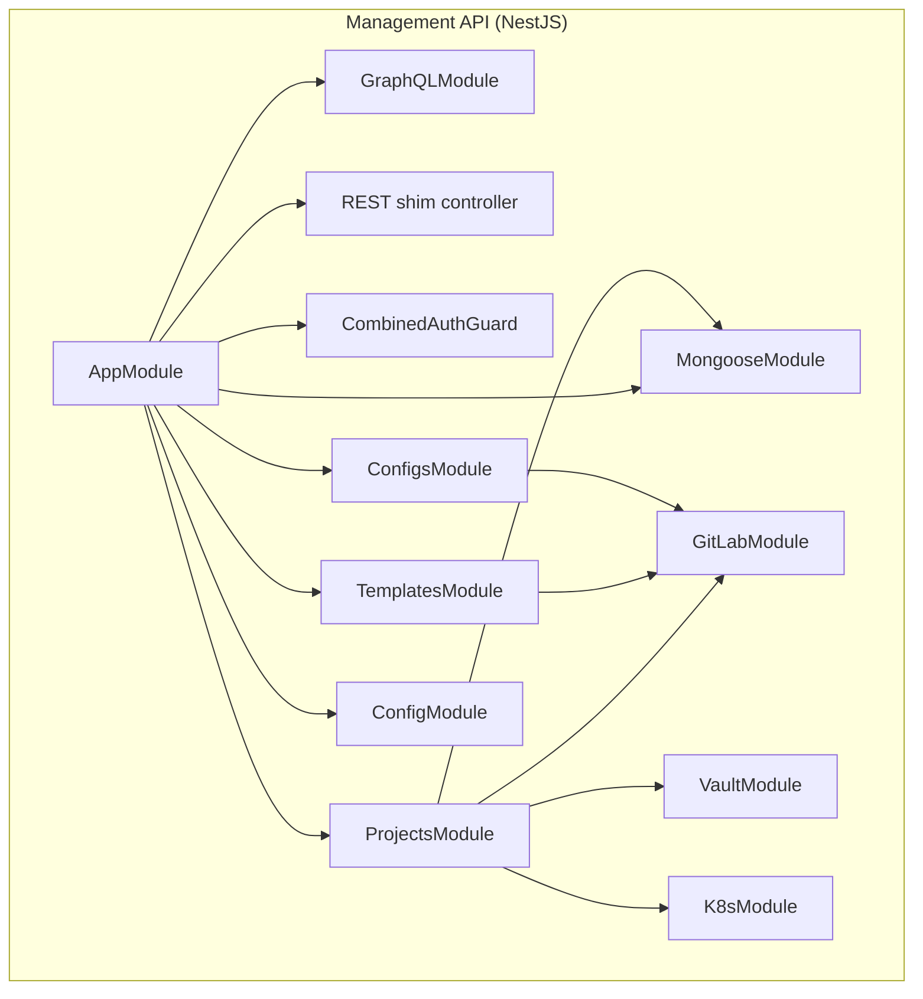

# DSOaaS — Migration Plan v2: Auto DevOps on Kubernetes

> **Document type**: Implementation plan
> **Scope**: Migrate DSOaaS from Docker-only app deployment to Kubernetes-based deployment with GitLab Auto DevOps as the default pipeline. Restructure the Management API around MongoDB + GraphQL and arbitrary group nesting. Retire Kong from the per-app data path. Backend-first; frontend deferred to a separate project.
> **Status**: Approved (design complete); ready for execution.
> **Target version**: `v2.0` (replaces v1's single-env Docker deploy model)
> **Owner**: Kara

---

## Table of contents

1. [Goal & design principles](#1-goal--design-principles)
2. [Target architecture](#2-target-architecture)
3. [Migration phases (Gantt)](#3-migration-phases-gantt)
4. [Phase-by-phase plan](#4-phase-by-phase-plan)
5. [Risks & rollback](#5-risks--rollback)
6. [Appendix](#6-appendix)

---

## 1. Goal & design principles

### 1.1 Goal

Make deploying a new application as close to **"push code → live URL"** as possible, with three environments (`dev` / `stg` / `prod`) per project. Keep the platform self-hosted on a single machine today and portable to a real cluster tomorrow.

### 1.2 Principles

1. **Source of truth = the goal, not existing code.** Current `api/`, `configs/`, `templates/`, `__DOCS__/` are informational only. Anything blocking the goal is rewritten or retired.
2. **Default to Auto DevOps.** Template-based projects remain as an opt-out for libraries / monorepos / special cases.
3. **Kubernetes-native, single-host today.** Apps run in k3d (k3s-in-Docker) on the same machine as the platform stack. Same host, different runtime.
4. **Portability over coupling.** Moving to a real cluster later changes `kubeconfig`, nothing else.
5. **Backward compatibility.** Existing v1 apps and Kong routes keep working until each project is explicitly migrated. No flag day.
6. **Replicability.** A single `make bootstrap` (or equivalent) takes a clean machine to a working platform — exact same behaviour, anywhere.
7. **Per-app Dockerfile is mandatory.** Auto DevOps switches to Kaniko automatically when a Dockerfile is detected.

### 1.3 What changes vs what stays

| Layer | v1 (current) | v2 (target) |
|---|---|---|
| App substrate | Docker containers on host | k3d cluster on host (Kubernetes API) |
| Pipeline | Custom shared CI templates | Auto DevOps + custom Helm chart wrapper |
| Per-app routing | Kong service + route | Kubernetes `Ingress` (in-cluster Traefik) |
| App-edge TLS | Outer Traefik | Outer Traefik → passthrough → in-cluster Traefik |
| Per-app DNS | Cloudflare API per app | Wildcard DNS (already in place) |
| Secrets → app | Vault read at runtime / compose env | Vault → ESO → K8s `Secret` (encrypted at rest) → pod |
| Environments | Single (`local`) | `dev` / `stg` / `prod` namespaces |
| Hierarchy | `clients/{clientName}` (2 levels) | `groupPath: string[]` (N levels) |
| Slug policy | Fixed `{client}-{project}` | Leaf-first, SHA1[0:4] suffix on collision, explicit override |
| API persistence | None (queries GitLab) | MongoDB |
| API interface | REST + Swagger | GraphQL + tiny REST shim |
| API modules | Kong, Cloudflare, GitLab, Vault | K8s, GitLab, Vault, Mongo (Kong + CF retired) |
| Frontend | None | Separate project, Phase 7 (deferred) |

---

## 2. Target architecture

### 2.1 High-level topology



### 2.2 Provisioning flow



### 2.3 Deploy flow (Auto DevOps)

```mermaid
sequenceDiagram
    actor D as Developer
    participant GL as GitLab
    participant GR as Runner
    participant K as k3d
    participant ESO as ESO
    participant V as Vault
    participant IT as In-cluster Traefik
    participant T as Outer Traefik

    D->>GL: git push
    GL->>GR: trigger Auto DevOps pipeline
    GR->>GR: Kaniko build (Dockerfile)
    GR->>GL: push image → GitLab Registry
    GR->>K: helm upgrade --install -n {env}
    K->>ESO: ExternalSecret created
    ESO->>V: read secret/data/projects/{path}/{env}
    ESO->>K: materialize K8s Secret (encrypted at rest)
    K->>K: Deployment rolls out; mounts Secret
    K->>IT: Ingress {host: app.{env-suffix}apps.&lt;DOMAIN&gt;}
    Note over T,IT: user hits the URL
    T->>IT: passthrough by Host header
    IT->>K: route to Service / Pod
```

### 2.4 Network / ingress topology



### 2.5 Module map after rewrite



---

## 3. Migration phases (Gantt)

```mermaid
gantt
    title v2 Migration — logical phases (relative)
    dateFormat X
    axisFormat %s

    section P0 Pre-flight
    Backups & branch    :done, p0, 0, 1
    section P1 Substrate
    k3d cluster         :p1a, after p0, 2
    Outer→inner ingress :p1b, after p1a, 1
    Runner authZ        :p1c, after p1b, 1
    section P2 Secrets
    ESO install         :p2a, after p1c, 1
    Vault K8s auth      :p2b, after p2a, 1
    section P3 Pipeline
    Chart wrapper       :p3a, after p2b, 2
    AutoDevOps template :p3b, after p3a, 1
    Update templates    :p3c, after p3b, 1
    section P4 API
    Mongo + deps        :p4a, after p2b, 1
    GraphQL + schemas   :p4b, after p4a, 2
    K8sService          :p4c, after p4b, 1
    Retire Kong/CF      :p4d, after p4c, 1
    Compat reconcile    :p4e, after p4d, 1
    section P5 Cutover
    Migrate v1 projects :p5a, after p3c, 2
    Remove Kong stack   :p5b, after p5a, 1
    section P6 Replicability
    Bootstrap script    :p6a, after p5b, 1
    Docs refresh        :p6b, after p6a, 1
    section P7 Frontend
    Deferred (separate) :crit, p7, after p6b, 4
```



---

## 4. Phase-by-phase plan

Each phase: **goal**, **prerequisites**, **tasks** (Cursor-style checkboxes), **validation step**, **backward-compat note**.

### Phase 0 — Pre-flight

**Goal**: Capture current state for safe rollback. Establish working branch.

**Prerequisites**: None.

**Tasks**:

- [ ] Tag current `main` as `v1-frozen` (rollback reference)
- [ ] Create branch `feat/v2-autodevops` from `main`
- [ ] Snapshot persistent volumes (each as `.tar.gz` to off-host storage)
  - [ ] `.vols/gitlab` (repos + DB)
  - [ ] `.vols/keycloak-db` (realm + users)
  - [ ] `.vols/vault` (only if not dev-mode)
  - [ ] `.vols/kong-db` (will be retired; archive for safety)
- [ ] Export current project inventory via existing API
  - [ ] `curl https://api.devops.<DOMAIN>/projects -H "X-API-Key: ..."` → `inventory-v1.json`
- [ ] Build a `hostname → groupPath` mapping for v1 projects (used by Phase 4 reconciliation)

**Validation**: Backups restorable to scratch dir; inventory file checked into a private location.

**Backward-compat**: No platform changes.

---

### Phase 1 — Kubernetes substrate

**Goal**: Working k3d cluster on the same host, joined to `devops-network`, with the GitLab Runner authorised to deploy into it.

**Prerequisites**: Phase 0 complete; `k3d` CLI installed on host.

#### 1.1 — Cluster bootstrap

- [ ] Add `k3d` to prerequisites in `__DOCS__/01_infra/01_prereqs.md`
- [ ] Author `bootstrap/k3d-cluster.sh`:
  ```bash
  k3d cluster create dsoaas \
    --network "${DOCKER_NETWORK}" \
    --api-port 0.0.0.0:16443 \
    --port "8081:80@loadbalancer" \
    --port "8444:443@loadbalancer" \
    --k3s-arg "--disable=servicelb@server:*" \
    --k3s-arg "--disable=traefik@server:*" \
    --k3s-arg "--secrets-encryption=true@server:*"
  ```
- [ ] Install in-cluster Traefik via Helm
  - [ ] `bootstrap/charts/traefik-values.yaml`
- [ ] Create namespaces: `dev`, `stg`, `prod`, `eso-system`
- [ ] Verify `EncryptionConfiguration` is active (`kubectl get secret -n kube-system | grep enc`)

#### 1.2 — Outer Traefik → in-cluster Traefik passthrough

- [ ] Create `traefik/dynamic/k3d-passthrough.yml` with HostRegexp routers for the three app zones
- [ ] Extend Traefik `traefik.yml` ACME with two additional wildcard SANs (`*.stg.apps.<D>`, `*.dev.apps.<D>`)
- [ ] Force `cloudflare` DNS-01 challenge for the new SANs
- [ ] Verify outer Traefik resolves `k3d-dsoaas-serverlb` via Docker DNS

#### 1.3 — Runner authorisation

- [ ] For each env namespace: create `ServiceAccount` `gitlab-deployer`
- [ ] Create `Role` + `RoleBinding` allowing `deployments`, `services`, `ingresses`, `configmaps`, `secrets`, `externalsecrets.external-secrets.io`
- [ ] Generate one kubeconfig per env (base64-encoded for CI var)
- [ ] Store kubeconfigs as **env-scoped masked CI variables** under the GitLab "configs" group (`KUBECONFIG_B64`, scope: `dev`/`stg`/`prod`)

**Validation**:
- Outer Traefik passes `https://test.dev.apps.<DOMAIN>` to a hand-deployed pod
- Runner can `kubectl --kubeconfig=$KUBECONFIG_FILE get pods -n dev`

**Backward-compat**: k3d is additive. Existing v1 `deploy-compose` apps untouched.

---

### Phase 2 — External Secrets Operator + Vault wiring

**Goal**: Any namespace can declare an `ExternalSecret` referencing a Vault path and receive an encrypted K8s `Secret`.

**Prerequisites**: Phase 1 complete.

#### 2.1 — Install ESO

- [ ] `helm repo add external-secrets https://charts.external-secrets.io`
- [ ] `helm install external-secrets external-secrets/external-secrets -n eso-system --create-namespace`
- [ ] Verify operator pod healthy and CRDs installed

#### 2.2 — Vault Kubernetes auth

- [ ] In Vault: `vault auth enable kubernetes`
- [ ] Fetch k3d CA + API URL; configure:
  ```
  vault write auth/kubernetes/config \
    kubernetes_host="https://k3d-dsoaas-server-0:6443" \
    kubernetes_ca_cert=@k3d-ca.crt \
    issuer="https://kubernetes.default.svc.cluster.local"
  ```
- [ ] Create Vault policy `app-secrets-read` granting `read` on `secret/data/projects/*` (and `secret/metadata/projects/*` for list)
- [ ] Create Vault role `eso-reader` binding to SA `eso-system/external-secrets` with TTL 1h

#### 2.3 — `ClusterSecretStore`

- [ ] Create `vault-backend` `ClusterSecretStore` resource pointing at Vault using K8s auth
- [ ] Smoke test:
  - [ ] Write `secret/data/projects/_smoketest/dev` → `{foo: bar}`
  - [ ] Create `ExternalSecret` in `dev` ns referencing it
  - [ ] Confirm K8s `Secret` materialises and a sample pod reads `foo=bar`

**Validation**: Smoke-test pod prints `bar`.

**Backward-compat**: Additive. Vault is unchanged for other consumers.

---

### Phase 3 — Helm chart wrapper + Auto DevOps templates

**Goal**: A versioned Helm chart that wraps Auto DevOps' default chart and adds `ExternalSecret`. A pipeline template that includes Auto DevOps and overrides deploy to use the chart.

**Prerequisites**: Phase 2 complete.

#### 3.1 — `configs/auto-devops-chart` (new GitLab project)

- [ ] Initialise chart skeleton:
  ```
  auto-devops-chart/
    Chart.yaml         # name: dsoaas-app, version: 0.1.0
    values.yaml        # sensible defaults
    templates/
      deployment.yaml
      service.yaml
      ingress.yaml
      externalsecret.yaml
      hpa.yaml         # optional
      _helpers.tpl
    .gitlab-ci.yml     # publish chart to package registry on tag
    README.md
  ```
- [ ] `templates/ingress.yaml`:
  - One Ingress per release
  - `host: {{ .Values.ingress.host }}` from CI var `APP_HOST`
  - `ingressClassName: traefik` (in-cluster)
  - No TLS block (outer Traefik terminates)
- [ ] `templates/externalsecret.yaml`:
  - References `ClusterSecretStore: vault-backend`
  - `dataFrom.extract.key: projects/{{ .Values.project.path }}/{{ .Values.project.env }}`
  - Target `Secret` name = release name
- [ ] `templates/deployment.yaml`: standard, env from target Secret via `envFrom.secretRef`
- [ ] CI publishes chart on tag (`v0.1.0`, `v0.1.1`, ...) to GitLab Generic Package registry

#### 3.2 — `configs/auto-devops-pipeline` (new GitLab project)

- [ ] `.gitlab-ci.yml`:
  ```yaml
  include:
    - template: Auto-DevOps.gitlab-ci.yml

  variables:
    AUTO_DEVOPS_PLATFORM_TARGET: ""        # disable upstream K8s deploy
    AUTO_DEVOPS_CHART: dsoaas-app          # our chart name
    AUTO_DEVOPS_CHART_REPOSITORY: "https://gitlab.devops.<D>/api/v4/projects/<chart-pid>/packages/helm/stable"
    BUILDPACK_BUILDER: kaniko
  ```
- [ ] Define `.deploy-helm` hidden job: writes `$KUBECONFIG_B64` → file, runs `helm upgrade --install $RELEASE_NAME oci://...dsoaas-app --version $CHART_VERSION --namespace $KUBE_NAMESPACE --set ingress.host=$APP_HOST --set project.path=$VAULT_PROJECT_PATH --set project.env=$ENV ...`
- [ ] Concrete jobs:
  - `deploy:dev` (`extends: .deploy-helm`, `environment: dev`, auto on `develop`)
  - `deploy:stg` (auto on `staging` branch)
  - `deploy:prod` (manual on `main`)
- [ ] Disable upstream `production`, `staging`, `canary`, `rollout` jobs by setting `*_DISABLED=1` variables

#### 3.3 — Update app templates

- [ ] `templates/nestjs-app/.gitlab-ci.yml`:
  ```yaml
  include:
    - project: "configs/auto-devops-pipeline"
      file: "/.gitlab-ci.yml"
  ```
- [ ] Delete `templates/nestjs-app/docker-compose.yml` (was v1 deploy artefact)
- [ ] Add `templates/nestjs-app/chart-values.yaml` for app-specific Helm overrides
- [ ] Author parallel templates as needed: `templates/static-site/`, `templates/python-app/`

**Validation**:
- A throwaway test project, created with the *still-v1* API and Auto DevOps include manually injected, deploys end-to-end and is reachable at `<slug>.dev.apps.<DOMAIN>`
- Pod env shows secrets sourced from Vault

**Backward-compat**: Additive. `configs/deploy-compose` and `configs/docker-pipeline` remain intact.

---

### Phase 4 — API rewrite (Mongo + GraphQL + K8s; retire Kong/CF)

**Goal**: New Management API with arbitrary nesting support, MongoDB persistence, GraphQL primary interface, K8s client module. Kong + Cloudflare modules removed. REST shim retained for `/health` + read-only project list.

**Prerequisites**: Phases 1–3 complete.

#### 4.1 — Platform stack updates

- [ ] Add `mongo` service to `docker-compose.yml`:
  ```yaml
  mongo:
    image: mongo:7
    container_name: mongo
    restart: unless-stopped
    volumes:
      - ./.vols/mongo:/data/db
    healthcheck:
      test: ["CMD","mongosh","--quiet","--eval","db.adminCommand('ping')"]
      interval: 15s
      timeout: 5s
      retries: 3
      start_period: 20s
    networks: [devops-network]
  ```
- [ ] Add `MONGO_URL`, `MONGO_DB_NAME` to `sample.env` + `.env`
- [ ] Update `api` service:
  - [ ] `depends_on: mongo (service_healthy)`
  - [ ] New env: `MONGO_URL`, `KUBE_API_URL`, `KUBECONFIG_DIR`
  - [ ] Mount per-env kubeconfigs read-only

#### 4.2 — Deprecate Kong + Cloudflare in compose (do not remove yet)

- [ ] Annotate `kong-db`, `kong-migration`, `kong`, `kong-deck-sync` blocks with a `# DEPRECATED v2: scheduled for removal in Phase 5` comment
- [ ] Comment block above `cloudflare` env vars in `api` service

#### 4.3 — NestJS dependencies

- [ ] Add: `@nestjs/mongoose mongoose`, `@nestjs/graphql @nestjs/apollo @apollo/server graphql`, `@kubernetes/client-node`, `class-validator class-transformer` (likely already present)
- [ ] Remove: any Kong/Cloudflare-specific client libs
- [ ] Update `tsconfig.json` to support GraphQL code-first emit

#### 4.4 — MongoDB schemas

- [ ] `Project` (collection `projects`):
  ```ts
  {
    _id: ObjectId,
    gitlabProjectId: number,        // unique index
    gitlabPath: string,             // unique index
    groupPath: string[],
    projectSlug: string,            // user-requested leaf
    effectiveSlug: string,          // resolved leaf (with -hash if collided), unique index
    displayName?: string,
    provisioning: 'auto-devops'|'template',
    templateSlug?: string,
    vaultBasePath: string,          // projects/{...}
    helmReleaseName: string,        // == effectiveSlug
    appHosts: { dev?: string, stg?: string, prod?: string },
    hostnameOverrides: { dev?: string, stg?: string, prod?: string },
    capabilities: { deployable: boolean, publishable: boolean },
    legacyV1: boolean,
    pinnedV1: boolean,
    createdAt: Date,
    updatedAt: Date,
  }
  ```
- [ ] `Template`, `Config` (catalog metadata, mirror GitLab projects in the respective groups)
- [ ] `AuditLog` (provisioning + deletion events; capped collection 100MB)

#### 4.5 — GraphQL schema (code-first)

- [ ] `Project`, `AppHosts`, `Capabilities`, `Template`, `Config` types
- [ ] Queries:
  - `projects(filter, page, perPage): [Project!]!`
  - `project(id|gitlabPath|effectiveSlug): Project`
  - `slugAvailable(slug): Boolean!`
  - `templates: [Template!]!`
  - `configs: [Config!]!`
- [ ] Mutations:
  - `createProject(input): Project!`
  - `deleteProject(id): Boolean!`
  - `migrateProjectToAutoDevops(id): Project!`
  - `setHostnameOverride(id, env, hostname): Project!`
- [ ] Apply `CombinedAuthGuard` via `@UseGuards()` on resolvers
- [ ] Mount at `POST /graphql`; serve Apollo Sandbox in non-prod

#### 4.6 — REST shim

- [ ] `GET /health` — unchanged
- [ ] `GET /projects` — paginated read, JSON only
- [ ] `GET /projects/:id` — single
- [ ] All write paths return `410 Gone` with `Location: /graphql`

#### 4.7 — `K8sService` (new module `api/src/k8s/`)

- [ ] Load kubeconfigs from `KUBECONFIG_DIR` (one per env)
- [ ] Methods:
  - `ensureNamespace(env)`
  - `ensureServiceAccountAndRBAC(env, name)`
  - `listProjectDeployments(effectiveSlug)` → `{env: status}`
  - `getAppUrl(env, effectiveSlug)` → reads Ingress `host`
  - `restartDeployment(env, releaseName)` (admin)

#### 4.8 — Slug resolver

- [ ] Implementation:
  ```ts
  async resolveEffectiveSlug(requested, groupPath, override?) {
    if (override) {
      if (await this.taken(override)) throw new ConflictException();
      return override;
    }
    if (!(await this.taken(requested))) return requested;
    const hash = sha1(groupPath.join('/')).slice(0,4);
    const candidate = `${requested}-${hash}`;
    if (await this.taken(candidate)) throw new ConflictException(`slug ${candidate} already taken`);
    return candidate;
  }
  ```
- [ ] Sticky: once an `effectiveSlug` is assigned to a `gitlabPath`, deletion does not free it for re-use by a different path

#### 4.9 — GitLab integration changes

- [ ] Provisioning sets **env-scoped masked CI variables** via GitLab API:
  - `KUBE_NAMESPACE` (`dev`/`stg`/`prod`)
  - `APP_HOST` (e.g. `repoa.dev.apps.<DOMAIN>`)
  - `VAULT_PROJECT_PATH` (e.g. `projects/groupa/groupab/projecta/componentab/repoa`)
  - `KUBECONFIG_B64` (env-scoped; inherits from group-level var set at platform bootstrap)
- [ ] For `provisioning: 'auto-devops'`: write minimal `.gitlab-ci.yml` with `include: configs/auto-devops-pipeline` + `chart-values.yaml`
- [ ] For `provisioning: 'template'`: existing fork flow; Auto DevOps include can still be added if caller asks

#### 4.10 — Backward-compat reconciliation

- [ ] API startup hook: scan GitLab for projects without Mongo record → backfill as `legacyV1: true`
- [ ] `migrateProjectToAutoDevops(id)`:
  1. Replace `.gitlab-ci.yml` with Auto DevOps include
  2. Set env-scoped CI vars
  3. Trigger pipeline
  4. After successful prod deploy: remove Kong route, stop docker-compose stack for that project, set `legacyV1: false`

#### 4.11 — Module retirement

- [ ] Delete `api/src/kong/`
- [ ] Delete `api/src/cloudflare/`
- [ ] Remove Kong/CF references from `ProjectsModule` and `app.module.ts`
- [ ] Strip Kong/CF env vars from `api/src/config/configuration.ts`
- [ ] Update `api/test/` accordingly; add new tests for K8s + GraphQL flows

**Validation**:
- `https://api.devops.<D>/graphql` introspects
- `createProject` with a 5-level `groupPath` creates all expected side effects (GitLab + Vault + Mongo + CI vars + k3d namespace + RBAC)
- Legacy v1 projects show up with `legacyV1: true`
- Slug-collision test produces deterministic `-{hash}` suffix
- REST `GET /projects` still works

**Backward-compat**: Legacy projects auto-reconciled. Kong containers still running until Phase 5.

---

### Phase 5 — Cutover & cleanup

**Implemented in this repo (compose + docs):** Kong stack removed from `docker-compose.yml`; Traefik **Docker labels** added for Keycloak, Vault, GitLab (HTTP + registry), Management API, and oauth2-proxy; `traefik/dynamic/kong.yml` replaced by `traefik/dynamic/forward-auth.yml` (ForwardAuth only); `kong/kong.template.yml` removed; `sample.env` stripped of `KONG_*`; Keycloak realm oauth2-proxy client web origins no longer reference Kong; `__DOCS__/03_devs/05_deployments.md` rewritten for v2 Auto DevOps; `bootstrap/phase5-archive-kong-db.sh` archives `.vols/kong-db` if present. **Operators must still:** migrate or pin legacy Mongo projects, run the archive script / delete volume data, smoke-test production, and tag **`v2.0.0`** when GA.

**Goal**: All projects migrated or explicitly pinned. Kong + CF moving parts removed.

**Prerequisites**: Phase 4 stable in production.

**Tasks**:

- [ ] For each `legacyV1: true` project (descending creation date):
  - [ ] Run `mutation migrateProjectToAutoDevops(id)`
  - [ ] Smoke-test the resulting `*.dev.apps.<D>` URL
  - [ ] On success, mark migration complete
- [ ] Projects that cannot/should-not migrate: mutation `setPinnedV1(id, true)` — they stay on v1 deploy and are excluded from Kong removal
- [ ] If zero `pinnedV1` projects remain:
  - [ ] Remove from `docker-compose.yml`: `kong-db`, `kong-migration`, `kong`, `kong-deck-sync`
  - [ ] Remove `kong/` directory and `traefik/dynamic/kong.yml`
  - [ ] Remove `KONG_*` env vars from `sample.env`
  - [ ] Remove Cloudflare API token + zone vars from `api` env (keep `CLOUDFLARE_TUNNEL_TOKEN`) — *no `CLOUDFLARE_*` on `api` in compose today; Traefik keeps ACME DNS token*
  - [ ] Archive `.vols/kong-db` → `backups/v1-kong-db-YYYYMMDD.tar.gz`; delete working copy — *helper: `./bootstrap/phase5-archive-kong-db.sh`*
- [ ] Update `__DOCS__/03_devs/05_deployments.md` to describe the Auto DevOps flow
- [ ] Tag `v2.0.0`

**Validation**: `docker compose ps` shows no Kong containers; all migrated apps reachable.

**Backward-compat**: This is the breaking phase. Pinned v1 projects keep working on the residual compose stack.

---

### Phase 6 — Replicability

**Goal**: A clean machine goes from zero → fully working v2 platform via one command.

**Prerequisites**: Phases 0–5 complete.

**Tasks**:

- [ ] Author `bootstrap/bootstrap.sh`:
  ```bash
  #!/usr/bin/env bash
  set -euo pipefail
  ./bootstrap/checks/prereqs.sh        # docker, k3d, helm, jq present
  docker compose --profile cftunnel up -d
  ./bootstrap/checks/wait-gitlab.sh    # poll /-/health
  ./bootstrap/k3d-cluster.sh           # idempotent
  ./bootstrap/k8s-primitives.sh        # in-cluster traefik, ESO, namespaces
  ./bootstrap/vault-k8s-auth.sh        # enable K8s auth + policy + role + ClusterSecretStore
  ./bootstrap/seed-platform-projects.sh  # configs/* + templates/* in GitLab
  ./bootstrap/smoke-test.sh
  ```
- [ ] Add `Makefile`:
  - `make bootstrap`, `make reset`, `make smoke`, `make backup`, `make restore`, `make migrate-v1`
- [ ] Update `__DOCS__/01_infra/03_bootstrap.md` for the one-liner
- [ ] New `__DOCS__/01_infra/06_k3d_and_k8s.md` — kubectl operations, troubleshooting (**must cover Phase 6.1** items: ServiceLB off, NodePort 30080, outer↔inner Traefik URL, Traefik v3 `HostRegexp`, passthrough health check pitfall, `K3D_CLUSTER_NAME` vs hostname)
- [ ] New `__DOCS__/99_maintainers/06_ci_cd.md` — chart wrapper + Auto DevOps pipeline internals (**must cover Phase 6.1** items: `CHART_VERSION`, `ExternalSecret` path semantics, registry pull secret + `kubectl` in deploy job, Helm `pending-*` pre-flight, port-80 convention)
- [ ] Update `__DOCS__/99_maintainers/03_management_api.md` for GraphQL schema
- [ ] Replace `__DOCS__/03_devs/05_deployments.md` content for v2 deploy model
- [ ] Mark `__DOCS__/02_admin/05_management_api.md` as v1 (Swagger) or rewrite for GraphQL Sandbox

#### Phase 6.1 — E2E / Phase 4.5 operational findings (must be explicit in docs + bootstrap)

These items were discovered during end-to-end validation (Phase 4.5). They are **already reflected in repo config** where noted; Phase 6 must **capture them in `bootstrap/bootstrap.sh` ordering**, **`__DOCS__/01_infra/06_k3d_and_k8s.md`**, and **`__DOCS__/99_maintainers/06_ci_cd.md`** so a clean machine does not depend on tribal knowledge.

- [ ] **k3d without ServiceLB** — `bootstrap/k3d-cluster.sh` uses `--k3s-arg "--disable=servicelb@server:*"`. With klipper-lb off, a `LoadBalancer` Service for in-cluster Traefik never gets a reachable “LB” path through `k3d-*-serverlb`. **Mitigation (in repo):** `bootstrap/charts/traefik-values.yaml` sets the Traefik chart Service to **`NodePort`** with fixed **`nodePort: 30080`** on the web port; `bootstrap/k8s-primitives.sh` applies it on install/upgrade.
- [ ] **Outer Traefik → inner Traefik** — `traefik/dynamic/k3d-passthrough.yml` must forward to **`http://k3d-<K3D_CLUSTER_NAME>-server-0:30080`** on `devops-network` (not host port `8081` on the LB container). **Replicability caveat:** the hostname embeds the cluster name (default `dsoaas`). If `K3D_CLUSTER_NAME` is changed, **passthrough URLs must be updated in lockstep** (or templated). Document this in `06_k3d_and_k8s.md`.
- [ ] **Traefik v3 `HostRegexp` syntax** — Outer Traefik is v3.x. Rules must use **Traefik v3 / Go regexp** (e.g. ``HostRegexp(`[a-z0-9-]+\\.dev\\.apps\\.<DOMAIN>`)``). The older **v2 named-group** form ``HostRegexp(`{subdomain:[a-z0-9-]+}.dev.apps.<DOMAIN>`)`` **does not match** in v3, so app-zone traffic silently misses k3d routes and falls through to Kong (`404` / “no Route matched”). Capture this in `06_k3d_and_k8s.md` with a before/after example.
- [ ] **No active health check on the k3d passthrough backend** — An `http` health check on `k3d-ingress` that probes **`/ping` on the web NodePort** fails (inner Traefik exposes `/ping` on its **internal** entrypoint, not on the Service’s web port), so Traefik marks the server **DOWN** and clients see **“No Available Server”**. **Mitigation (in repo):** remove the active `healthCheck` from the `k3d-ingress` service; rely on passive upstream handling. Document why in `06_k3d_and_k8s.md`.
- [ ] **GitLab object storage (MinIO)** — GitLab needs a real S3-compatible backend for artifacts (and related object types) in dev; local paths break uploads and can **bootloop** Omnibus if buckets/types are incomplete. **In repo:** `docker-compose.yml` adds `minio` / `minio-init`, env keys in `sample.env`, and `bootstrap/minio-bootstrap.sh` for idempotent buckets. Bootstrap order must ensure MinIO is up before GitLab is relied on for CI artifacts; document in `03_bootstrap.md` / compose notes.
- [ ] **Vault ↔ ExternalSecrets** — Kubernetes auth for Vault (`bootstrap/vault-k8s-auth.sh`) must succeed after k3d + ESO CRDs exist; ESO `ClusterSecretStore` otherwise stays unhealthy. Chart `ExternalSecret` **`dataFrom.extract.key`** must use the **full KV path** (`{{ .Values.project.path }}/{{ .Values.project.env }}`) without an extra hard-coded `projects/` prefix if `project.path` already includes it. Per-environment Vault KV paths must be **seeded for every deploy env** (sentinel keys at minimum) so sync never targets an empty path. Document in `06_ci_cd.md` + management API docs.
- [ ] **Auto DevOps pipeline robustness (GitLab project `configs/auto-devops-pipeline`)** — Deploy jobs need **`kubectl`** (e.g. Alpine image) to create a **`docker-registry`** pull secret from `CI_REGISTRY_*` so the cluster can pull private GitLab images; pass **`imagePullSecrets`** into Helm. Add a **pre-flight** for Helm releases stuck in **`pending-install` / `pending-upgrade` / `pending-rollback`** (rollback or uninstall before `helm upgrade`). Keep **`CHART_VERSION`** aligned with tagged chart releases in `configs/auto-devops-chart`. Document in `06_ci_cd.md`.
- [ ] **Container listen port convention** — Standardize app images on **container port 80** (`EXPOSE 80`, `ENV PORT=80` for Node apps). The `dsoaas-app` chart default **`service.targetPort: 80`** avoids per-repo `chart-values.yaml` port overrides. Document for template authors in `05_deployments.md`.

**Validation**: On a fresh Docker host + fresh checkout: `make bootstrap` completes; smoke test deploys `hello-world` and reaches it at `hello.dev.apps.<DOMAIN>`.

**Backward-compat**: Tooling-only phase.

---

### Phase 7 — Frontend (DEFERRED, separate repo)

**Goal**: Web UI on top of the GraphQL API.

**Scope (sketch only — not in this plan)**:

- Separate repo, suggested name `dsoaas-console`
- Stack: Next.js + Apollo Client (or Vite + urql + React Router)
- Pages: project list, project detail with env tabs (status / URL / restart), template & config catalog, audit log
- Auth: Keycloak OIDC via NextAuth
- Deployment: itself an Auto DevOps app inside the platform → `console.devops.<DOMAIN>`

Phase 7 begins only after Phases 0–6 are stable.

---

## 5. Risks & rollback

| Risk | Likelihood | Impact | Mitigation | Rollback |
|---|---|---|---|---|
| k3d destabilises platform Docker (resource contention) | Medium | High | Set k3d resource limits; monitor `docker stats`; consider host-mode k3s later | `k3d cluster delete dsoaas` — zero impact on `docker compose` stack |
| ESO → Vault auth misconfig allows cross-namespace secret read | Low | High | Scope Vault policy paths strictly (`secret/data/projects/+/{dev,stg,prod}`); audit role bindings | Revoke Vault role; secrets stop syncing |
| Outer Traefik wildcard cert renewal fails | Low | Medium | Test with Let's Encrypt staging first; CF DNS-01 already proven | Manual cert load; retry ACME |
| Apps break when Kong is removed | Medium | Medium | Phase 5 only proceeds after `legacyV1 == 0`; pinned-v1 projects keep Kong | Restore Kong from `.vols/kong-db` tarball + revert compose |
| Mongo data loss | Low | High | Daily `make backup`; future: replica set | Restore from latest archive |
| GraphQL DoS via deep / expensive queries | Medium | Low | Depth limit (10), complexity score (100), per-IP rate limit, no public introspection in prod | Disable Sandbox; tighten complexity limit |
| GitLab CI var leak via `legacyV1` reconciliation | Low | Medium | Reconciliation only reads metadata, never copies secrets between projects | Revert reconciliation; secrets remain in original location |
| Slug-suffix hash collision (4 hex chars → 65,536 space) | Very low | Low | Resolver throws on second-order collision; admin can call `setHostnameOverride` | Manual override |

**Rollback strategy at any phase**: `git checkout v1-frozen`; restore `.vols/` from latest backup; `docker compose up -d`. K8s side: `k3d cluster delete dsoaas`. The `v1-frozen` tag is the always-safe restore point.

---

## 6. Appendix

### 6.1 — File-level change inventory

| Path | Action | Phase |
|---|---|---|
| `docker-compose.yml` | edit: add `mongo`; `minio` / `minio-init`; GitLab `object_store` → MinIO; later remove Kong | P4.1 / P4.5 / P5 / P6.1 |
| `sample.env`, `.env` | edit: add `MONGO_*`; later remove `KONG_*` | P4.1 / P5 |
| `traefik/dynamic/kong.yml` | **deleted** (Phase 5); ForwardAuth → `traefik/dynamic/forward-auth.yml` | P5 |
| `traefik/dynamic/forward-auth.yml` | **new** — `oidc-auth` middleware only | P5 |
| `traefik/dynamic/k3d-passthrough.yml` | **new**; later edits (NodePort backend, Traefik v3 `HostRegexp`, no active health check on passthrough) — see Phase 6.1 | P1.2 / P6.1 |
| `traefik/traefik.yml` | edit: add wildcard SANs | P1.2 |
| `bootstrap/charts/traefik-values.yaml` | **new**; Service `NodePort` + fixed `nodePort: 30080` (ServiceLB off) — see Phase 6.1 | P1.1 / P6.1 |
| `bootstrap/minio-bootstrap.sh` | **new** (optional manual bucket parity with `minio-init`) | P4.5 / P6.1 |
| `kong/` (directory) | delete | P5 |
| `api/src/kong/` | delete | P4.11 |
| `api/src/cloudflare/` | delete | P4.11 |
| `api/src/k8s/` | **new** | P4.7 |
| `api/src/mongo/`, `*.schema.ts` | **new** | P4.4 |
| `api/src/graphql/`, resolvers | **new** | P4.5 |
| `api/src/projects/*` | rewrite | P4.5 / P4.8 |
| `api/src/config/configuration.ts` | edit: drop Kong/CF; add Mongo/K8s | P4.3 / P4.11 |
| `templates/nestjs-app/.gitlab-ci.yml` | edit: switch to Auto DevOps include | P3.3 |
| `templates/nestjs-app/docker-compose.yml` | delete | P3.3 |
| `templates/nestjs-app/chart-values.yaml` | **new** | P3.3 |
| `configs/auto-devops-chart/` (GitLab project) | **new** | P3.1 |
| `configs/auto-devops-pipeline/` (GitLab project) | **new** | P3.2 |
| `configs/deploy-compose/` | keep (used by `provisioning: template`) | — |
| `bootstrap/` | **new** | P1.1 / P6 |
| `Makefile` | **new** | P6 |
| `__DOCS__/01_infra/01_prereqs.md` | edit: add k3d, helm, mongo | P1.1 |
| `__DOCS__/01_infra/03_bootstrap.md` | edit: one-liner | P6 |
| `__DOCS__/01_infra/06_k3d_and_k8s.md` | **new** (must document Phase 6.1) | P6 / P6.1 |
| `__DOCS__/03_devs/05_deployments.md` | rewrite | P5 / P6 |
| `__DOCS__/99_maintainers/03_management_api.md` | rewrite for GraphQL | P6 |
| `__DOCS__/99_maintainers/06_ci_cd.md` | rewrite for chart wrapper (must document Phase 6.1) | P6 / P6.1 |
| `MIGRATION_PLAN_v2.md` | this file | — |

### 6.2 — Env-var diff (`sample.env`)

**Added**:
```
MONGO_URL=mongodb://mongo:27017
MONGO_DB_NAME=platform
K3D_CLUSTER_NAME=dsoaas
KUBE_API_INTERNAL_URL=https://k3d-dsoaas-server-0:6443
KUBECONFIG_DIR=/etc/dsoaas/kubeconfigs
# MinIO (GitLab object storage in dev) — see Phase 6.1
MINIO_ROOT_USER=...
MINIO_ROOT_PASSWORD=...
MINIO_ACCESS_KEY=...
MINIO_SECRET_KEY=...
MINIO_CONSOLE_DOMAIN=...
```

**Removed (Phase 5)**:
```
KONG_PG_HOST, KONG_PG_PORT, KONG_PG_DATABASE, KONG_PG_USER, KONG_PG_PASSWORD
KONG_PROXY_LISTEN, KONG_ADMIN_LISTEN, KONG_LOG_LEVEL
KONG_DOMAIN, KONG_ADMIN_DOMAIN
CLOUDFLARE_ZONE_ID                # unless retained for other automation
```

**Kept**:
```
CLOUDFLARE_API_TOKEN              # still used by Traefik DNS-01
CLOUDFLARE_TUNNEL_TOKEN           # still used by cloudflared
```

### 6.3 — GraphQL schema sketch

```graphql
scalar DateTime
scalar JSON

enum Env { DEV STG PROD }
enum Provisioning { AUTO_DEVOPS TEMPLATE }

type AppHosts { dev: String, stg: String, prod: String }
type Capabilities { deployable: Boolean!, publishable: Boolean! }

type Project {
  id: ID!
  gitlabProjectId: Int!
  gitlabPath: String!
  groupPath: [String!]!
  projectSlug: String!
  effectiveSlug: String!
  displayName: String
  provisioning: Provisioning!
  templateSlug: String
  vaultBasePath: String!
  helmReleaseName: String!
  appHosts: AppHosts!
  capabilities: Capabilities!
  legacyV1: Boolean!
  pinnedV1: Boolean!
  createdAt: DateTime!
  updatedAt: DateTime!
}

input CapabilitiesInput {
  deployable: Boolean = true
  publishable: Boolean = false
}

input EnvScopedVarsInput {
  dev: JSON
  stg: JSON
  prod: JSON
}

input CreateProjectInput {
  groupPath: [String!]!
  projectSlug: String!
  displayName: String
  provisioning: Provisioning = AUTO_DEVOPS
  templateSlug: String
  capabilities: CapabilitiesInput
  envVars: JSON
  envScopedVars: EnvScopedVarsInput
  hostnameOverride: String
}

input ProjectFilter {
  groupPathPrefix: [String!]
  legacyV1: Boolean
  pinnedV1: Boolean
}

type Query {
  projects(filter: ProjectFilter, page: Int = 0, perPage: Int = 50): [Project!]!
  project(id: ID, gitlabPath: String, effectiveSlug: String): Project
  slugAvailable(slug: String!): Boolean!
  templates: [Template!]!
  configs: [Config!]!
}

type Mutation {
  createProject(input: CreateProjectInput!): Project!
  deleteProject(id: ID!): Boolean!
  migrateProjectToAutoDevops(id: ID!): Project!
  setPinnedV1(id: ID!, pinned: Boolean!): Project!
  setHostnameOverride(id: ID!, env: Env!, hostname: String!): Project!
}
```

### 6.4 — Walked example: deeply-nested project

Given input:

```graphql
mutation {
  createProject(input: {
    groupPath: ["groupa","groupab","projecta","componentab"]
    projectSlug: "repoa"
    displayName: "app-repo-a"
    provisioning: AUTO_DEVOPS
    capabilities: { deployable: true }
  }) { id effectiveSlug appHosts { dev stg prod } }
}
```

Resulting state:

| Resource | Value |
|---|---|
| GitLab path | `groupa/groupab/projecta/componentab/repoa` |
| GitLab display name | `app-repo-a` |
| Effective slug | `repoa` (or `repoa-xxxx` on collision) |
| Helm release name | same as effective slug |
| Vault base | `secret/data/projects/groupa/groupab/projecta/componentab/repoa` |
| K8s namespaces | `dev`, `stg`, `prod` (ensured) |
| CI vars (per env) | `KUBE_NAMESPACE`, `APP_HOST`, `VAULT_PROJECT_PATH`, `KUBECONFIG_B64` |
| URLs | dev: `app-repo-a.dev.apps.<D>` · stg: `app-repo-a.stg.apps.<D>` · prod: `app-repo-a.apps.<D>` |

(Note: `appHosts` uses `displayName` if set and slug-safe; otherwise falls back to `effectiveSlug`. Decide policy in P4.5.)

### 6.5 — Decision log

| Decision | Choice | Date |
|---|---|---|
| App substrate | k3d on `devops-network` | 2026-05-11 |
| Pipeline default | Auto DevOps + custom chart | 2026-05-11 |
| Secrets → app | External Secrets Operator (Vault K8s auth) | 2026-05-11 |
| Hierarchy | Arbitrary-depth `groupPath: string[]` | 2026-05-11 |
| Slug policy | Leaf-first, `SHA1(path)[0:4]` suffix on collision, explicit override wins | 2026-05-11 |
| Registry | MongoDB | 2026-05-11 |
| API interface | GraphQL (code-first) + tiny REST shim | 2026-05-11 |
| Kong | Retired | 2026-05-11 |
| Cloudflare DNS automation | Retired (wildcard handles it) | 2026-05-11 |
| Frontend | Deferred to Phase 7, separate repo | 2026-05-11 |

### 6.6 — Done criteria for v2.0 release tag

- [ ] All Phase 0–6 task checkboxes ticked
- [ ] `make bootstrap` succeeds on a clean machine
- [ ] `make smoke` deploys hello-world to `dev`, `stg`, `prod` and reaches each URL
- [ ] Zero `legacyV1: true` projects, or all remaining marked `pinnedV1: true`
- [ ] Kong containers and module absent from running stack
- [ ] `__DOCS__/` reflects v2 in: bootstrap, deployments, management API, CI/CD
- [ ] `v1-frozen` and `v2.0.0` tags both exist on `origin/main`

---

*End of plan. Version: 1.0 · Authored: 2026-05-11*
