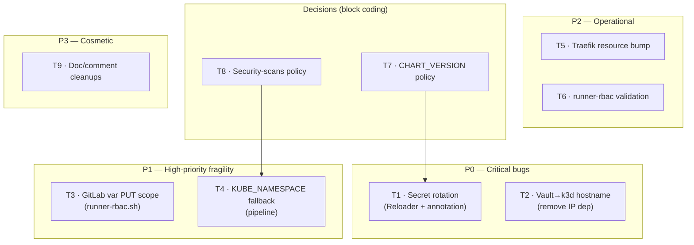
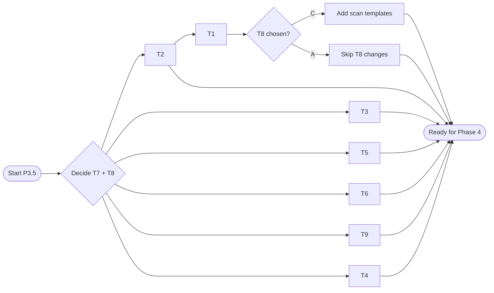

# DSOaaS — Migration Plan v2 · Phase 3.5: Hardening Pass

> **Document type**: Implementation plan (supplement to `MIGRATION_PLAN_v2.md`)
> **Scope**: Address findings from the Phase 0–3 review before starting Phase 4 (API rewrite). Covers one real bug (silent secret-rotation), one fragile API call, one stability landmine, plus operational hardening and policy decisions.
> **Status**: Proposed; awaiting execution.
> **Position**: Slots between Phase 3 (Helm chart + Auto DevOps templates) and Phase 4 (API rewrite). All Phase 4+ phases remain unchanged.
> **Owner**: Kara

---

## Table of contents

1. [Goal & principles](#1-goal--principles)
2. [Position in timeline](#2-position-in-timeline)
3. [Task overview](#3-task-overview)
4. [Per-task plan](#4-per-task-plan)
5. [Risks & rollback](#5-risks--rollback)
6. [Appendix](#6-appendix)

---

## 1. Goal & principles

### 1.1 Goal

Close the gaps surfaced by the Phase 0–3 review so Phase 4 (API rewrite) lands on a clean, idempotent, prod-shaped substrate. **No new features** — only bug fixes, hardening, and explicit policy decisions.

### 1.2 Principles

1. **Source of truth = the goal**, as established in the main plan. Existing scripts and docs are informational.
2. **Backward compatibility.** Every task is additive or an idempotent re-run. Existing running stack does **not** need to be torn down or recreated. Apps already deployed via Phase 3's pipeline continue to work unchanged.
3. **Replicability.** Each fix is a single script invocation or a focused file edit. Re-running the existing bootstrap scripts after this phase produces identical results to a clean install.
4. **No scope creep into Phase 4.** Two callouts from the review (`CI_PROJECT_NAME` as release name; `KUBE_NAMESPACE` provisioning) are explicitly *not* in this phase — Phase 4 will replace them via the new API.

### 1.3 What this phase covers — and what it does not

| Concern from review | Status |
|---|---|
| Secret rotation doesn't restart pods | ✅ Fixed here (T1) |
| Vault → k3d uses IP not hostname | ✅ Fixed here (T2) |
| GitLab env-scoped variable PUT scope | ✅ Fixed here (T3) |
| Pipeline lacks defensive `KUBE_NAMESPACE` fallback | ✅ Patched here (T4) |
| Traefik resource limits tight | ✅ Bumped here (T5) |
| `runner-rbac.sh` validation always WARNs from host | ✅ Fixed here (T6) |
| `CHART_VERSION` pin policy | ✅ Decided here (T7) |
| Auto DevOps security scans dropped | ✅ Decided here (T8) |
| Cosmetic doc/comment cleanups (3 items) | ✅ Bundled (T9) |
| `CI_PROJECT_NAME` as Helm release name | ⏭ Deferred to Phase 4 (slug resolver) |
| `KUBE_NAMESPACE` provisioning by API | ⏭ Deferred to Phase 4 (4.9) |

---

## 2. Position in timeline

```mermaid
gantt
    title v2 Migration — Phase 3.5 insertion
    dateFormat X
    axisFormat %s

    section Done
    P0 Pre-flight          :done, p0, 0, 1
    P1 K8s substrate       :done, p1, after p0, 2
    P2 ESO + Vault auth    :done, p2, after p1, 1
    P3 Helm + pipeline     :done, p3, after p2, 2
    section This phase
    P3.5 Hardening         :crit, p35, after p3, 2
    section Pending
    P4 API rewrite         :p4, after p35, 4
    P5 Cutover             :p5, after p4, 2
    P6 Replicability       :p6, after p5, 1
    P7 Frontend (deferred) :p7, after p6, 4
```



---

## 3. Task overview



Dependency notes: T7 (chart version policy) influences whether T1's Reloader annotation lands in the chart or is added at install time. T8 (security scans) influences how T4 reworks the pipeline.

---

## 4. Per-task plan

Each task: **goal**, **affected files**, **Cursor-style checkboxes**, **validation**, **backward-compat note**.

### T1 — Secret rotation: install Reloader + annotate Deployments

**Severity**: P0 (real bug — Vault changes silently don't reach running pods).

**Goal**: When an `ExternalSecret` syncs new content from Vault into a K8s `Secret`, the Deployment consuming it via `envFrom` rolls automatically.

**Affected files**:
- `bootstrap/k8s-primitives.sh` — install Reloader Helm chart
- `configs/auto-devops-chart/templates/deployment.yaml` — add Reloader annotation
- `configs/auto-devops-chart/Chart.yaml` — bump chart version → `0.2.0`
- `__DOCS__/01_infra/06_k3d_and_k8s.md` *(new in Phase 6)* — note Reloader as a platform primitive

**Tasks**:

- [ ] Add Reloader install block to `k8s-primitives.sh`:
  ```bash
  helm repo add stakater https://stakater.github.io/stakater-charts --force-update
  helm upgrade --install reloader stakater/reloader \
    -n reloader-system --create-namespace \
    --wait --timeout 5m
  ```
- [ ] Verify Reloader pod healthy and CRDs not required (Reloader works via annotations on existing K8s objects)
- [ ] In `auto-devops-chart/templates/deployment.yaml`, add to `metadata.annotations`:
  ```yaml
  reloader.stakater.com/auto: "true"
  ```
- [ ] Remove the misleading `checksum/externalsecret` annotation from the pod-template (it never worked the way it suggested)
- [ ] Bump `Chart.yaml` version: `0.1.0 → 0.2.0`
- [ ] Tag chart repo `v0.2.0`; publish via existing CI
- [ ] Bump `CHART_VERSION` in `auto-devops-pipeline/.gitlab-ci.yml` to `0.2.0` (or read T7 first if policy changes)

**Validation**:
- Deploy a test app to `dev`. Note pod creation timestamp.
- Update its Vault secret: `vault kv put secret/projects/<path>/dev FOO=NEW`.
- Wait up to `refreshInterval` (5m default) — Reloader detects the K8s Secret update and rolls the Deployment. New pod has `FOO=NEW`. Old pod terminates.

**Backward-compat**: Additive. Existing Deployments without the annotation are unaffected; they continue *not* to auto-reload (same as today).

---

### T2 — Vault → k3d uses hostname, not IP

**Severity**: P0 (silent failure after k3d server container restart).

**Goal**: Vault's `auth/kubernetes/config` survives k3d server container restarts.

**Affected files**:
- `bootstrap/vault-k8s-auth.sh`

**Tasks**:

- [ ] Remove the `K3D_IP` discovery block (lines 72–77):
  ```bash
  # REMOVE these lines
  K3D_IP=$(docker inspect "k3d-${K3D_CLUSTER_NAME}-server-0" \
    --format '{{range .NetworkSettings.Networks}}{{.IPAddress}} {{end}}' \
    | awk '{print $1}')
  [[ -z "${K3D_IP}" ]] && die "Could not determine k3d server IP."
  info "k3d API server IP: ${K3D_IP}"
  ```
- [ ] In the `vault write auth/kubernetes/config` block (line 152), replace `${K3D_IP}` with the Docker DNS hostname:
  ```bash
  kubernetes_host='https://k3d-${K3D_CLUSTER_NAME}-server-0:6443'
  ```
- [ ] Re-run `bootstrap/vault-k8s-auth.sh` once on the existing platform to update Vault's stored config
- [ ] Confirm no `K3D_IP` references remain: `grep -n K3D_IP bootstrap/vault-k8s-auth.sh` should be empty

**Validation**:
- After re-running: `docker compose restart vault` then `docker stop k3d-dsoaas-server-0 && docker start k3d-dsoaas-server-0` (container will pick up a new IP).
- ESO smoke-test (`bootstrap/k8s/smoketest-external-secret.yaml`) still materialises the K8s `Secret` correctly.

**Backward-compat**: Vault's `auth/kubernetes/config` is overwritten by the re-run — same path, same role, new `kubernetes_host`. ESO continues to work without interruption.

---

### T3 — GitLab env-scoped variable PUT scope

**Severity**: P1 (script re-runs leak duplicate variables or update the wrong scope).

**Goal**: `runner-rbac.sh` upserts `KUBECONFIG_B64` against the correct env scope on every re-run, with no duplicates.

**Affected files**:
- `bootstrap/runner-rbac.sh`

**Tasks**:

- [ ] In the PUT curl block (lines 200–207), append URL query parameter `?filter%5Benvironment_scope%5D=${GL_SCOPE}` so GitLab disambiguates the target variable:
  ```bash
  "https://${GITLAB_DOMAIN}/api/v4/groups/${GITLAB_CONFIG_GROUP_ID}/variables/KUBECONFIG_B64?filter%5Benvironment_scope%5D=${GL_SCOPE}"
  ```
- [ ] (Optional but recommended) Add a pre-flight check that lists existing scopes and warns if duplicates already exist from prior runs:
  ```bash
  curl -s -H "PRIVATE-TOKEN: $GITLAB_ROOT_TOKEN" \
    "https://${GITLAB_DOMAIN}/api/v4/groups/${GITLAB_CONFIG_GROUP_ID}/variables?per_page=100" \
    | jq -r '.[] | select(.key=="KUBECONFIG_B64") | .environment_scope'
  ```
- [ ] In GitLab UI: manually verify only three `KUBECONFIG_B64` variables exist (one per env scope); delete any duplicates from prior runs
- [ ] Re-run `bootstrap/runner-rbac.sh` to confirm clean upsert

**Validation**:
- After re-run, list `KUBECONFIG_B64` variables — exactly three (dev / stg / prod), no `*` scope.
- A test pipeline using `KUBECONFIG_B64` in each env decodes a kubeconfig pointing at the right namespace.

**Backward-compat**: PUT URL fix is purely additive. Existing correct variables stay correct; duplicates from prior buggy runs need manual cleanup (one-time).

---

### T4 — Pipeline defensive `KUBE_NAMESPACE` fallback

**Severity**: P1 (pipeline silently deploys to wrong namespace if API provisioning missed a scope).

**Goal**: Even if the API forgets to set `KUBE_NAMESPACE` scoped to an env, `.deploy-helm` still lands in the correct namespace by deriving it from `DEPLOY_ENV`.

**Affected files**:
- `configs/auto-devops-pipeline/.gitlab-ci.yml`

**Tasks**:

- [ ] In `.deploy-helm.script`, change:
  ```yaml
  --namespace "${KUBE_NAMESPACE}"
  ```
  to:
  ```yaml
  --namespace "${KUBE_NAMESPACE:-$DEPLOY_ENV}"
  ```
- [ ] Add a one-line comment above the fallback explaining the intent
- [ ] Tag pipeline repo `v0.2.0` (mirrors chart bump from T1)

**Validation**:
- Temporarily unset `KUBE_NAMESPACE` in a test project's CI variables — pipeline still deploys to `$DEPLOY_ENV` namespace.

**Backward-compat**: Same behaviour when `KUBE_NAMESPACE` is set (today's path). New path triggers only on absence.

---

### T5 — Traefik in-cluster resource bump

**Severity**: P2 (OOM risk under burst).

**Goal**: In-cluster Traefik survives bursty Ingress reloads without OOMKill.

**Affected files**:
- `bootstrap/charts/traefik-values.yaml`

**Tasks**:

- [ ] Update `resources` block:
  ```yaml
  resources:
    requests:
      cpu: 100m
      memory: 128Mi
    limits:
      cpu: 500m
      memory: 256Mi
  ```
- [ ] Run `helm upgrade traefik ...` (re-run `bootstrap/k8s-primitives.sh` does this idempotently)
- [ ] Confirm `kubectl describe pod -n kube-system -l app.kubernetes.io/name=traefik` shows new limits

**Validation**: `kubectl top pod -n kube-system` shows steady-state under the new limits. No OOMKill events in `kubectl get events -n kube-system`.

**Backward-compat**: Single rolling restart of the Traefik pod. Outer Traefik continues to serve passthrough — brief 2–5s window where in-cluster requests may queue. Negligible.

---

### T6 — `runner-rbac.sh` validation step

**Severity**: P2 (misleading warnings; not a functional bug).

**Goal**: The validation step either succeeds reliably or is removed with explanation.

**Affected files**:
- `bootstrap/runner-rbac.sh`

**Decision — pick one (recommend option A)**:

**Option A (recommended)**: Validate from a throwaway container on `devops-network`:
- [ ] Replace lines 237–243 with:
  ```bash
  log "Validating kubeconfigs from devops-network sidecar..."
  for ENV in "${ENVS[@]}"; do
    KC="${KUBECONFIG_DIR}/kubeconfig-${ENV}.yaml"
    if docker run --rm --network "${DOCKER_NETWORK}" \
      -v "$(pwd)/${KC#./}:/kc:ro" \
      bitnami/kubectl:latest \
      --kubeconfig=/kc get pods -n "${ENV}" >/dev/null 2>&1; then
      info "kubeconfig-${ENV}.yaml: access OK."
    else
      warn "kubeconfig-${ENV}.yaml: access FAILED. Check SA permissions."
    fi
  done
  ```

**Option B**: Drop the validation entirely with a comment:
- [ ] Replace lines 237–243 with a comment explaining why host-side validation cannot work (Docker DNS hostname `k3d-dsoaas-serverlb` is not resolvable outside the bridge network).

**Validation** (Option A): Re-run the script — three "access OK" lines, no warnings.

**Backward-compat**: Cosmetic. No effect on actual runner deploys.

---

### T7 — Decision: chart-version pinning policy

**Severity**: Decision (no code until decided).

**Goal**: Pick a stance on how apps pick up new versions of `dsoaas-app` chart.

**Options**:

| Option | Behaviour | Pros | Cons |
|---|---|---|---|
| **A — Centralised pin** (current) | `CHART_VERSION` hard-coded in pipeline template; bumped by platform team | Predictable; one-PR-to-roll-out; all apps move together | No per-app stability window; a buggy chart bumps everyone |
| **B — Per-app override allowed** | Pipeline reads `CHART_VERSION` from project variable if set, else default | Apps can pin during transitions; platform default still applies | Drift; some apps stuck on old versions |
| **C — Per-env pin** | Different `CHART_VERSION` per env (dev = latest, stg = pinned, prod = pinned) | Dev tries new chart first; prod stays stable | More config to manage; release cadence overhead |

**Recommendation**: **Option A** for now. Single source of truth, low cognitive overhead, fits the "platform team is small" reality. Revisit when ≥10 active apps or when a chart bump breaks one of them.

**Tasks**:

- [ ] Decide A / B / C
- [ ] Document the choice in `__DOCS__/99_maintainers/06_ci_cd.md` *(will be created in Phase 6)*
- [ ] If B: change `CHART_VERSION: "0.2.0"` to keep default but note override path in `auto-devops-pipeline/.gitlab-ci.yml` header
- [ ] If C: add env-scoped `CHART_VERSION` GitLab CI vars and reference them in `.deploy-helm`

**Validation**: Document references the chosen option; pipeline reflects it (or stays unchanged for A).

**Backward-compat**: A and C affect only future deploys. B is purely opt-in.

---

### T8 — Decision: Auto DevOps security-scan stages

**Severity**: Decision (security posture).

**Goal**: Pick whether to bring SAST / dependency scanning / container scanning / secret detection into the pipeline.

**Context**: Current `auto-devops-pipeline/.gitlab-ci.yml` replaces Auto DevOps wholesale, so all GitLab-provided security scan stages are absent. The plan never explicitly said "drop the scans" — that was an implicit consequence of the wholesale-override approach.

**Options**:

| Option | Implementation | Pros | Cons |
|---|---|---|---|
| **A — Keep dropped** | No change | Lean pipeline; fast | No automated security coverage |
| **B — Include + override** | `include: template: Auto-DevOps.gitlab-ci.yml` then redefine deploy jobs; disable only K8s-deploy stages via `*_DISABLED=1` | Full scan suite for free; pipelines auto-pick-up new scan types from GitLab | Heavier pipelines (10+ jobs per push); some scans require GitLab Ultimate licence |
| **C — Cherry-pick scans** | `include: template: Jobs/SAST.gitlab-ci.yml` + `Jobs/Container-Scanning.gitlab-ci.yml` + `Jobs/Secret-Detection.gitlab-ci.yml` only | Selective; lighter than B; works on Free tier | Manual maintenance when GitLab adds new scan types |

**Recommendation**: **Option C** (cherry-pick). SAST + Secret Detection + Container Scanning cover the highest-value cases and all work on GitLab Free / self-hosted CE. SAST adds ~30–60s per push; Secret Detection is fast; Container Scanning runs after build and surfaces CVEs in the image.

**Tasks** (if C chosen):

- [ ] In `auto-devops-pipeline/.gitlab-ci.yml`, add to `include:`:
  ```yaml
  - template: Jobs/SAST.gitlab-ci.yml
  - template: Jobs/Secret-Detection.gitlab-ci.yml
  - template: Jobs/Container-Scanning.gitlab-ci.yml
  ```
- [ ] Add stages if missing: `- test` (already present), `- security`
- [ ] Verify scans run on a test project; review surfaced findings as the policy-setting baseline
- [ ] Document in `__DOCS__/99_maintainers/06_ci_cd.md` what scans run and where reports surface (GitLab project → Security & Compliance → Vulnerability Report)

**Validation**: A test push runs SAST + Secret Detection + Container Scanning; results visible in the project's Security & Compliance section.

**Backward-compat**: Adding scan stages is additive — does not change build/test/deploy behaviour. Pipelines run a bit longer.

---

### T9 — Cosmetic / doc cleanups (bundled)

**Severity**: P3 (no functional impact).

**Goal**: Remove the small inaccuracies that accumulate technical debt.

**Affected files**:
- `bootstrap/vault-k8s-auth.sh`
- `traefik/dynamic/k3d-passthrough.yml`
- `docker-compose.yml`

**Tasks**:

- [ ] In `bootstrap/vault-k8s-auth.sh` line 263, replace:
  ```
  log "Next step: run bootstrap/vault-k8s-auth.sh is complete — proceed to Phase 3."
  ```
  with:
  ```
  log "Next step: proceed to Phase 3 (Helm chart wrapper + Auto DevOps templates)."
  ```
- [ ] In `traefik/dynamic/k3d-passthrough.yml`, rewrite the misleading comment on line 19–20:
  ```yaml
  #   4. TLS is terminated at the outer Traefik; the in-cluster Traefik receives
  #      plain HTTP. From devops-network, the LB container is reachable at
  #      k3d-dsoaas-serverlb:8081 (klipper-LB forwards to the in-cluster Service).
  ```
- [ ] In `docker-compose.yml` near the new sed loop, add a comment block explaining the `__DOMAIN__` substitution applies to *all* `dynamic-templates/*.yml` files, so contributors don't get bitten when they add a new dynamic file containing a literal `__DOMAIN__` for a non-domain purpose

**Validation**: `git diff` cleanly applies; no functional change.

**Backward-compat**: None — text edits only.

---

## 5. Risks & rollback

| Risk | Likelihood | Impact | Mitigation | Rollback |
|---|---|---|---|---|
| Reloader misfires and restarts pods unnecessarily | Low | Low | `reloader.stakater.com/auto: "true"` only watches resources the Deployment references — limited blast radius | Remove the annotation → Reloader stops watching |
| Vault re-config (T2) momentarily breaks ESO mid-update | Low | Low | The vault-k8s-auth script restarts ESO at the end → fresh auth context | Re-run `bootstrap/vault-k8s-auth.sh` |
| GitLab variable cleanup (T3) accidentally deletes the wrong scope | Low | Medium | Manual cleanup is the only destructive step; verify list before deleting | Re-run `bootstrap/runner-rbac.sh` to recreate |
| Traefik resource bump (T5) causes brief route blip during rolling restart | Medium | Low | Helm `--atomic` ensures rollout completes or rolls back; outer Traefik queues during the few-second window | `helm rollback traefik 0 -n kube-system` |
| Option C in T8 surfaces an avalanche of findings, blocks deploys | Medium | Low | Findings are advisory by default; deploys not blocked unless explicitly configured | Remove the included templates |

**Rollback strategy**: Each task is a single commit or a single script re-run. Cherry-pick reverts on `feat/v2-autodevops` branch. The `v1-frozen` tag remains the always-safe restore point for the whole platform.

---

## 6. Appendix

### 6.1 — File-level change inventory

| Path | Action | Task |
|---|---|---|
| `bootstrap/k8s-primitives.sh` | edit: add Reloader install block | T1 |
| `configs/auto-devops-chart/templates/deployment.yaml` | edit: add Reloader annotation, drop checksum/externalsecret | T1 |
| `configs/auto-devops-chart/Chart.yaml` | edit: bump version 0.1.0 → 0.2.0 | T1 |
| `bootstrap/vault-k8s-auth.sh` | edit: replace IP with hostname; fix final log line | T2, T9 |
| `bootstrap/runner-rbac.sh` | edit: PUT URL filter; replace validation step | T3, T6 |
| `configs/auto-devops-pipeline/.gitlab-ci.yml` | edit: defensive `--namespace` fallback; tag v0.2.0; (T8 if C) add scan templates; bump `CHART_VERSION` | T4, T8, T1 |
| `bootstrap/charts/traefik-values.yaml` | edit: resource bump | T5 |
| `traefik/dynamic/k3d-passthrough.yml` | edit: rewrite misleading comment | T9 |
| `docker-compose.yml` | edit: add `__DOMAIN__` convention comment | T9 |

### 6.2 — Execution order



Recommended commit order (one commit per task for auditable history):

1. `fix(phase-2): use Docker DNS hostname for k3d API in Vault auth (T2)`
2. `fix(phase-1): scope GitLab variable PUT to the right environment (T3)`
3. `fix(phase-1): validate runner kubeconfigs from devops-network sidecar (T6)`
4. `chore(phase-1): bump in-cluster Traefik resource limits (T5)`
5. `feat(phase-2): install Reloader + chart annotation for secret rotation (T1)`
6. `fix(phase-3): defensive KUBE_NAMESPACE fallback in deploy job (T4)`
7. `feat(phase-3): include SAST + Secret Detection + Container Scanning (T8, if C)`
8. `chore(phase-3): cosmetic doc and comment cleanups (T9)`
9. `docs(phase-3.5): record chart-version policy decision (T7)`

### 6.3 — Done criteria for Phase 3.5

- [ ] T1: Test app picks up Vault secret changes within `refreshInterval + rollout time` automatically
- [ ] T2: Vault re-config survives a k3d server container restart
- [ ] T3: Exactly three `KUBECONFIG_B64` variables on GitLab configs group (one per env)
- [ ] T4: Test pipeline with `KUBE_NAMESPACE` unset still deploys to the correct namespace
- [ ] T5: In-cluster Traefik shows new resource limits; no OOMKill in 24h
- [ ] T6: Either validation step succeeds or has been replaced with an explanatory comment
- [ ] T7: Decision recorded in plan + docs
- [ ] T8: Decision recorded in plan + docs; if C, scans surface in test project
- [ ] T9: All three text edits committed; `git diff` shows no functional changes
- [ ] Chart tag `v0.2.1` published to OCI registry
- [ ] Pipeline tag `v0.2.1` exists on `configs/auto-devops-pipeline`

### 6.4 — Decision log (filled in as decisions are made)

| Decision | Choice | Date |
|---|---|---|
| T7 — Chart version policy | Option A — centralised pin (`CHART_VERSION` in pipeline template, bumped by platform team) | 2026-05-12 |
| T8 — Security scan adoption | Option C — cherry-pick SAST + Secret Detection + Container Scanning (GitLab Free / CE compatible) | 2026-05-12 |

---

*End of plan. Version: 1.0 · Authored: 2026-05-12 · Supplement to MIGRATION_PLAN_v2.md*
