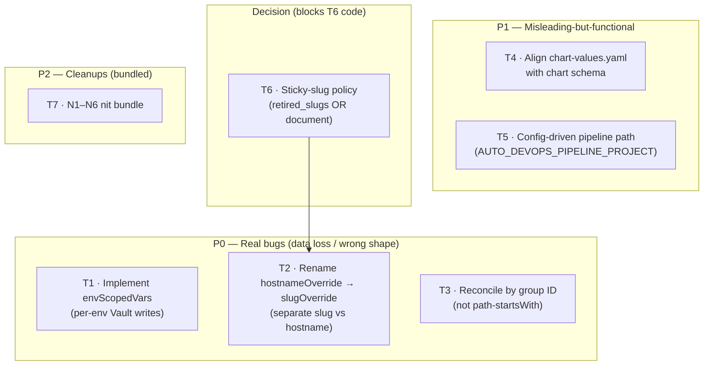
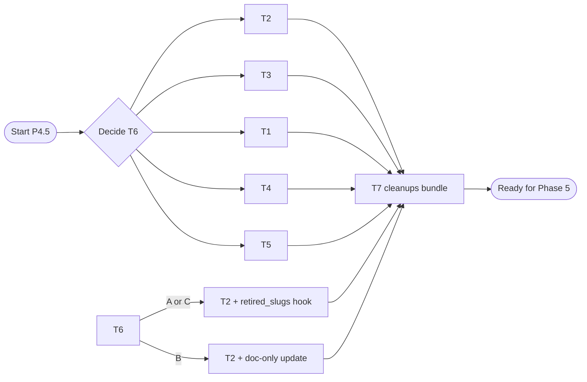

# DSOaaS — Migration Plan v2 · Phase 4.5: API Rewrite Hardening

> **Document type**: Implementation plan (supplement to `MIGRATION_PLAN_v2.md`)
> **Scope**: Address findings from the Phase 4 review before starting Phase 5 (cutover). Fixes silent data-loss on `envScopedVars`, a slug/hostname semantic mismatch, a brittle reconciliation filter, two misleading-but-functional issues, one acknowledged design gap, and a bundled set of nits.
> **Status**: Proposed; awaiting execution.
> **Position**: Slots between Phase 4 (API rewrite) and Phase 5 (cutover). All Phase 5+ phases remain unchanged.
> **Owner**: Kara

---

## Table of contents

1. [Goal & principles](#1-goal--principles)
2. [Position in timeline](#2-position-in-timeline)
3. [Task overview](#3-task-overview)
4. [Per-task plan](#4-per-task-plan)
5. [Risks & rollback](#5-risks--rollback)
6. [Appendix](#6-appendix)

---

## 1. Goal & principles

### 1.1 Goal

Close the gaps surfaced by the Phase 4 review so Phase 5 (cutover) lands on an API that doesn't silently drop caller data, doesn't conflate slug-versus-hostname semantics, and doesn't depend on brittle path-string matching. **No new features** — only correctness fixes, semantic clarifications, and operational hardening.

### 1.2 Principles

1. **Source of truth = the goal**, as established in the main plan. Code shipped in Phase 4 is informational; anything blocking correct behaviour is rewritten.
2. **Backward compatibility.** The v2 API hasn't shipped to external callers yet, so we can rename input fields without a deprecation window. The on-disk schema (MongoDB documents already written via Phase 4) must remain readable — no destructive migrations.
3. **Replicability.** Each fix is a focused code edit with a test. Re-running existing bootstrap scripts continues to produce identical results.
4. **No scope creep into Phase 5.** Cutover work (migrating legacy v1 projects, removing Kong from compose) remains in Phase 5.

### 1.3 What this phase covers — and what it does not

| Concern from review | Status |
|---|---|
| `envScopedVars` silently dropped | ✅ Fixed here (T1) |
| `hostnameOverride` semantically conflated with `hostnameOverrides[env]` | ✅ Fixed here (T2) |
| `reconcileLegacyProjects` uses path-startsWith instead of group IDs | ✅ Fixed here (T3) |
| `buildChartValues` emits schema the chart ignores | ✅ Aligned here (T4) |
| `AUTO_DEVOPS_CI_CONTENT` hardcoded | ✅ Config-driven here (T5) |
| Sticky-slug semantics not enforced | ✅ Decided here (T6) |
| Bundled cleanups (`PaginationInput` unused, `displayName` fallback, `envVars` scalar type, `/health` ping depth, kong/cloudflare deletions, nestjs-app chart-values alignment) | ✅ Bundled (T7) |
| Migrate legacy v1 projects | ⏭ Deferred to Phase 5 |
| Remove Kong + CF from compose | ⏭ Deferred to Phase 5 |

---

## 2. Position in timeline

```mermaid
gantt
    title v2 Migration — Phase 4.5 insertion
    dateFormat X
    axisFormat %s

    section Done
    P0 Pre-flight          :done, p0, 0, 1
    P1 K8s substrate       :done, p1, after p0, 2
    P2 ESO + Vault auth    :done, p2, after p1, 1
    P3 Helm + pipeline     :done, p3, after p2, 2
    P3.5 Hardening (P1-P3) :done, p35, after p3, 2
    P4 API rewrite         :done, p4, after p35, 4
    section This phase
    P4.5 API hardening     :crit, p45, after p4, 2
    section Pending
    P5 Cutover             :p5, after p45, 2
    P6 Replicability       :p6, after p5, 1
    P7 Frontend (deferred) :p7, after p6, 4
```



---

## 3. Task overview



Dependency notes: T6 (sticky-slug decision) affects how T2's slug renaming interacts with deletion. If T6 → "implement retired_slugs," the rename in T2 needs to also wire the SlugService into delete-time hook. If T6 → "document non-stickiness," T2 is purely a rename.

---

## 4. Per-task plan

Each task: **goal**, **affected files**, **Cursor-style checkboxes**, **validation**, **backward-compat note**.

### T1 — Implement `envScopedVars` (per-env Vault writes)

**Severity**: P0 (silent data loss — caller-supplied values are dropped without warning).

**Goal**: When a caller passes `envScopedVars: { dev: '{"FEATURE_FLAG":"on"}', ... }` to `createProject`, the values land in the per-env Vault path (`projects/{path}/{env}`) where the chart's `ExternalSecret` reads them.

**Affected files**:
- `api/src/projects/projects.service.ts` — extend step 4 (Vault seed) to write per-env paths
- `api/src/projects/graphql/project.inputs.ts` — confirm `EnvScopedVarsInput` JSON-string semantics (already there)
- `api/src/projects/projects.service.spec.ts` — add a unit test
- `api/test/projects.e2e-spec.ts` — add e2e coverage

**Tasks**:

- [ ] In `projects.service.ts createProject()` step 4, after the base-secrets write:
  ```ts
  // Step 4b: Per-env Vault writes when envScopedVars is provided
  if (input.envScopedVars) {
    for (const env of DEPLOY_ENVS) {
      const raw = input.envScopedVars[env];
      if (!raw) continue;
      try {
        const parsed = JSON.parse(raw) as Record<string, string>;
        const envPath = `${vaultBasePath}/${env}`;
        await this.vaultService.writeSecrets(envPath, parsed);
        this.logger.log(`Step 4b: Seeded env-scoped Vault secrets at "${envPath}"`);
      } catch (err) {
        this.logger.warn(`envScopedVars.${env} is not valid JSON — skipping: ${(err as Error).message}`);
      }
    }
  }
  ```
- [ ] Bubble errors up only when **all** envs fail or when the JSON is malformed; partial success logs a warning (matches the existing pattern for `envVars`)
- [ ] Audit log: add a `metadata.envScopedVars` field listing the envs that received writes (or just `[envs]`)
- [ ] Unit test: assert `vaultService.writeSecrets` is called with each provided env path and the parsed values
- [ ] e2e test: provision a project with `envScopedVars`, then `vaultService.readSecrets(...)` for each env returns the expected keys

**Validation**:
- GraphQL mutation `createProject` with `envScopedVars: { dev: '{"FOO":"bar"}' }` results in `secret/data/projects/<path>/dev` containing `FOO=bar`
- A test app deployed to `dev` shows `FOO=bar` in its pod env (via ExternalSecret → Reloader)

**Backward-compat**: Pure additive. Callers that don't pass `envScopedVars` see no change.

---

### T2 — Rename `hostnameOverride` → `slugOverride` and stop polluting `hostnameOverrides`

**Severity**: P0 (semantic mismatch — current code writes a *slug* into a field named *hostnameOverrides[env]* that the `setHostnameOverride` mutation treats as a *full hostname*).

**Goal**: Clean separation between create-time slug control and runtime per-env hostname overrides.

**Affected files**:
- `api/src/projects/graphql/project.inputs.ts` — rename field
- `api/src/projects/projects.service.ts` — drop pollution, use new name
- `api/src/projects/graphql/projects.resolver.ts` — passthrough rename
- `api/src/projects/slug.service.ts` — signature update
- `api/src/projects/projects.service.spec.ts` — test coverage

**Tasks**:

- [ ] In `project.inputs.ts CreateProjectInput`: rename `hostnameOverride` → `slugOverride`, update the `@Field` description to "explicit effective slug override (bypasses auto-generation and collision-suffix)"
- [ ] In `slug.service.ts resolve(requested, groupPath, override)`: rename parameter `override` → `slugOverride` (signature unchanged otherwise)
- [ ] In `projects.service.ts createProject()`:
  - [ ] Read `input.slugOverride` instead of `input.hostnameOverride`
  - [ ] Remove the buggy `hostnameOverrides: hostnameOverride ? { dev, stg, prod: <slug> } : {}` block — at create time, `hostnameOverrides` should always start as `{}`
  - [ ] Keep `appHosts` computed from `effectiveSlug` (unchanged behaviour)
- [ ] Confirm `setHostnameOverride(id, env, hostname)` mutation continues to write `hostnameOverrides[env]` with a *full hostname* (its current behaviour is correct — don't touch)
- [ ] Update tests
- [ ] Sweep for stale `hostnameOverride` references: `rg "hostnameOverride[^s]" api/`

**Validation**:
- GraphQL schema introspection shows `slugOverride: String` on `CreateProjectInput`, no `hostnameOverride` field
- `createProject(input: { ... slugOverride: "myapp" })` → `effectiveSlug === "myapp"` and `hostnameOverrides === {}` in MongoDB
- `setHostnameOverride(id, env: DEV, hostname: "custom.example.com")` → `hostnameOverrides.dev === "custom.example.com"`

**Backward-compat**: v2 API hasn't shipped externally yet — no consumers to break. Internal callers (if any) need a one-line rename.

---

### T3 — `reconcileLegacyProjects` filters by group ID, not path

**Severity**: P0 (will fail silently the day someone renames `templates/` or `configs/` GitLab groups).

**Goal**: Use the stable `templateGroupId` and `configGroupId` already loaded from config, instead of comparing `path_with_namespace` strings.

**Affected files**:
- `api/src/projects/projects.service.ts reconcileLegacyProjects`
- `api/src/gitlab/gitlab.service.ts` — confirm `GitLabProject.namespace.id` is exposed

**Tasks**:

- [ ] In `gitlab.service.ts`: verify `GitLabProject` type includes `namespace: { id: number; full_path: string }`. If not, extend the type (GitLab REST API `/projects` already returns this).
- [ ] In `projects.service.ts reconcileLegacyProjects`:
  - [ ] Replace path-startsWith check with:
    ```ts
    const namespaceId = glProject.namespace?.id;
    if (namespaceId === templateGroupId || namespaceId === configGroupId) {
      this.logger.verbose(
        `Reconciliation: skipping platform project "${glProject.path_with_namespace}" (group ${namespaceId})`,
      );
      continue;
    }
    ```
  - [ ] Remove the three `void rootGroup; void templateGroupId; void configGroupId;` lines
  - [ ] Remove the now-unused `rootGroup` variable

**Validation**:
- Rename the `templates` group to `tpls` in GitLab (in a scratch instance). Re-run the API; reconciliation continues to skip those projects. Rename back.
- Unit test: stub `gitlabService.listProjects` to return projects with various `namespace.id` values; assert only those with `namespace.id ∉ {templateGroupId, configGroupId}` get backfilled.

**Backward-compat**: Behavioural improvement only — projects that were already skipped under the old path-prefix logic continue to be skipped under the group-ID logic (assuming nobody put a non-template/config project under the `templates/` or `configs/` paths).

---

### T4 — Align `buildChartValues` output with the chart's expected values

**Severity**: P1 (misleading-but-functional — the emitted YAML doesn't match what the chart reads).

**Goal**: `chart-values.yaml` committed to app repos contains values that the `dsoaas-app` chart actually consumes.

**Current state** (`projects.service.ts:36–54`): emits `externalSecret.enabled: true` + `externalSecret.vaultPath: ...`. The chart's `externalsecret.yaml` template gates on `.Values.project.path` and `.Values.project.env`, ignoring `externalSecret.*` entirely. The pipeline `.deploy-helm` job sets `--set project.path=$VAULT_PROJECT_PATH --set project.env=$DEPLOY_ENV` at runtime, so deploys work — but the committed file is misleading.

**Affected files**:
- `api/src/projects/projects.service.ts buildChartValues`
- `templates/nestjs-app/chart-values.yaml` *(bundled with T7-N6)*

**Tasks**:

- [ ] Rewrite `buildChartValues` to emit values that map to the chart's schema. Two options:
  - **Option A (recommended)**: drop the redundant section entirely. Pipeline `--set` already covers `project.path` / `project.env`. The chart-values.yaml file becomes a place for per-app overrides (probes, resources, replicaCount) — *not* project metadata.
    ```ts
    function buildChartValues(): string {
      return `# Chart value overrides for the dsoaas-app Helm chart.
    # Project metadata (path, env, host) is injected by the pipeline at deploy time
    # via --set flags; do not duplicate it here.
    # Use this file for app-specific overrides: probes, resources, replicaCount, extraEnv.
    `;
    }
    ```
  - **Option B**: keep emitting project metadata but use the chart's actual keys:
    ```yaml
    project:
      path: "<vaultBasePath>"
      # env is set per-deploy by the pipeline
    ```
- [ ] Apply the same change to the manual template file `templates/nestjs-app/chart-values.yaml` (currently has commented-out hints that don't reference the right schema)

**Validation**:
- Provision a fresh test project. Inspect the committed `chart-values.yaml`: contains only overrides relevant to the chart's actual schema; no dead `externalSecret.*` keys.
- `helm lint` against the chart with the new chart-values.yaml passes cleanly.

**Backward-compat**: Existing app repos with the old `chart-values.yaml` still deploy correctly (the dead `externalSecret.*` keys are simply ignored by the chart). Migration is voluntary per project.

---

### T5 — Config-driven Auto DevOps pipeline path

**Severity**: P1 (renames of the `configs/auto-devops-pipeline` GitLab project break every newly provisioned app).

**Goal**: The path of the shared pipeline template is a config value, not a string literal in code.

**Affected files**:
- `api/src/config/configuration.ts` — add config field
- `api/src/projects/projects.service.ts` — read config
- `sample.env` — document the new env var

**Tasks**:

- [ ] In `configuration.ts AppConfiguration`, add:
  ```ts
  autoDevops: {
    pipelineProject: string;  // e.g. "configs/auto-devops-pipeline"
    pipelineFile: string;     // e.g. "/.gitlab-ci.yml"
  };
  ```
- [ ] In `configuration()`:
  ```ts
  autoDevops: {
    pipelineProject: optional('AUTO_DEVOPS_PIPELINE_PROJECT') ?? 'configs/auto-devops-pipeline',
    pipelineFile: optional('AUTO_DEVOPS_PIPELINE_FILE') ?? '/.gitlab-ci.yml',
  },
  ```
- [ ] In `projects.service.ts`:
  - [ ] Replace the module-level `AUTO_DEVOPS_CI_CONTENT` constant with a method that builds the content from config:
    ```ts
    private buildAutoDevopsCi(): string {
      const project = this.configService.get<string>('autoDevops.pipelineProject', { infer: true })!;
      const file = this.configService.get<string>('autoDevops.pipelineFile', { infer: true })!;
      return `include:\n  - project: ${project}\n    file: ${file}\n`;
    }
    ```
  - [ ] Use it in both `createProject` and `migrateProjectToAutoDevops`
- [ ] Add `AUTO_DEVOPS_PIPELINE_PROJECT` and `AUTO_DEVOPS_PIPELINE_FILE` to `sample.env` with the defaults documented

**Validation**:
- Set `AUTO_DEVOPS_PIPELINE_PROJECT=tpls/auto-devops` in `.env`; provision a project; verify the committed `.gitlab-ci.yml` references the new path.
- Default behaviour unchanged when the env vars are not set.

**Backward-compat**: Defaults match the current hardcoded path. No deploy-side change needed.

---

### T6 — Decision: sticky-slug policy

**Severity**: Decision (no code until decided).

**Context**: `slug.service.ts` comment says slugs are sticky, but the current implementation only enforces uniqueness against *existing* projects. After deletion the slug is reusable. The plan said "sticky" in the original design.

**Options**:

| Option | Behaviour | Pros | Cons |
|---|---|---|---|
| **A — Implement `retired_slugs`** | New MongoDB collection writing slug + decommission timestamp on every delete. `SlugService.isTaken` checks both `projects` and `retired_slugs`. | Honours original design intent. URLs never recycle. | Extra collection, schema migration, slight cost on every slug check. Slugs are "burned forever" — operator must manually purge `retired_slugs` to free one. |
| **B — Document non-stickiness for v2** | Update slug.service.ts comment to say "slugs are reusable after project deletion." No code change. | Simplest. Matches actual behaviour. Operators can delete + re-provision freely. | Theoretical URL recycling — if Project A is deleted and Project B claims its slug, anyone with cached references to Project A reaches Project B. Low risk in self-hosted single-tenant. |
| **C — Implement with TTL** | Same as A, but retired slugs expire after N days (e.g., 90). | Best of both worlds. | Most complex; needs TTL index + clarity around the TTL value. |

**Recommendation**: **B for v2**. The platform is single-tenant and small-team; the URL-recycle risk is operational, not security. Document the behaviour and revisit if the platform grows multi-tenant or starts serving external traffic where deep-linked references matter. Implementing A later is straightforward — `SlugService.isTaken` is the only call site that changes.

**Tasks**:

- [ ] Decide A / B / C and record in the decision log
- [ ] If B: update `slug.service.ts` JSDoc to drop the "(Future: maintain a `retired_slugs` collection...)" line and instead say "Slugs are released back to the pool when a project is deleted; downstream URL references should not assume immortality."
- [ ] If A or C: implement `RetiredSlug` schema, write on delete in `projects.service.deleteProject`, and extend `SlugService.isTaken` to check both collections

**Validation**: Documentation reflects the chosen behaviour; if A/C, unit test that a deleted-then-re-provisioned slug is rejected.

**Backward-compat**: Option B preserves current code behaviour. Options A/C are forward-only (existing projects keep their slugs; deletions from this point on populate the new collection).

---

### T7 — Bundled cleanups (N1–N6)

**Severity**: P2 (cosmetic / consistency).

**Goal**: Sweep up the smaller findings from the review in a single commit.

**Affected files**: various.

**Tasks**:

- [ ] **N1 — `PaginationInput` unused**: in `project.inputs.ts:197–205`, either remove the type entirely or refactor `projects.resolver.ts projects(...)` to take `@Args('pagination') pagination?: PaginationInput`. Recommend: remove (the inline `@Args('page')` / `@Args('perPage')` is clearer).
- [ ] **N2 — `displayName ?? projectSlug` fallback**: in `projects.service.ts:260`, when `displayName` is absent, derive a title-case fallback from the slug (`projectSlug.replace(/-/g, ' ').replace(/\b\w/g, c => c.toUpperCase())` → `"My App"` for `my-app`). Trivial UX win in GitLab UI.
- [ ] **N3 — `envVars` as String holding JSON**: replace `String` with a real `JSON` scalar. Install `graphql-type-json`; register the scalar in `AppModule`; change `envVars?: string` → `envVars?: Record<string, string>`; drop the inline `JSON.parse` + try/catch in step 4 (validation happens at the gateway).
- [ ] **N4 — `/health` doesn't ping deps**: extend `AppController.getHealth()` to:
  ```ts
  async getHealth() {
    const mongoOk = mongoose.connection.readyState === 1;
    const vaultOk = await this.vaultService.ping().catch(() => false);
    return {
      status: mongoOk && vaultOk ? 'ok' : 'degraded',
      mongo: mongoOk ? 'ok' : 'down',
      vault: vaultOk ? 'ok' : 'down',
    };
  }
  ```
  Add `ping()` to `VaultService` if not present (`GET /v1/sys/health`).
- [ ] **N5 — Stage kong/cloudflare deletions**: `git add -A` to remove the now-empty `api/src/kong/` and `api/src/cloudflare/` directory shells from the index. Verify `find api/src/kong api/src/cloudflare -type f` is empty.
- [ ] **N6 — `templates/nestjs-app/chart-values.yaml` alignment** (paired with T4): rewrite the template's chart-values.yaml to match the chart schema. Add a header comment pointing operators at the actual override points (probes, resources, replicaCount). Remove any references to the dead `externalSecret.*` keys.

**Validation**:
- `pnpm run lint` clean
- `pnpm run test` green
- Hitting `/health` while Mongo is healthy and Vault is reachable returns `{ status: 'ok', mongo: 'ok', vault: 'ok' }`
- `git status` clean after `git add -A`

**Backward-compat**: N1 / N3 are GraphQL schema changes — `pnpm generate:schema` (or equivalent) re-emits the SDL. No external consumers shipped yet, so safe.

---

## 5. Risks & rollback

| Risk | Likelihood | Impact | Mitigation | Rollback |
|---|---|---|---|---|
| T1 partial Vault write leaves env path inconsistent across envs | Low | Low | Each env write is independent; failures log + continue | Re-run `createProject` (idempotent on Vault path); or delete + re-provision |
| T2 rename breaks any internal scripts referencing `hostnameOverride` | Low | Low | Sweep with `rg`; v2 hasn't shipped externally | Re-add field as alias if a consumer surfaces |
| T3 reconciliation skips a real project because GitLab returns no `namespace` field | Very low | Medium | Fall back to path check if `namespace?.id` is undefined | Revert commit |
| T4 Option A makes chart-values.yaml empty by default — confusing for new contributors | Low | Low | Header comment explains the file's purpose | Revert to Option B (keep `project.path` block) |
| T5 misconfigured `AUTO_DEVOPS_PIPELINE_PROJECT` env var leads every new project to a broken `.gitlab-ci.yml` | Low | Medium | Defaults match current behaviour; validate the project path resolves on API startup | Set the env var correctly; re-run reconciliation |
| T6 Option A `retired_slugs` collection grows unboundedly | Low | Low | TTL index (Option C) or manual cleanup job | Truncate the collection |
| T7-N4 `/health` becomes flaky due to transient Vault latency | Low | Low | 1s timeout on `vaultService.ping()`; treat `false` as degraded, not down | Revert to synchronous `{status: 'ok'}` |

**Rollback strategy**: Each task is one or two focused commits. `git revert <sha>` walks back to the prior state; the `v2-frozen` tag (to be set after this phase) becomes the always-safe restore point for the next phase.

---

## 6. Appendix

### 6.1 — File-level change inventory

| Path | Action | Task |
|---|---|---|
| `api/src/projects/projects.service.ts` | edit: implement envScopedVars, rename slugOverride, group-ID reconcile, config-driven Auto DevOps include, drop hostnameOverrides pollution | T1, T2, T3, T5 |
| `api/src/projects/graphql/project.inputs.ts` | edit: rename `hostnameOverride` → `slugOverride` | T2 |
| `api/src/projects/graphql/projects.resolver.ts` | edit: passthrough rename | T2 |
| `api/src/projects/slug.service.ts` | edit: parameter rename; (optional T6 A/C) extend `isTaken` | T2, T6 |
| `api/src/projects/schemas/retired-slug.schema.ts` | **new** if T6 = A/C | T6 |
| `api/src/projects/schemas/project.schema.ts` | edit: comment update (T6) | T6 |
| `api/src/config/configuration.ts` | edit: add `autoDevops.pipelineProject` + `pipelineFile` | T5 |
| `api/src/gitlab/gitlab.service.ts` | edit: confirm/extend `GitLabProject.namespace` type | T3 |
| `api/src/vault/vault.service.ts` | edit: add `ping()` method | T7-N4 |
| `api/src/app.controller.ts` | edit: enrich `/health` with mongo + vault checks | T7-N4 |
| `api/src/app.module.ts` | edit: register JSON scalar | T7-N3 |
| `api/package.json` | edit: add `graphql-type-json` | T7-N3 |
| `templates/nestjs-app/chart-values.yaml` | edit: align with chart schema | T7-N6, T4 |
| `sample.env` | edit: add `AUTO_DEVOPS_PIPELINE_PROJECT`, `AUTO_DEVOPS_PIPELINE_FILE` | T5 |
| `api/src/projects/projects.service.spec.ts` | edit: tests for T1, T2, T3 | T1, T2, T3 |
| `api/test/projects.e2e-spec.ts` | edit: e2e for envScopedVars | T1 |
| `api/src/kong/`, `api/src/cloudflare/` | delete: stage empty-dir removal via `git add -A` | T7-N5 |

### 6.2 — Execution order



Recommended commit order (one task per commit for auditable history):

1. `docs(phase-4.5): record sticky-slug decision (T6)`
2. `fix(phase-4.5/T1): implement envScopedVars per-env Vault writes`
3. `refactor(phase-4.5/T2): rename hostnameOverride → slugOverride; stop polluting hostnameOverrides`
4. `fix(phase-4.5/T3): reconcile legacy projects by group ID, not path-startsWith`
5. `chore(phase-4.5/T5): config-driven Auto DevOps pipeline path (AUTO_DEVOPS_PIPELINE_PROJECT)`
6. `chore(phase-4.5/T4): align buildChartValues output with chart schema`
7. `chore(phase-4.5/T7): N1–N6 cleanups (PaginationInput, displayName, JSON scalar, /health deps, dir cleanup, nestjs-app chart-values)`

### 6.3 — Done criteria for Phase 4.5

- [ ] T1: `createProject` with `envScopedVars` writes per-env Vault paths; unit + e2e tests green
- [ ] T2: GraphQL schema introspection shows `slugOverride` (not `hostnameOverride`); `hostnameOverrides` is empty in MongoDB at create time; `setHostnameOverride` still works
- [ ] T3: Reconciliation no longer references `path_with_namespace.startsWith`; rename test passes
- [ ] T4: Provisioned `chart-values.yaml` either empty (Option A) or uses `project.path`-style keys (Option B); `helm lint` clean
- [ ] T5: `AUTO_DEVOPS_PIPELINE_PROJECT=...` override works end-to-end
- [ ] T6: Decision recorded in plan + slug.service.ts comment; if A/C, retired_slugs collection exists and is exercised by delete
- [ ] T7: `pnpm run lint && pnpm run test` green; `/health` returns mongo + vault status; `git status` clean after `git add -A`
- [ ] Tag `v2.0.0-rc.1` on the platform repo (denoting Phase 4.5 complete; Phase 5 cutover remaining)

### 6.4 — Decision log (filled in as decisions are made)

| Decision | Choice | Date |
|---|---|---|
| T4 — chart-values content | Option A — comment-only header; pipeline `--set` flags own project metadata | 2026-05-12 |
| T6 — sticky-slug policy | Option B — document non-stickiness; slugs are released on delete; revisit if multi-tenant | 2026-05-12 |

---

*End of plan. Version: 1.0 · Authored: 2026-05-12 · Supplement to MIGRATION_PLAN_v2.md*
