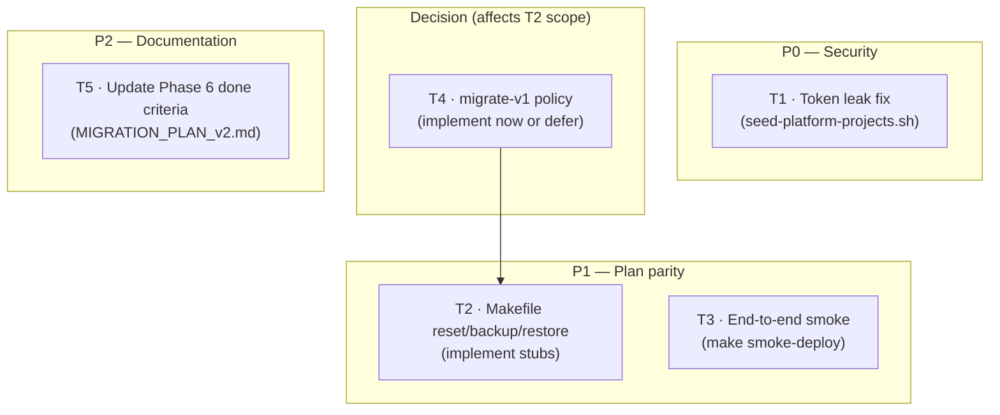
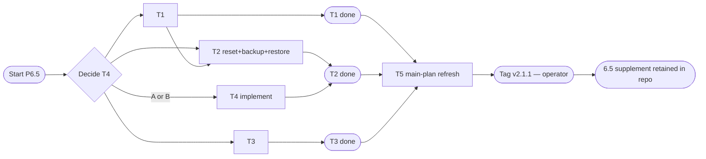

# DSOaaS — Migration Plan v2 · Phase 6.5: Phase 6 Completion

> **Document type**: Implementation plan (supplement to `MIGRATION_PLAN_v2.md`)
> **Scope**: Close the three loose ends from the Phase 6 review — a real token-leak risk in the platform-seed script, partial Makefile parity with the plan (reset/backup/restore are stubs), and a smoke-deploy gap (no end-to-end hello-world validation today). Plus one policy decision on whether `migrate-v1` should be automated or stay manual.
> **Status**: **Executed** (2026-05-12) — implementation landed in repo; see git history for the execution commit.
> **Position**: Slots between Phase 6 (Replicability) and the next milestone work (path-based routing, frontend console). All milestone-folder designs remain unchanged.
> **Owner**: Kara

---

## Table of contents

1. [Goal & principles](#1-goal--principles)
2. [Position in timeline](#2-position-in-timeline)
3. [Task overview](#3-task-overview)
4. [Per-task plan](#4-per-task-plan)
5. [Risks & rollback](#5-risks--rollback)
6. [Appendix](#6-appendix)

---

## 1. Goal & principles

### 1.1 Goal

Take Phase 6 from "structurally complete" to "ships without footnotes". One real fix (token leak), two scope items the plan committed to but didn't ship (Makefile parity, end-to-end smoke), one decision recorded (migrate-v1 policy), and one plan-document update so Phase 6's "Done criteria" reflect ground truth.

### 1.2 Principles

1. **Source of truth = the goal**, as established in the main plan. Phase 6 docs and scripts are informational; anything blocking correct or plan-faithful behaviour is updated.
2. **Backward compatibility.** All changes are additive or in-place edits to scripts. Existing bootstrap flows continue to work; new targets/flags are optional.
3. **Replicability.** Each change is a focused script edit or addition. Re-running `make bootstrap` after this phase produces identical results to before, plus the new Makefile targets and an optional `make smoke-deploy` capability.
4. **No scope creep into the milestones.** Path-based routing and the operator console remain in `__DOCS__/XX_milestone/` until they're explicitly scheduled.

### 1.3 What this phase covers — and what it does not

| Concern from Phase 6 review | Status |
|---|---|
| Token persisted in `.git/config` after `seed-platform-projects.sh` runs | ✅ Fixed here (T1) |
| `make reset` is a stub | ✅ Implemented here (T2) |
| `make backup` is a stub | ✅ Implemented here (T2) |
| `make restore` is a stub | ✅ Implemented here (T2) |
| `make migrate-v1` is a stub | ✅ Decided here (T4) |
| Smoke test doesn't deploy hello-world end-to-end (plan's validation criterion) | ✅ Added as `make smoke-deploy` (T3) |
| Main plan's Phase 6 done criteria don't match shipped state | ✅ Updated here (T5) |
| Path-based routing | ⏭ Remains in milestone (`XX_milestone/01_path_based_routing.md`) |
| Operator console (frontend) | ⏭ Remains in milestone (`XX_milestone/02_frontend_console.md`) |

---

## 2. Position in timeline

```mermaid
gantt
    title v2 Migration — Phase 6.5 insertion
    dateFormat X
    axisFormat %s

    section Done
    P0 Pre-flight              :done, p0, 0, 1
    P1 K8s substrate           :done, p1, after p0, 2
    P2 ESO + Vault auth        :done, p2, after p1, 1
    P3 Helm + pipeline         :done, p3, after p2, 2
    P3.5 Hardening             :done, p35, after p3, 2
    P4 API rewrite             :done, p4, after p35, 4
    P4.5 API hardening         :done, p45, after p4, 2
    P5 Cutover                 :done, p5, after p45, 2
    P6 Replicability           :done, p6, after p5, 1
    section This phase
    P6.5 Completion            :crit, p65, after p6, 1
    section Milestones (unscheduled)
    Path-based routing         :p7a, after p65, 3
    Frontend console           :p7b, after p7a, 4
```



---

## 3. Task overview



Dependency notes: T4 (migrate-v1 decision) determines whether T2 includes a fifth Makefile target. T5 records both the decision and the actual shipped state for future reference.

---

## 4. Per-task plan

Each task: **goal**, **affected files**, **Cursor-style checkboxes**, **validation**, **backward-compat note**.

### T1 — Fix token leak in `seed-platform-projects.sh`

**Severity**: P0 (real security risk — credential persisted to disk where it shouldn't be).

**Goal**: After `seed-platform-projects.sh` finishes, no GitLab token should remain in any `.git/config` on disk. Pushes still succeed.

**Affected files**:
- `bootstrap/seed-platform-projects.sh` (function `push_git_subtree`, lines 133–149)

**Background**: Today the function does:

```bash
local url="https://oauth2:${GITLAB_ROOT_TOKEN}@${GITLAB_DOMAIN}/${group_path}/${slug}.git"
git -C "${dir}" remote set-url origin "${url}"
git -C "${dir}" push -u origin main
```

The `remote set-url` writes the token into `${dir}/.git/config`. Anyone with read access to the working tree (or anyone who runs `cat .git/config` later) recovers the token in plaintext.

**Tasks**:

- [x] Replace `git remote set-url origin <token-url>` with a one-shot inline push that doesn't persist:
  ```bash
  push_git_subtree() {
    local rel="$1"
    local slug="$2"
    local dir="${REPO_ROOT}/${rel}"
    [[ -d "${dir}/.git" ]] || return 0
    log "Pushing git repo ${rel} → GitLab (${slug})..."
    local group_path
    group_path="$(gitlab_get "${GITLAB_API}/groups/${GITLAB_CONFIG_GROUP_ID}" | jq -r '.full_path')"
    [[ -n "${group_path}" && "${group_path}" != "null" ]] || die "Could not resolve config group full_path"
    local push_url="https://oauth2:${GITLAB_ROOT_TOKEN}@${GITLAB_DOMAIN}/${group_path}/${slug}.git"

    if git -C "${dir}" push "${push_url}" main 2>/dev/null; then
      log "Push OK: ${slug}"
    else
      warn "git push failed for ${slug} — resolve conflicts or push manually"
    fi
    # Note: push_url passed inline — never persisted to .git/config.
  }
  ```
- [x] Also: scrub any *already-leaked* tokens from existing nested `.git/config` files on the maintainer's host:
  ```bash
  # one-time cleanup, idempotent
  for d in configs/auto-devops-pipeline configs/auto-devops-chart; do
    git -C "${d}" remote set-url origin \
      "https://${GITLAB_DOMAIN}/${group_path}/${d##*/}.git" 2>/dev/null || true
  done
  ```
- [x] Add a comment near the push explaining why the inline URL form is required ("token must never persist in `.git/config`")
- [x] Verify after a fresh run: `grep -E 'oauth2:|PRIVATE-TOKEN' configs/*/\.git/config` returns empty

**Validation**:
- After re-running `bootstrap/seed-platform-projects.sh`, `cat configs/auto-devops-pipeline/.git/config` shows the remote URL **without** an embedded token
- Subsequent `git push` from those repos (without the script) requires manual authentication — confirming no stored credential

**Backward-compat**: Pure security improvement. Push behaviour unchanged.

---

### T2 — Implement Makefile `reset` / `backup` / `restore`

**Severity**: P1 (plan parity — Phase 6 plan listed these as deliverables).

**Goal**: Replace the three "not implemented, see docs" stubs in the Makefile with real, idempotent scripts. `migrate-v1` handled in T4.

**Affected files**:
- `bootstrap/backup.sh` — **new**
- `bootstrap/restore.sh` — **new**
- `bootstrap/reset.sh` — **new**
- `Makefile` — wire the three new targets
- `__DOCS__/01_infra/05_reset_from_zero.md` — cross-reference `make reset` and the backup story
- `__DOCS__/01_infra/04_operations.md` — add a "Backups" section

**Tasks**:

- [x] Author `bootstrap/backup.sh`:
  ```bash
  #!/usr/bin/env bash
  # Idempotent backup of platform state. Outputs a tarball into backups/.
  # Includes: .vols/ (Compose persistent volumes), .env, .vols/kubeconfigs/.
  # Excludes: k3d cluster state (rebuildable via bootstrap), node_modules, dist/, .git/objects.
  set -euo pipefail
  ROOT="$(cd "$(dirname "${BASH_SOURCE[0]}")/.." && pwd)"
  DST_DIR="${ROOT}/backups"
  STAMP="$(date +%Y%m%d-%H%M%S)"
  ARCHIVE="${DST_DIR}/platform-${STAMP}.tar.gz"
  mkdir -p "${DST_DIR}"
  echo "[backup] Creating ${ARCHIVE}..."
  tar -czf "${ARCHIVE}" \
      --exclude='./.vols/gitlab/data/builds' \
      --exclude='./.vols/gitlab/logs' \
      --exclude='./node_modules' \
      --exclude='./api/node_modules' \
      --exclude='./api/dist' \
      -C "${ROOT}" .env .vols
  echo "[backup] Done. Size: $(du -h "${ARCHIVE}" | cut -f1)"
  echo "[backup] To restore: ./bootstrap/restore.sh ${ARCHIVE}"
  ```

- [x] Author `bootstrap/restore.sh`:
  ```bash
  #!/usr/bin/env bash
  # Restores from a previously-created platform-*.tar.gz archive.
  # Requires the Compose stack to be stopped: docker compose down (--volumes is destructive)
  set -euo pipefail
  ROOT="$(cd "$(dirname "${BASH_SOURCE[0]}")/.." && pwd)"
  ARCHIVE="${1:-}"
  [[ -f "${ARCHIVE}" ]] || { echo "Usage: $0 path/to/platform-YYYYMMDD-HHMMSS.tar.gz" >&2; exit 1; }
  if docker compose ps --services --filter status=running | grep -q .; then
    echo "[restore] ERROR: Compose stack is running. Run 'docker compose down' first." >&2
    exit 1
  fi
  echo "[restore] Extracting ${ARCHIVE} into ${ROOT}..."
  tar -xzf "${ARCHIVE}" -C "${ROOT}"
  echo "[restore] Done. Next: ./bootstrap/bootstrap.sh"
  ```

- [x] Author `bootstrap/reset.sh`:
  ```bash
  #!/usr/bin/env bash
  # Destroys k3d cluster and (optionally) Compose volumes. INTERACTIVE confirmation.
  # Usage:
  #   ./bootstrap/reset.sh         # k3d only
  #   ./bootstrap/reset.sh --all   # k3d + docker compose down -v (DESTRUCTIVE)
  set -euo pipefail
  ROOT="$(cd "$(dirname "${BASH_SOURCE[0]}")/.." && pwd)"
  cd "${ROOT}"
  ALL=0
  [[ "${1:-}" == "--all" ]] && ALL=1
  if [[ "${ALL}" == "1" ]]; then
    echo "[reset] WARNING: this will delete the k3d cluster AND all Compose volumes (.vols)."
    echo "[reset] Run ./bootstrap/backup.sh first if you want to keep state."
    read -r -p "[reset] Type 'yes' to continue: " confirm
    [[ "${confirm}" == "yes" ]] || { echo "[reset] Aborted."; exit 1; }
  fi
  k3d cluster delete "${K3D_CLUSTER_NAME:-dsoaas}" 2>/dev/null || true
  if [[ "${ALL}" == "1" ]]; then
    docker compose down -v --remove-orphans
  fi
  echo "[reset] Done."
  ```

- [x] Update `Makefile`:
  ```makefile
  .PHONY: help bootstrap smoke smoke-deploy reset backup restore migrate-v1

  bootstrap:
  	@"$(BOOT)/bootstrap.sh"

  smoke:
  	@"$(BOOT)/smoke-test.sh"

  smoke-deploy:
  	@"$(BOOT)/smoke-deploy.sh"

  backup:
  	@"$(BOOT)/backup.sh"

  restore:
  	@if [ -z "$(ARCHIVE)" ]; then \
  	  echo "Usage: make restore ARCHIVE=backups/platform-YYYYMMDD-HHMMSS.tar.gz" >&2; \
  	  exit 1; \
  	fi
  	@"$(BOOT)/restore.sh" "$(ARCHIVE)"

  reset:
  	@"$(BOOT)/reset.sh" $(ARGS)

  migrate-v1:
  	# See T4 decision in MIGRATION_PLAN_v2_PHASE_6.5.md
  ```

- [x] Update `make help` to list the new targets accurately
- [x] Cross-link `make reset` / `make backup` / `make restore` from `__DOCS__/01_infra/05_reset_from_zero.md` (currently the doc explains the manual steps; add a section saying "see also: `make reset`")
- [x] Add a "Backups" subsection to `__DOCS__/01_infra/04_operations.md` covering when/how to run `make backup`, retention guidance, and `make restore`

**Validation**:
- `make backup` produces a `backups/platform-<timestamp>.tar.gz` of reasonable size (>10MB if the stack has any data)
- `make restore ARCHIVE=...` extracts cleanly when the Compose stack is down; refuses cleanly when it's up
- `make reset` (no `--all`) deletes the k3d cluster only; Compose state survives
- `make reset ARGS=--all` interactively confirms then wipes everything; afterwards `make bootstrap` produces a working platform

**Backward-compat**: New scripts and targets. Existing flows unchanged.

---

### T3 — End-to-end smoke deploy (hello-world)

**Severity**: P1 (Phase 6 validation criterion in the original plan).

**Goal**: Provide a separate, opt-in target that exercises the full provisioning + deploy + URL-reachable flow. Keep `make smoke` cheap and infra-only.

**Affected files**:
- `bootstrap/smoke-deploy.sh` — **new**
- `Makefile` — already wired in T2
- `__DOCS__/01_infra/03_bootstrap.md` — mention `make smoke-deploy`

**Tasks**:

- [x] Author `bootstrap/smoke-deploy.sh`:
  ```bash
  #!/usr/bin/env bash
  # End-to-end smoke: provision 'smoke-hello' via Management API GraphQL,
  # commit a tiny nginx Dockerfile, push to develop, wait for Ingress, curl URL.
  set -euo pipefail
  ROOT="$(cd "$(dirname "${BASH_SOURCE[0]}")/.." && pwd)"
  cd "${ROOT}"
  [[ -f .env ]] && { set -a; source .env; set +a; }

  : "${API_KEY:?Set API_KEY in .env}"
  : "${DOMAIN:?Set DOMAIN in .env}"
  : "${GITLAB_DOMAIN:?}"
  API_LOCAL="${API_LOCAL_PORT:-13000}"
  PROJECT_SLUG="${SMOKE_SLUG:-smoke-hello}"
  GROUP="${SMOKE_GROUP:-smoke}"
  TIMEOUT="${SMOKE_TIMEOUT:-600}"

  # 1) Create project via GraphQL (idempotent: tolerate "already exists")
  payload=$(jq -n \
    --arg groupRoot "${GROUP}" \
    --arg slug "${PROJECT_SLUG}" \
    '{ query: "mutation($g:[String!]!,$s:String!){createProject(input:{groupPath:$g,projectSlug:$s,capabilities:{deployable:true}}){id effectiveSlug appHosts{dev}}}",
       variables: { g: [$groupRoot], s: $slug } }')
  resp=$(curl -sf -X POST "http://127.0.0.1:${API_LOCAL}/graphql" \
    -H "Content-Type: application/json" \
    -H "X-API-Key: ${API_KEY}" \
    -d "${payload}" || true)
  effective=$(echo "${resp}" | jq -r '.data.createProject.effectiveSlug // empty')
  host=$(echo "${resp}" | jq -r '.data.createProject.appHosts.dev // empty')
  [[ -n "${effective}" ]] || { echo "[smoke-deploy] createProject failed: ${resp}" >&2; exit 1; }
  echo "[smoke-deploy] Project ready: ${effective} → ${host}"

  # 2) Clone, add minimal Dockerfile + .gitlab-ci.yml, push to develop
  WORK=$(mktemp -d)
  trap 'rm -rf "${WORK}"' EXIT
  git clone "https://oauth2:${GITLAB_ROOT_TOKEN}@${GITLAB_DOMAIN}/${GROUP}/${PROJECT_SLUG}.git" "${WORK}/repo"
  cd "${WORK}/repo"
  cat > Dockerfile <<'EOF'
  FROM nginx:alpine
  RUN echo "hello from smoke-deploy" > /usr/share/nginx/html/index.html
  EXPOSE 80
  EOF
  cat > .gitlab-ci.yml <<'EOF'
  include:
    - project: "system/devsecops-platform/configs/auto-devops-pipeline"
      file: "/.gitlab-ci.yml"
  EOF
  git checkout -b develop
  git add Dockerfile .gitlab-ci.yml
  git -c user.email=smoke@local -c user.name=smoke commit -m "smoke deploy"
  git push -u origin develop
  cd - >/dev/null

  # 3) Wait for HTTP 200 on the URL (Ingress + pod ready)
  echo "[smoke-deploy] Waiting up to ${TIMEOUT}s for https://${host}/ ..."
  start=$(date +%s)
  while true; do
    if curl -ksf -m 5 "https://${host}/" | grep -q "hello from smoke-deploy"; then
      echo "[smoke-deploy] PASS: https://${host}/ returned expected body"
      exit 0
    fi
    elapsed=$(( $(date +%s) - start ))
    (( elapsed >= TIMEOUT )) && { echo "[smoke-deploy] TIMEOUT after ${TIMEOUT}s" >&2; exit 1; }
    sleep 10
    echo "[smoke-deploy] ...still waiting ($((TIMEOUT - elapsed))s left)"
  done
  ```

- [x] Add a `--cleanup` flag that runs `mutation deleteProject(id: ...)` after passing
- [x] Document required env: `API_KEY`, `GITLAB_ROOT_TOKEN`, `DOMAIN`, `GITLAB_DOMAIN` (and the optional overrides)
- [x] Update `__DOCS__/01_infra/03_bootstrap.md` to add a "End-to-end smoke" subsection: `make smoke-deploy` runs the full provision + deploy + reach flow; takes ~5 min; requires a registered GitLab Runner

**Validation**:
- On a freshly-bootstrapped platform with a GitLab Runner registered: `make smoke-deploy` completes in 3–8 minutes and exits 0
- Removing the runner from `.env` makes it fail at the pipeline-trigger step, with a clear error pointing at GITLAB_RUNNER_TOKEN

**Backward-compat**: Additive. `make smoke` keeps doing the cheap infra check; the heavy version is opt-in.

---

### T4 — Decision: `migrate-v1` automation policy

**Severity**: Decision (no code until decided).

**Goal**: Pick a stance on whether the Makefile gets a fifth real target, or `migrate-v1` is documented as an operator workflow.

**Context**: Phase 5 already executed the v1 → v2 cutover. Any future need for `migrate-v1` would only arise on a fresh platform install where a tarball from a v1 system is being imported — a rare, operator-specific path. Automating it means encoding assumptions about how v1 data is shaped, which is fragile.

**Options**:

| Option | Behaviour | Pros | Cons |
|---|---|---|---|
| **A — Defer with doc** (recommended) | Replace the Makefile stub with a single line that prints a doc pointer; add `__DOCS__/01_infra/07_v1_migration.md` explaining the manual steps | Honest; cheap; matches the actual frequency of need | Plan parity is "implemented as documentation, not as a script" |
| **B — Minimal script** | `bootstrap/migrate-v1.sh` that wraps `migrateProjectToAutoDevops` GraphQL mutation in a loop over projects flagged `legacyV1: true` | Plan parity; idempotent re-runs work | Script encodes a workflow that may not match every operator's situation |
| **C — Remove from Makefile** | Drop the target entirely; mention only in MIGRATION_PLAN's Phase 5 section | Cleanest if you never expect to import another v1 state | Plan parity lost |

**Recommendation**: **A**. Phase 5 has already happened; the use case for `migrate-v1` is bounded and rare. A short doc captures the operator workflow without committing to script-level support for a one-off migration.

**Tasks**:

- [x] Decide A / B / C and record in the [decision log](#64--decision-log)
- [x] If A:
  - [x] Update `Makefile` `migrate-v1` target to print `__DOCS__/01_infra/07_v1_migration.md` location and exit 0 (not 1)
  - [x] Author `__DOCS__/01_infra/07_v1_migration.md` covering: prerequisites, GraphQL mutation walkthrough, per-project checklist
- [x] If B *(not chosen; option A executed)*: see T2's pattern; author `bootstrap/migrate-v1.sh`; wire Makefile target

**Validation**: Documentation reflects the chosen approach; the Makefile target prints the right thing (doc path for A; runs script for B; absent for C).

**Backward-compat**: No-op — Phase 5 already completed the actual migration.

---

### T5 — Update Phase 6 done criteria in main plan

**Severity**: P2 (documentation hygiene).

**Goal**: `MIGRATION_PLAN_v2.md`'s Phase 6 section accurately reflects what shipped, what's deferred, and where the deferrals are tracked.

**Affected files**:
- `MIGRATION_PLAN_v2.md` (Phase 6 section)

**Tasks**:

- [x] In the Phase 6 section, update the done-criteria checklist:
  - [x] Mark items shipped in Phase 6 as done with their commit reference (`ea04b77`)
  - [x] Mark items shipped in Phase 6.5 with commit `e17236d` (see git log for full message)
  - [x] For `migrate-v1`: link to the T4 decision in this plan
- [x] Add a single line at the end of Phase 6 in `MIGRATION_PLAN_v2.md` pointing readers here for post–Phase 6 completion items.
- [x] **Document lifecycle:** this supplement file is **retained** as an executed audit trail (original plan called for deletion after merge; repo keeps it for traceability alongside the updated §Phase 6 in the main plan).

**Validation**: A reader of `MIGRATION_PLAN_v2.md`'s Phase 6 section can tell at a glance what's in v2.1.0 vs what's in v2.1.1 (this phase's tag), and where to find migrate-v1 guidance.

**Backward-compat**: Documentation-only.

---

## 5. Risks & rollback

| Risk | Likelihood | Impact | Mitigation | Rollback |
|---|---|---|---|---|
| T1 inline push URL exposes token via process listing (`ps aux`) on multi-user host | Low | Low | The platform is typically self-hosted single-operator; document the consideration in the script comment. For shared hosts, use `GIT_ASKPASS` or a credentials helper instead. | Revert commit; manual push without seed script |
| T2 backup tarball balloons due to unexpected large files in `.vols/` | Medium | Low | Excludes lined up for the worst offenders (gitlab build logs); script reports size on completion so anomalies surface immediately | Delete the tarball; refine excludes |
| T2 restore overwrites a partially-running system (user forgot `docker compose down`) | Low | High | `restore.sh` refuses to run when Compose services are up; explicit check at the top | Run `docker compose down` and re-run |
| T2 reset --all on the wrong host (operator confusion) | Low | High | Interactive `read 'yes'` prompt; backup advisory before deletion | Backup taken pre-reset is the rollback |
| T3 smoke-deploy leaves a `smoke-hello` project orphaned on every run | Medium | Low | Document `--cleanup` flag; recommend running it in CI environments | `mutation deleteProject` manually |
| T3 smoke-deploy timing varies on slow CI hardware | Medium | Low | `SMOKE_TIMEOUT` env var overridable; default 600s | Increase timeout; re-run |
| T4 Option A users miss the doc when actually needing migrate-v1 | Low | Medium | `make migrate-v1` prints the doc path explicitly | Switch to Option B later if real demand surfaces |

**Rollback strategy**: Each task is one or two focused commits. `git revert` walks back per task; nothing in this phase is destructive of existing data. The `v2.1.0` tag remains the safe restore point pre-this-phase; `v2.1.1` is cut after this phase ships.

---

## 6. Appendix

### 6.1 — File-level change inventory

| Path | Action | Task |
|---|---|---|
| `bootstrap/seed-platform-projects.sh` | edit: inline-URL push, no `remote set-url` | T1 |
| `bootstrap/backup.sh` | **new** | T2 |
| `bootstrap/restore.sh` | **new** | T2 |
| `bootstrap/reset.sh` | **new** | T2 |
| `bootstrap/smoke-deploy.sh` | **new** | T3 |
| `bootstrap/migrate-v1.sh` | skipped (T4 = A) | T4 |
| `Makefile` | edit: wire reset/backup/restore/smoke-deploy/migrate-v1; refresh help | T2, T3, T4 |
| `__DOCS__/01_infra/03_bootstrap.md` | edit: `make smoke-deploy` subsection | T3 |
| `__DOCS__/01_infra/04_operations.md` | edit: Backups + `make backup` / `make restore` | T2 |
| `__DOCS__/01_infra/05_reset_from_zero.md` | edit: cross-link `make reset` / `make reset ARGS=--all` | T2 |
| `__DOCS__/01_infra/07_v1_migration.md` | **new** (T4 = A) | T4 |
| `__DOCS__/01_infra/index.md` | edit: link `07_v1_migration.md` | T4 |
| `MIGRATION_PLAN_v2.md` | edit: Phase 6 done-criteria refresh + 6.5 pointer | T5 |
| `MIGRATION_PLAN_v2_PHASE_6.5.md` | executed supplement (retained; see T5 note) | T5 |

### 6.2 — Execution order



Recommended commit order (one task per commit for auditable history):

1. `docs(phase-6.5): record T4 decision (migrate-v1 policy)`
2. `fix(phase-6.5/T1): inline-URL push in seed-platform-projects.sh; scrub leaked tokens`
3. `feat(phase-6.5/T2): implement Makefile reset/backup/restore + scripts`
4. `feat(phase-6.5/T3): end-to-end smoke-deploy with hello-world`
5. `feat(phase-6.5/T4): migrate-v1 — <doc-only | script | removed>` *(only if T4 chose A or B)*
6. `docs(phase-6.5/T5): refresh Phase 6 done criteria in MIGRATION_PLAN_v2.md`

### 6.3 — Done criteria for Phase 6.5

- [x] T1: Inline push + scrub implemented; operator should confirm `grep -E 'oauth2:|PRIVATE-TOKEN' configs/*/.git/config` is empty after `seed-platform-projects.sh`
- [x] T2: `make backup` / `make restore` / `make reset` scripts merged; restore refuses when Compose is up; operator validates tarball size and restore on a test host
- [x] T3: `make smoke-deploy` script shipped (GraphQL + git + URL wait); operator validates on a live stack with runner (<8 min typical)
- [x] T4: Decision recorded in the [decision log](#64--decision-log); Makefile target reflects the choice
- [x] T5: `MIGRATION_PLAN_v2.md` Phase 6 section accurately lists what shipped where; 6.5 pointer added
- [ ] **Operator:** tag `v2.1.1` on the merge commit after review (`git tag -a v2.1.1 -m "Phase 6.5 — seed security, Make parity, smoke-deploy, migrate-v1 doc"`)
- [x] This supplement file kept in-tree (see T5 document lifecycle note) instead of deleting after merge

### 6.4 — Decision log (filled in as decisions are made)

| Decision | Choice | Date |
|---|---|---|
| T4 — `migrate-v1` automation policy | **A** — doc-only; `make migrate-v1` prints `__DOCS__/01_infra/07_v1_migration.md` | 2026-05-12 |

### 6.5 — Cross-references

- Phase 6.5 execution commit: `e17236d feat(phase-6.5): seed inline push, backup/restore/reset, smoke-deploy, migrate-v1 doc`
- Original review findings: chat thread reviewing Phase 6 execution
- Related script: `bootstrap/seed-platform-projects.sh` (T1)
- Related Makefile context: existing `make bootstrap` / `make smoke` targets
- Plan-side reference: `MIGRATION_PLAN_v2.md` §4 Phase 6 (updated for 6.5)

---

*End of plan. Version: 1.0 · Authored: 2026-05-14 · Supplement to MIGRATION_PLAN_v2.md*
