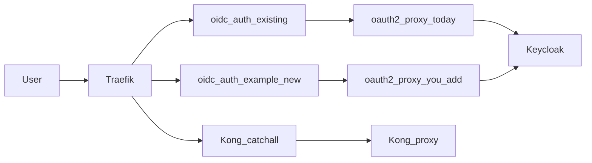

# Adding tiered OIDC with oauth2-proxy (Traefik v2 stack)

← [Back to Admin Guide](index.md)

This guide explains **how to extend** the platform when you need **more than one authorization policy** for browser flows that use [oauth2-proxy](https://oauth2-proxy.github.io/oauth2-proxy/) in front of tools that do not speak OIDC themselves. You do that by **adding oauth2-proxy instances** (and matching Traefik ForwardAuth middlewares and Keycloak clients)—not by flipping a single “tiers” switch.

The sections below start from **what ships today**, then describe **when** to introduce extra tiers, and use three **example labels**—**admin**, **internal**, **external**—only as **illustrative** naming and policies. Your real tiers might be fewer (often **one** proxy is enough) or more than three.

---

## What you have today (baseline)

The repo runs **one** `oauth2-proxy` container. Traefik’s ForwardAuth middleware `**oidc-auth**` is defined in `[traefik/dynamic/forward-auth.yml](../../traefik/dynamic/forward-auth.yml)` and delegates login checks to `**http://oauth2-proxy:4180/**`. Routers that need operator SSO (Traefik dashboard, MinIO console, etc.) attach that middleware via labels in `[docker-compose.yml](../../docker-compose.yml)`.

Group restriction for that single proxy is configured with `**OAUTH2_PROXY_ALLOWED_GROUPS**` (default `**admins**` when unset in Compose). That is **one** policy for **both** those admin surfaces: comma-separated group names are **OR** (membership in any listed group is enough). Details and env spelling are in [Environment variables](../01_infra/02_env.md#oauth2-proxy-allowed-groups).

Until you **duplicate** the proxy and wire new middlewares, you do **not** have separate “internal” or “external” oauth2-proxy tiers—only this baseline.

---

## When tiered auth is worth adding

Consider extra oauth2-proxy processes when:

- **Different routes need different group lists** (for example Traefik/Kong admin only for `admins`, but another hostname should allow `staff` **without** opening admin UIs to them).
- **You want separate OAuth callbacks / cookies / audit** per audience (partners vs employees).

You **do not** need a second proxy just to allow several groups for the **same** URLs—that is what `**OAUTH2_PROXY_ALLOWED_GROUPS=groupA,groupB`** does on the **existing** service.

---

## How ForwardAuth limits what one proxy can express

Traefik [ForwardAuth](https://doc.traefik.io/traefik/master/middlewares/http/forwardauth/) calls **one** upstream URL per middleware definition. That upstream is usually oauth2-proxy. Its policy (`allowed_groups`, roles, etc.) is fixed **per process**.

So:

- **One middleware ⇒ one oauth2-proxy listener ⇒ one allowlist** for every router using that middleware.
- **Different routes, different group policies** ⇒ typically **different** ForwardAuth middlewares and **different** oauth2-proxy containers (different ports), each with its own `**OAUTH2_PROXY_ALLOWED_GROUPS`** (or roles).
- **OR inside one tier:** multiple groups on the **same** proxy—oauth2-proxy treats the list as **OR**.
- **AND (must be in group A and B):** not modeled by stacking groups in `allowed_groups`; use a **single** Keycloak group or role that represents that intersection, or external policy (for example OPA). See [Keycloak administration](03_keycloak.md).

---

## How Traefik picks which oauth2-proxy for which service or path

Filtering is **not** done inside oauth2-proxy. **Traefik** decides, per **HTTP request**, which **router** handles it. Each router lists **middlewares**; your ForwardAuth middleware name decides which upstream URL Traefik calls—and that URL is one specific oauth2-proxy instance.

### The chain (mental model)

```text
Request → Traefik matches a router (rule) → runs middleware chain → ForwardAuth calls one URL → that URL is one oauth2-proxy:port → that process applies its allowlist
```

- `**forwardAuth` in middleware `oidc-auth@file**` → `[forward-auth.yml](../../traefik/dynamic/forward-auth.yml)` points at `http://oauth2-proxy:4180/` (baseline).
- `**forwardAuth` in middleware `oidc-auth-internal@file**` → you point at `http://oauth2-proxy-internal:4181/` (example second tier).

So: **which proxy** = **which middleware name** you put on the **router** that matches the traffic.

### Where you attach middlewares (two places in this repo)


| Mechanism                              | Typical use                                                                   | What you set                                                                                                       |
| -------------------------------------- | ----------------------------------------------------------------------------- | ------------------------------------------------------------------------------------------------------------------ |
| **Docker labels** on a Compose service | Per-host routing (Traefik dashboard, GitLab, Vault, protected consoles, …) | `traefik.http.routers.<routerName>.rule` (Host, PathPrefix, …) and `traefik.http.routers.<routerName>.middlewares` |
| **File provider** YAML                 | Shared routes in `[traefik/dynamic/forward-auth.yml](../../traefik/dynamic/forward-auth.yml)` | `http.routers.<name>.rule`, `middlewares`, `priority`                                                              |


Examples from this repo (baseline `**oidc-auth@file`** on specific hosts only):

**Traefik dashboard** (`traefik` service in `[docker-compose.yml](../../docker-compose.yml)`):

```yaml
traefik.http.routers.traefik-dashboard.rule: "Host(`${TRAEFIK_DOMAIN}`)"
traefik.http.routers.traefik-dashboard.middlewares: "oidc-auth@file,traefik-root-redirect"
```

**MinIO console** (`minio` service — same label pattern):

```yaml
traefik.http.routers.minio-console.rule: "Host(`${MINIO_CONSOLE_DOMAIN}`)"
traefik.http.routers.minio-console.middlewares: "oidc-auth@file"
```

To put **another** hostname on the **internal** tier proxy, you use a **different** middleware list, e.g. `oidc-auth-internal@file` (after you define that middleware next to `oidc-auth` in `forward-auth.yml`).

### Host vs path (and combining them)

- **Host-only:** `Host(\`internal-tools.devops.example.com)` — everything on that hostname uses the listed middlewares (common for a dedicated app).
- **Path-only** (same hostname, split tiers—unusual but valid): `Host(\`apps.devops.example.com) && PathPrefix(/staff)`on one router with`oidc-auth-internal@file`, and another router` Host(apps.devops.example.com) && PathPrefix(/public)`**without** OIDC or with`oidc-auth@file`—**router order and priority** must be set so the more specific rule wins (higher` traefik.http.routers.*.priority`or more specific`rule` first).

Traefik’s own docs: [HTTP routing](https://doc.traefik.io/traefik/master/routing/routers/) and [Priorities](https://doc.traefik.io/traefik/master/routing/routers/#priority).

### Priority vs catch-all

**Phase 5** removed Kong and the old anonymous PathPrefix `/` catch-all. `forward-auth.yml` defines only the `oidc-auth` middleware. Platform services use explicit Host() routers in `docker-compose.yml` (priority 30); application zones use `traefik/dynamic/k3d-passthrough.yml`. Unmatched hosts get Traefik's default 404. When you add internal tools, give each router a clear Host/Path rule and attach `oidc-auth@file` (or a sibling middleware) as needed.

### OAuth callback hosts vs app routers (easy to confuse)

- **ForwardAuth** runs on the **router that fronts your app** (dashboard, internal tool, …)—that chooses `**oidc-auth`** vs `**oidc-auth-internal**`.
- **Traefik route to `${OAUTH_DOMAIN}`** (see `oauth2-proxy` labels in `docker-compose.yml`) serves the **browser OAuth redirect** (`/oauth2/callback`) for oauth2-proxy. It does **not** decide per-path app policy; it only exposes the callback URL for login.

### Multiple services or routes

You **do not** add another oauth2-proxy container for each new app **if** they should share the **same** group policy. One oauth2-proxy process + one ForwardAuth middleware can guard **many** URLs.


| Goal                                         | What you add                                                                                                                                                                                                  |
| -------------------------------------------- | ------------------------------------------------------------------------------------------------------------------------------------------------------------------------------------------------------------- |
| **Several apps, same tier** (same allowlist) | **One Traefik router per** hostname or path: unique `traefik.http.routers.<name>.rule` each time, but **reuse** the same `middlewares` value (for example `oidc-auth-internal@file` on every router).         |
| **Several apps, different tiers**            | Same number of routers, but put `**oidc-auth@file**` on routers for “admin” surfaces and `**oidc-auth-internal@file**` (or another middleware) on routers that should use a different proxy/allowlist.        |
| **Multiple routers on one Compose service**  | Multiple label prefixes (`traefik.http.routers.tool-a.*`, `traefik.http.routers.tool-b.*`) if one container exposes more than one external hostname (less common).                                            |
| **One hostname, multiple paths**             | Multiple routers with different `rule` (e.g. `Host(\`x) && PathPrefix(/a)`vs`… && PathPrefix(/b)`) and appropriate` priority`; assign **`middlewares`** per router if` /a`and`/b` should use different tiers. |


**Router names must be unique** across Traefik’s config (labels + file provider). `**rule`** decides **which requests** hit that router; `**middlewares`** decides **which oauth2-proxy** ForwardAuth uses.

**OAuth callback:** You still have **one public callback URL per oauth2-proxy tier** (for example one `OAUTH_INTERNAL_DOMAIN` for `oauth2-proxy-internal`). Many routers can point at that tier—after login, the browser holds the session cookie for that tier and each protected router works until the session expires.

Example: two internal tools on **different hosts**, **same** internal tier (copy-paste pattern; expand with `tool-c`, `tool-d` as needed):

```yaml
      traefik.http.routers.grafana.rule: "Host(`${GRAFANA_DOMAIN}`)"
      traefik.http.routers.grafana.entrypoints: "websecure"
      traefik.http.routers.grafana.tls.certresolver: "letsencrypt"
      traefik.http.routers.grafana.middlewares: "oidc-auth-internal@file"
      traefik.http.services.grafana.loadbalancer.server.port: "3000"

      traefik.http.routers.kibana.rule: "Host(`${KIBANA_DOMAIN}`)"
      traefik.http.routers.kibana.entrypoints: "websecure"
      traefik.http.routers.kibana.tls.certresolver: "letsencrypt"
      traefik.http.routers.kibana.middlewares: "oidc-auth-internal@file"
      traefik.http.services.kibana.loadbalancer.server.port: "5601"
```

Ensure each hostname exists in Traefik’s Docker network **aliases** (same pattern as `[docker-compose.yml](../../docker-compose.yml)` `traefik` → `networks.devops-network.aliases`) and in DNS / TLS as you do for other platform hosts.

---

## Example tier names (illustrative only)

These names are **not** predefined in Keycloak or Compose. They are a convenient way to talk about policies while designing an extension:


| Example label | Example purpose                                                                                     | Relation to this repo                                                                                                  |
| ------------- | --------------------------------------------------------------------------------------------------- | ---------------------------------------------------------------------------------------------------------------------- |
| **admin**     | Highest-privilege operator UIs (Traefik dashboard, Kong Admin).                                     | **Matches today’s single proxy** route protection when you use group allowlists such as `admins`.                      |
| **internal**  | Staff-only tools you might put behind a **stricter or different** group list than generic SSO apps. | **Not deployed by default**—you would add another oauth2-proxy + middleware + routes if you introduce such a hostname. |
| **external**  | Partners or contractors—**separate** policy or Keycloak client boundary.                            | **Not deployed by default**—same as internal: add services and wiring when you need it.                                |


Nothing in Keycloak is labeled “tier”; tiers are **whatever you name** your Compose services, middlewares, and allowlists.

---

## Keycloak before you add instances

oauth2-proxy only sees what appears in tokens:

- **Groups:** ensure a **groups** [client scope](https://www.keycloak.org/docs/latest/server_admin/#_client_scopes) with a group-membership mapper (`groups` claim is typical). Align allowlist strings with what Keycloak emits (short names vs `/full/path` depends on mapper settings). Reference: [Keycloak OIDC provider (OAuth2 Proxy)](https://oauth2-proxy.github.io/oauth2-proxy/configuration/providers/keycloak_oidc).
- **Roles:** Keycloak-specific `**allowed_roles`** needs provider `**keycloak-oidc**`, not plain `**oidc**`.

Realm operations are covered in [Keycloak administration](03_keycloak.md). Live realms do not auto-sync from `realm-export.json` after first boot.

### Redirect URIs when you add oauth2-proxy instances

Each new oauth2-proxy needs a `**OAUTH2_PROXY_REDIRECT_URL**` (for example `https://oauth-internal.devops.example.com/oauth2/callback`) registered on its Keycloak client.

Patterns operators use:

1. **One Keycloak client, many redirect URIs** — simpler; one secret shared across tiers using that client.
2. **One client per tier** — clearer rotation and auditing (`oauth2-proxy-internal`, etc.).

---

## Extension checklist: duplicate the baseline pattern

When you **add** another tier, duplicate what `[docker-compose.yml](../../docker-compose.yml)` already does for `oauth2-proxy`, changing names and ports:


| Concern                                      | What must differ per new tier                                                                                      |
| -------------------------------------------- | ------------------------------------------------------------------------------------------------------------------ |
| Compose service                              | New service name (for example `oauth2-proxy-internal`).                                                            |
| Listen port                                  | `**OAUTH2_PROXY_HTTP_ADDRESS`** (for example `0.0.0.0:4181`).                                                      |
| OIDC client / secret                         | If you split Keycloak clients per tier.                                                                            |
| `**OAUTH2_PROXY_REDIRECT_URL**`              | Must match the public callback URL and Keycloak allowed redirects.                                                 |
| `**OAUTH2_PROXY_COOKIE_NAME**` (and related) | Avoid collisions on the same parent cookie domain between tiers.                                                   |
| `**OAUTH2_PROXY_ALLOWED_GROUPS**`            | Policy for **this** tier only.                                                                                     |
| `**OAUTH2_PROXY_UPSTREAMS`**                 | Keep `**static://202**` if Traefik ForwardAuth still hits the proxy **root** URL (this repo’s pattern; see below). |


Official option reference: [configuration overview](https://oauth2-proxy.github.io/oauth2-proxy/configuration/overview/).

---

## Quickstart: add a second oauth2-proxy (internal example)

Use this when one shared `**OAUTH2_PROXY_ALLOWED_GROUPS`** on the existing container is not enough (different policy on another hostname). The examples use:

- Service name: `**oauth2-proxy-internal**`
- Container listen port: `**4181**`
- Callback hostname placeholder: `**${OAUTH_INTERNAL_DOMAIN}**` (define it in `.env`, e.g. `oauth-internal.devops.yourdomain.com`)
- Traefik middleware name: `**oidc-auth-internal**`

Adjust names to match your convention. `**OAUTH2_PROXY_ALLOWED_GROUPS**` must stay **plural** (singular env names are ignored by oauth2-proxy).

### Files to touch


| File                                                                                                 | What you add                                                                                                                                                   |
| ---------------------------------------------------------------------------------------------------- | -------------------------------------------------------------------------------------------------------------------------------------------------------------- |
| `.env` (document new keys in `[sample.env](../../sample.env)` if your team tracks suggestions there) | `OAUTH_INTERNAL_DOMAIN`, optional `KC_CLIENT_SECRET_OAUTH2_PROXY_INTERNAL`, `OAUTH2_PROXY_INTERNAL_ALLOWED_GROUPS`, optional `OAUTH2_PROXY_INTERNAL_CLIENT_ID` |
| `[docker-compose.yml](../../docker-compose.yml)`                                                     | New service block; Traefik `networks.devops-network.aliases` entry for the new OAuth hostname                                                                  |
| `[traefik/dynamic/forward-auth.yml](../../traefik/dynamic/forward-auth.yml)`                                         | New `middlewares` entry pointing at `http://oauth2-proxy-internal:4181/`                                                                                       |
| `[kong/kong.template.yml](../../kong/kong.template.yml)`                                             | New `service` + `route` for `${OAUTH_INTERNAL_DOMAIN}` → new upstream                                                                                          |
| Keycloak admin UI                                                                                    | Valid redirect URI(s); optional new OIDC client                                                                                                                |
| New or existing Compose service for the app                                                          | Traefik labels referencing `oidc-auth-internal@file`                                                                                                           |


### 1) Environment variables (`.env`)

Add alongside your existing platform variables (names are suggestions):

```bash
# Public hostname for the second tier’s /oauth2/callback (DNS must resolve to Traefik).
OAUTH_INTERNAL_DOMAIN=oauth-internal.devops.yourdomain.com

# Optional: second Keycloak confidential client (recommended for separate audit/rotation).
# KC_CLIENT_SECRET_OAUTH2_PROXY_INTERNAL=...

# Group allowlist for this tier only (comma-separated OR).
OAUTH2_PROXY_INTERNAL_ALLOWED_GROUPS=staff,developers

# Hostname for an example app protected by oidc-auth-internal (step 6 labels).
INTERNAL_TOOL_DOMAIN=internal-tools.devops.yourdomain.com
```

If you **reuse** the existing Keycloak client `oauth2-proxy`, append `**https://${OAUTH_INTERNAL_DOMAIN}/oauth2/callback`** to that client’s **Valid redirect URIs** instead of creating `KC_CLIENT_SECRET_OAUTH2_PROXY_INTERNAL`.

### 2) `docker-compose.yml` — second service + Traefik alias

Add a service (mirror `[oauth2-proxy](../../docker-compose.yml)`; change names, port, redirect URL, cookie name, and allowlist):

```yaml
  oauth2-proxy-internal:
    image: quay.io/oauth2-proxy/oauth2-proxy:latest
    container_name: oauth2-proxy-internal
    restart: unless-stopped
    environment:
      OAUTH2_PROXY_PROVIDER: oidc
      OAUTH2_PROXY_OIDC_ISSUER_URL: ${OAUTH2_PROXY_OIDC_ISSUER_URL}
      OAUTH2_PROXY_INSECURE_OIDC_SKIP_ISSUER_VERIFICATION: "true"
      OAUTH2_PROXY_CLIENT_ID: ${OAUTH2_PROXY_INTERNAL_CLIENT_ID:-oauth2-proxy}
      OAUTH2_PROXY_CLIENT_SECRET: ${KC_CLIENT_SECRET_OAUTH2_PROXY_INTERNAL:-${KC_CLIENT_SECRET_OAUTH2_PROXY}}
      OAUTH2_PROXY_COOKIE_SECRET: ${OAUTH2_PROXY_COOKIE_SECRET}
      OAUTH2_PROXY_COOKIE_NAME: "_oauth2_proxy_internal"
      OAUTH2_PROXY_COOKIE_SECURE: "true"
      OAUTH2_PROXY_COOKIE_DOMAINS: ".${DOMAIN}"
      OAUTH2_PROXY_COOKIE_SAMESITE: "none"
      OAUTH2_PROXY_COOKIE_CSRF_PER_REQUEST: "true"
      OAUTH2_PROXY_COOKIE_CSRF_EXPIRE: "5m"
      OAUTH2_PROXY_REDIRECT_URL: https://${OAUTH_INTERNAL_DOMAIN}/oauth2/callback
      OAUTH2_PROXY_EMAIL_DOMAINS: "*"
      OAUTH2_PROXY_HTTP_ADDRESS: "0.0.0.0:4181"
      OAUTH2_PROXY_REVERSE_PROXY: "true"
      OAUTH2_PROXY_SET_XAUTHREQUEST: "true"
      OAUTH2_PROXY_SKIP_PROVIDER_BUTTON: "true"
      OAUTH2_PROXY_PASS_ACCESS_TOKEN: "true"
      OAUTH2_PROXY_WHITELIST_DOMAINS: ".${DOMAIN}"
      OAUTH2_PROXY_UPSTREAMS: "static://202"
      OAUTH2_PROXY_ALLOWED_GROUPS: ${OAUTH2_PROXY_INTERNAL_ALLOWED_GROUPS:-staff}
    depends_on:
      keycloak:
        condition: service_healthy
    networks:
      - devops-network
```

**Traefik** must resolve the new OAuth hostname on the Docker network. Under the `traefik` service `networks.devops-network.aliases`, add:

```yaml
          - ${OAUTH_INTERNAL_DOMAIN}
```

(`KEYCLOAK_DOMAIN`, `OAUTH_DOMAIN`, etc. are already listed there—same pattern.)

### 3) `traefik/dynamic/forward-auth.yml` — ForwardAuth middleware

Append a sibling middleware under `http.middlewares` (keep `**oidc-auth**` unchanged for the stock admin proxy):

```yaml
    oidc-auth-internal:
      forwardAuth:
        address: "http://oauth2-proxy-internal:4181/"
        trustForwardHeader: true
        authResponseHeaders:
          - "X-Auth-Request-User"
          - "X-Auth-Request-Email"
          - "X-Auth-Request-Access-Token"
```

ForwardAuth must target the proxy **root** URL above (this repo’s pattern), **not** `/oauth2/auth`. Pair it with `**OAUTH2_PROXY_UPSTREAMS=static://202`** on that container so Traefik sees **202** when the session is valid.

### 4) `kong/kong.template.yml` — OAuth callback through Kong

Duplicate the existing `oauth2-proxy-service` / `oauth2-proxy-route` block and point it at the new upstream and host:

```yaml
  - name: oauth2-proxy-internal-service
    url: http://oauth2-proxy-internal:4181
    connect_timeout: 10000
    read_timeout: 60000
    write_timeout: 60000
    retries: 3
    routes:
      - name: oauth2-proxy-internal-route
        hosts:
          - ${OAUTH_INTERNAL_DOMAIN}
        protocols:
          - http
          - https
        strip_path: false
        preserve_host: true
```

Run `kong-deck-sync` (or your usual deck sync) after editing the template.

### 5) Keycloak

1. **Clients →** either `**oauth2-proxy`** or a new client `**oauth2-proxy-internal**`.
2. **Valid redirect URIs:** `https://${OAUTH_INTERNAL_DOMAIN}/oauth2/callback`.
3. Ensure **groups** (or roles) required by `**OAUTH2_PROXY_INTERNAL_ALLOWED_GROUPS`** appear in tokens (`groups` claim for generic `oidc` provider).

### 6) Attach auth to an app router (labels)

This step is where you **choose** which traffic uses the internal proxy: you set the router `**rule`** (which host/path matches) and list `**oidc-auth-internal@file**` in `**middlewares**`. Changing `**middlewares**` from `**oidc-auth@file**` to `**oidc-auth-internal@file**` switches which oauth2-proxy Traefik’s ForwardAuth calls—see [How Traefik picks which oauth2-proxy](#how-traefik-picks-which-oauth2-proxy-for-which-service-or-path).

Point **only** the routers that should use the internal tier at `**oidc-auth-internal@file`**. Example labels on a Compose service (replace router name and domain placeholders):

```yaml
      traefik.enable: "true"
      traefik.http.routers.my-internal-tool.rule: "Host(`${INTERNAL_TOOL_DOMAIN}`)"
      traefik.http.routers.my-internal-tool.entrypoints: "websecure"
      traefik.http.routers.my-internal-tool.tls.certresolver: "letsencrypt"
      traefik.http.routers.my-internal-tool.middlewares: "oidc-auth-internal@file"
      traefik.http.services.my-internal-tool.loadbalancer.server.port: "8080"
```

The stock Traefik dashboard and Kong Admin labels continue to use `**oidc-auth@file**` unless you intentionally move them to another middleware.

### 7) Deploy

```bash
docker compose up -d oauth2-proxy-internal traefik kong
```

Re-run Kong deck sync if that is how you apply `kong.template.yml`. Then test with users inside and outside `**OAUTH2_PROXY_INTERNAL_ALLOWED_GROUPS**`.

### Traefik and Kong (conceptual recap)

- **Traefik:** one ForwardAuth middleware name per oauth2-proxy listener; router `**middlewares`** choose which tier applies.
- **Kong:** each `**OAUTH_*_DOMAIN`** that serves `**/oauth2/callback**` needs a route to the matching container port.
- **Catch-all:** removed in Phase 5 with Kong. Use explicit Host/Path routers and ForwardAuth middlewares; application APIs should enforce auth in the app or at the Ingress layer.

---

## Verification

**Baseline (single proxy, shipped layout):**

1. User **without** allowed groups: Keycloak login succeeds, **403** from oauth2-proxy on Traefik/Kong admin URLs.
2. User **with** allowed groups: access succeeds.

**After you add another oauth2-proxy:**

1. Confirm `**docker compose exec`** or logs show `**allowedGroups**` (or test deny/allow) for **each** container.
2. Exercise each hostname with users who differ by group.
3. Confirm cookies do not overwrite across tiers (distinct `**OAUTH2_PROXY_COOKIE_NAME`** where needed).

---

## Diagram: baseline vs optional extension

**Today:** one ForwardAuth middleware → one oauth2-proxy → Keycloak for the labeled admin routes.

**When you extend:** add branches only where you introduced another middleware and container (names are examples):




`fwInt` / `opNew` exist **only after** you add them; the catch-all path remains unauthenticated unless you add dedicated routers.

---

## Summary

- **Which URLs use which proxy:** Traefik **router `rule` + `middlewares`** (labels or dynamic YAML)—see [How Traefik picks which oauth2-proxy](#how-traefik-picks-which-oauth2-proxy-for-which-service-or-path). **Many routes, one tier:** add **one router per URL** and reuse the same `middlewares`; see [Multiple services or routes](#multiple-services-or-routes).
- **Copy-paste walkthrough:** see [Quickstart](#quickstart-add-a-second-oauth2-proxy-internal-example) for concrete `**docker-compose.yml`**, `[forward-auth.yml](../../traefik/dynamic/forward-auth.yml)`, `[kong.template.yml](../../kong/kong.template.yml)`, and label snippets.
- **Shipped:** one oauth2-proxy + `**oidc-auth`** + `**OAUTH2_PROXY_ALLOWED_GROUPS**` for operator surfaces—no separate “internal/external” services unless you add them.
- **Tiered auth** means **extending** Compose, Traefik dynamic config, Kong, and Keycloak redirect URIs/clients using the same oauth2-proxy pattern **again**, with **distinct** allowlists and callbacks per tier.
- **admin / internal / external** in this page are **examples**, not a built-in three-tier product mode.

For SSO basics and login troubleshooting, see [Access and Single Sign-On](01_access_and_sso.md).