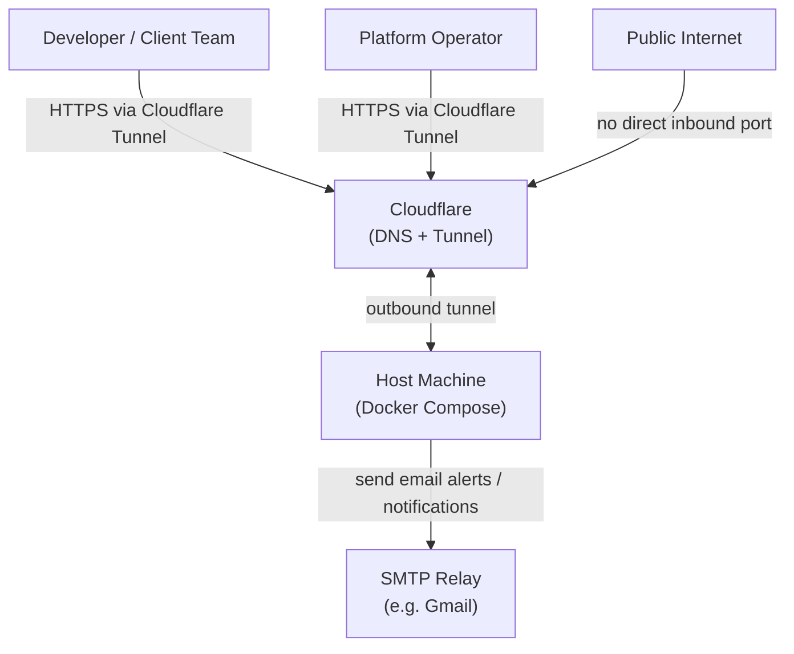
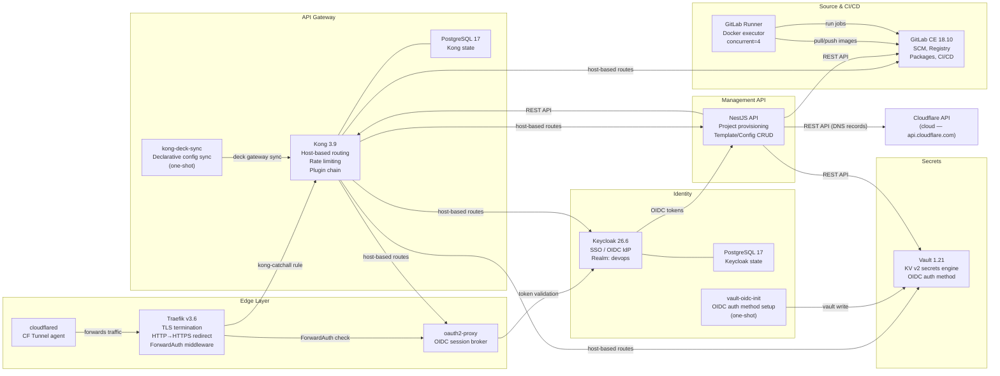
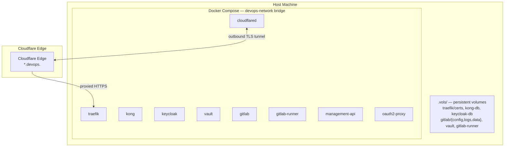
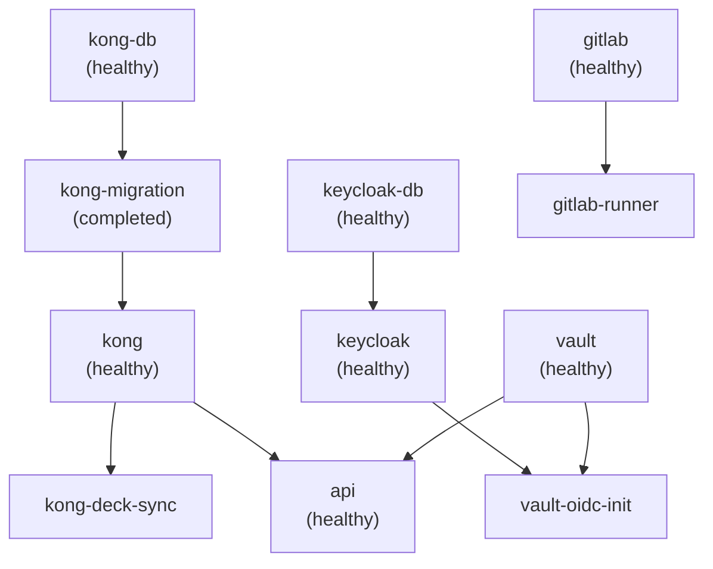

# Architecture

← [Back to Maintainer Guide](index.md)

This document describes the structural design of the platform from multiple viewpoints: system context, container layout, component relationships, and key design decisions.

---

## System context

The platform sits between the public internet and a single physical host machine. It provides development infrastructure as a service to client teams, and is administered by a platform operator.

No inbound TCP ports are exposed to the public internet. All traffic arrives via the Cloudflare Tunnel, which maintains an outbound-only connection from the host to Cloudflare's edge. The host itself only opens Docker host ports for local management access (on non-standard ports).

---

## Container layout

---

## Component responsibilities

### Traefik

- Terminates TLS using Let's Encrypt ACME DNS-01 challenge via Cloudflare.
- Issues a single wildcard certificate for `*.devops.<DOMAIN>`.
- Redirects all `http://` traffic to `https://`.
- Defines a `kong-catchall` dynamic rule (priority 1) that forwards all HTTPS traffic to Kong unless a higher-priority route matches first.
- Defines an `oidc-auth` ForwardAuth middleware that delegates session checks to `oauth2-proxy`.
- Exposes its own dashboard at `${TRAEFIK_DOMAIN}` behind the `oidc-auth` middleware.

### oauth2-proxy

- Brokers OIDC authentication for services that have no native OIDC client.
- Keycloak is the OIDC provider. `oauth2-proxy` redirects unauthenticated users to the Keycloak login page and stores the session in a cookie scoped to `.devops.<DOMAIN>`.
- On successful auth, injects `X-Auth-Request-User`, `X-Auth-Request-Email`, and `X-Auth-Request-Access-Token` headers for downstream services.
- The Traefik `oidc-auth` ForwardAuth middleware calls `oauth2-proxy` at `/oauth2/auth` for every protected request.

### Kong

- Routes traffic to upstream services by matching the `Host` header.
- All public-facing services (Keycloak, Vault, GitLab, Management API, oauth2-proxy) are declared as Kong services in `kong/kong.template.yml`.
- Deployed applications are registered dynamically via the Management API and appear as additional Kong services.
- Kong Admin API (`${KONG_ADMIN_DOMAIN}`) is exposed via a Docker label-defined Traefik route, protected by the `oidc-auth` middleware.
- `kong-deck-sync` runs once at startup to apply the declarative config via `deck gateway sync`.

### Keycloak

- Single OIDC realm: `devops`.
- Pre-configured clients: `gitlab`, `vault`, `management-api`, `oauth2-proxy`.
- Roles: `admin`, `developer` (default for new users).
- The realm is imported from `keycloak/realm-export.json` on first boot. The file contains `${VAR}` placeholders that Keycloak resolves from container environment variables.
- `realm_roles` claim is mapped via a dedicated client scope so that JWT bearer tokens carry the user's realm roles.

### Vault

- Runs in **dev mode** (`server -dev`). Auto-initialized and auto-unsealed on every start.
- Data persisted at `.vols/vault` via the volume mount.
- KV v2 secrets engine on the default `secret/` mount.
- OIDC auth method configured by `vault-oidc-init` (one-shot container) pointing at the Keycloak realm.
- Management API authenticates to Vault via a static `VAULT_DEV_ROOT_TOKEN_ID` token. A production-ready `config.hcl` is included for future migration to server mode.

### GitLab

- Hosts all source repositories, including the `templates` group and `configs` group used by the Management API.
- Provides a container registry at `${GITLAB_REGISTRY_DOMAIN}` (port 5000 internally).
- Provides npm/package registries per-project.
- OmniAuth OpenID Connect SSO is configured via `GITLAB_OMNIBUS_CONFIG` using Keycloak as the provider.
- `GITLAB_ROOT_TOKEN` is the API token used by the Management API.

### GitLab Runner

- Docker executor. Runs jobs inside Docker containers on the host.
- Connected to the `devops-network` via `network_mode`, so jobs can reach internal services (Vault, GitLab registry, etc.) by DNS name.
- Registers automatically on first start if `GITLAB_RUNNER_TOKEN` is set and no config exists.
- Supports concurrent 4 jobs.

### Management API

- NestJS application. Acts as the orchestration layer for project lifecycle management.
- Exposes a REST API authenticated via API key and/or OIDC JWT.
- Full provisioning logic: GitLab fork → CI inject → Vault secrets → Kong route → Cloudflare DNS → pipeline trigger.
- Manages the `templates` group (project skeletons) and `configs` group (shared CI/CD config repos) via GitLab API.
- Exposes Swagger UI at `/api/docs`.

### cloudflared

- Profile-gated service — only starts with `docker compose --profile cftunnel up -d`.
- Maintains an outbound-only tunnel from the host to Cloudflare's network.
- Routing rules (which hostnames map to which tunnel) are configured entirely in the Cloudflare dashboard (Zero Trust → Networks → Tunnels), not in any file in this repository.
- The `TUNNEL_TOKEN` environment variable authenticates the agent to Cloudflare.
- Has no health check (distroless image; exposes metrics on `:60123`).

---

## Technology choices

| Component | Technology | Why |
|---|---|---|
| Reverse proxy | Traefik v3.6 | Native Docker label integration, automatic TLS with ACME, ForwardAuth middleware |
| API Gateway | Kong 3.9 | Mature plugin ecosystem, declarative config via decK, host-based routing |
| Identity | Keycloak 26.6 | Industry-standard OIDC/OAuth2, configurable client scopes, realm import |
| Secrets | Vault 1.21 | KV v2 versioning, OIDC auth, fine-grained policies |
| SCM | GitLab CE 18.10 | Integrated registry, package manager, CI/CD, OIDC SSO |
| Management API | NestJS 11 | TypeScript, decorator-driven, built-in Swagger, modular |
| Database | PostgreSQL 17 | Separate instances for Kong and Keycloak; Alpine for smaller image size |
| Tunneling | cloudflared | Zero-trust ingress without firewall rules |
| OIDC proxy | oauth2-proxy | Lightweight session broker for services without native OIDC |

---

## Deployment topology

All persistent state lives under `.vols/` on the host. Back up this directory to recover the platform. The `traefik/certs/acme.json` file contains the live TLS certificates.

---

## Startup order and dependencies

The Docker Compose `depends_on` graph forms a strict boot sequence:

`traefik` and the Postgres instances have no upstream dependencies declared in Compose. They start concurrently with the rest. `oauth2-proxy` depends on `keycloak` (healthy). `cloudflared` depends on `traefik` (healthy) and is profile-gated (`cftunnel`); it does not start with a regular `docker compose up -d`.

GitLab has a `start_period: 300s` on its health check, reflecting its slow boot time. Expect the full stack to be ready 5–10 minutes after `docker compose up`.
