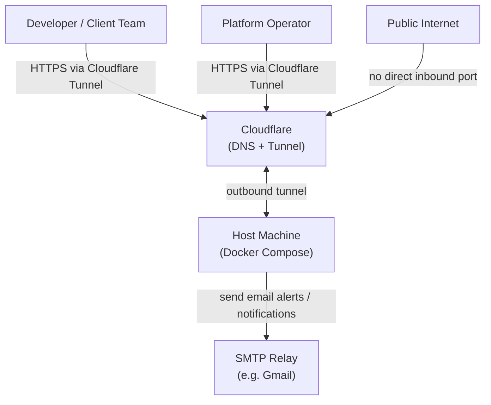
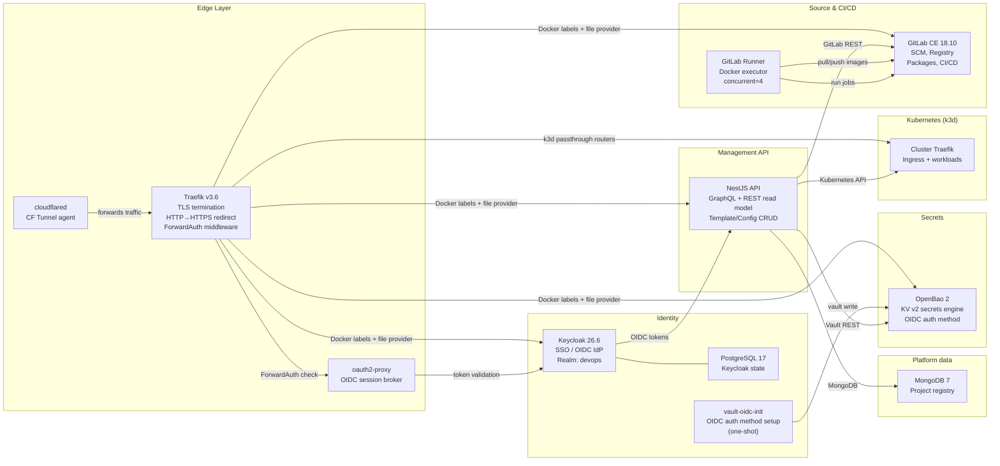
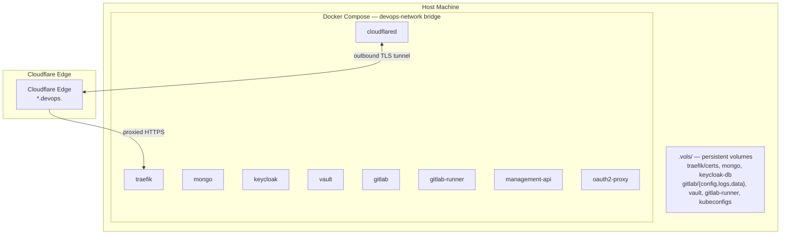
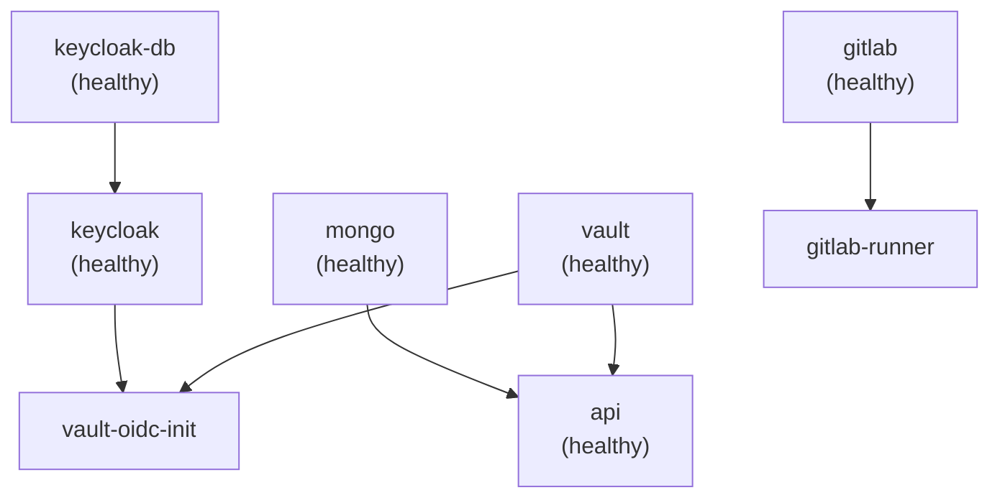

# Architecture

← [Back to Maintainer Guide](index.md)

This document describes the structural design of the platform from multiple viewpoints: system context, container layout, component relationships, and key design decisions.

---

## System context

The platform sits between the public internet and a single physical host machine. It provides development infrastructure as a service to client teams, and is administered by a platform operator.

No inbound TCP ports are exposed to the public internet when you use **Cloudflare Tunnel** (`cftunnel`): traffic arrives via an outbound-only connection from `cloudflared` to Cloudflare. Alternatively, **VPN edge** (`vpnedge`) uses a cloud VM with public TCP and WireGuard to your home; see [Networking](05_networking.md). The host still opens Docker-mapped ports for local management (non-standard host ports).

---

## Container layout

---

## Component responsibilities

### Traefik

- Terminates TLS using Let's Encrypt ACME DNS-01 challenge via Cloudflare.
- Issues a single wildcard certificate for `*.devops.<DOMAIN>`.
- Redirects all `http://` traffic to `https://`.
- Loads shared middlewares from `traefik/dynamic/forward-auth.yml` and app-zone passthrough rules from `traefik/dynamic/k3d-passthrough.yml` (after entrypoint `sed` substitution).
- Routes operator services via **Docker labels** on each upstream container and publishes the dashboard at `${TRAEFIK_DOMAIN}` behind `oidc-auth@file`.

### oauth2-proxy

- Brokers OIDC authentication for services that have no native OIDC client.
- Keycloak is the OIDC provider. `oauth2-proxy` redirects unauthenticated users to the Keycloak login page and stores the session in a cookie scoped to `.devops.<DOMAIN>`.
- On successful auth, injects `X-Auth-Request-User`, `X-Auth-Request-Email`, and `X-Auth-Request-Access-Token` headers for downstream services.
- The Traefik `oidc-auth` ForwardAuth middleware calls `oauth2-proxy` at its root URL for each protected request.

### Application ingress (k3d)

- Team workloads run in k3d; **Kubernetes Ingress** (via in-cluster Traefik) routes HTTP to pods.
- The outer Traefik instance forwards `*.apps.<DOMAIN>` / `*.dev.apps.<DOMAIN>` / `*.stg.apps.<DOMAIN>` hostnames to the cluster using file-provider `HostRegexp` routers.
- The Management API provisions namespaces, Helm releases, and CI variables—there is no separate compose-level API gateway for app traffic.

### Keycloak

- Single OIDC realm: `devops`.
- Pre-configured clients: `gitlab`, `vault`, `management-api`, `oauth2-proxy`.
- Roles: `admin`, `developer` (default for new users).
- The realm is imported from `keycloak/realm-export.json` on first boot. The file contains `${VAR}` placeholders that Keycloak resolves from container environment variables.
- `realm_roles` claim is mapped via a dedicated client scope so that JWT bearer tokens carry the user's realm roles.

### OpenBao

- Runs in **dev mode** (`server -dev`). Auto-initialized and auto-unsealed on every start.
- Data persisted at `.vols/vault` via the volume mount.
- KV v2 secrets engine on the default `secret/` mount.
- OIDC auth method configured by `vault-oidc-init` (one-shot container) pointing at the Keycloak realm.
- Management API authenticates to OpenBao via a static `VAULT_DEV_ROOT_TOKEN_ID` token. A production-ready `config.hcl` is included for future migration to server mode.

### GitLab

- Hosts all source repositories, including the `templates` group and `configs` group used by the Management API.
- Provides a container registry at `${GITLAB_REGISTRY_DOMAIN}` (port 5000 internally).
- Provides npm/package registries per-project.
- OmniAuth OpenID Connect SSO is configured via `GITLAB_OMNIBUS_CONFIG` using Keycloak as the provider.
- `GITLAB_ROOT_TOKEN` is the API token used by the Management API.

### GitLab Runner

- Docker executor. Runs jobs inside Docker containers on the host.
- Connected to the `devops-network` via `network_mode`, so jobs can reach internal services (Vault, GitLab registry, etc.) by DNS name.
- Registers automatically on first start if `GITLAB_RUNNER_TOKEN` is set and no config exists.
- Supports concurrent 4 jobs.

### Management API

- NestJS application. Acts as the orchestration layer for project lifecycle management.
- Exposes **GraphQL** at `/graphql` (primary write path) and a small **REST** surface (`GET /projects`, `GET /health`, deprecated 410 stubs for legacy POST/DELETE).
- Provisioning flow: GitLab project or fork → CI inject → Vault secrets → Kubernetes namespaces / Helm → MongoDB persistence → optional pipeline trigger.
- Manages the `templates` group (project skeletons) and `configs` group (shared CI/CD config repos) via GitLab API.
- Exposes Swagger UI at `/api/docs`.

### cloudflared

- Profile-gated service — only starts with `docker compose --profile cftunnel up -d`.
- Maintains an outbound-only tunnel from the host to Cloudflare's network.
- Routing rules (which hostnames map to which tunnel) are configured entirely in the Cloudflare dashboard (Zero Trust → Networks → Tunnels), not in any file in this repository.
- The `TUNNEL_TOKEN` environment variable authenticates the agent to Cloudflare.
- Has no health check (distroless image; exposes metrics on `:60123`).

---

## Technology choices

| Component | Technology | Why |
|---|---|---|
| Reverse proxy | Traefik v3.6 | Native Docker label integration, automatic TLS with ACME, ForwardAuth middleware |
| Ingress (apps) | k3d + Traefik (in-cluster) | Standard Kubernetes networking for deployable workloads |
| Identity | Keycloak 26.6 | Industry-standard OIDC/OAuth2, configurable client scopes, realm import |
| Secrets | OpenBao 2 | KV v2 versioning, OIDC auth, fine-grained policies |
| SCM | GitLab CE 18.10 | Integrated registry, package manager, CI/CD, OIDC SSO |
| Management API | NestJS 11 | TypeScript, GraphQL + REST, modular services |
| Registry data | MongoDB 7 | Document store for projects, audit log, catalog metadata |
| Database | PostgreSQL 17 | Keycloak state; Alpine image for smaller footprint |
| Tunneling | cloudflared | Zero-trust ingress without firewall rules |
| OIDC proxy | oauth2-proxy | Lightweight session broker for services without native OIDC |

---

## Deployment topology

All persistent state lives under `.vols/` on the host. Back up this directory to recover the platform. The `traefik/certs/acme.json` file contains the live TLS certificates.

---

## Startup order and dependencies

The Docker Compose `depends_on` graph forms a strict boot sequence:

`traefik` and the Postgres instances have no upstream dependencies declared in Compose. They start concurrently with the rest. `oauth2-proxy` depends on `keycloak` (healthy). `cloudflared` depends on `traefik` (healthy) and is profile-gated (`cftunnel`); it does not start with a regular `docker compose up -d`. `wireguard` is profile-gated (`vpnedge`) and has no Compose dependency on other services.

GitLab has a `start_period: 300s` on its health check, reflecting its slow boot time. Expect the full stack to be ready 