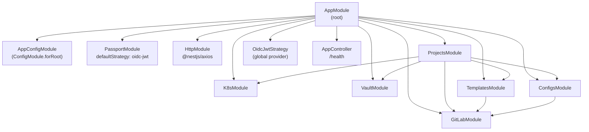
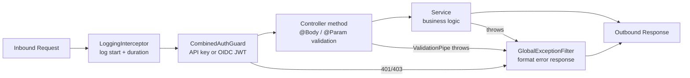

# Management API Internals

← [Back to Maintainer Guide](index.md)

The Management API is a NestJS 11 application located at `api/`. It is the orchestration layer of the platform — the service that talks to GitLab, MongoDB, OpenBao (Vault), and Kubernetes (k3d) on behalf of operators and CI/CD automation.

---

## Module tree



`HttpModule` is imported at the root level and is available to all feature modules because it is `@Global()` in NestJS or re-exported. Each service that needs HTTP calls injects `HttpService` from `@nestjs/axios`.

---

## Request lifecycle

Every inbound HTTP request passes through these layers in order:



### LoggingInterceptor (`api/src/common/interceptors/logging.interceptor.ts`)

Logs at `debug` level on entry (`--> METHOD /path`) and at `log` level on exit (`<-- METHOD /path 42ms`) using NestJS Logger with context `HTTP`.

### CombinedAuthGuard (`api/src/common/guards/combined-auth.guard.ts`)

Evaluates authentication in this order:

1. **API key check**: if `X-API-Key` header is present, compare it against the `apiKey` config value.
   - Match → allow.
   - Mismatch → throw `UnauthorizedException`.
2. **OIDC JWT check**: if `Authorization: Bearer <token>` is present and `oidc.issuerUrl` is configured, delegate to `AuthGuard('oidc-jwt')`.
   - Valid JWT → allow.
   - Invalid JWT → throw `UnauthorizedException`.
3. **Dev mode**: if neither `apiKey` nor `oidc.issuerUrl` is configured, allow all requests (log a warning). This state should never exist in production.
4. **Missing auth**: if auth mechanisms are configured but no credentials were supplied → `UnauthorizedException`.

### OidcJwtStrategy (`api/src/common/guards/oidc-jwt.strategy.ts`)

Passport strategy (`passport-jwt`, name `oidc-jwt`):
- **Algorithm**: RS256.
- **JWKS**: fetched from `oidc.jwksUrl` (the internal Keycloak endpoint: `http://keycloak:8080/realms/devops/protocol/openid-connect/certs`).
- **Issuer**: validated against `oidc.issuerUrl` (the external Keycloak URL: `https://auth.devops.yourdomain.com/realms/devops`).
- **Audience**: validated against `oidc.audience` (e.g. `management-api`).
- **`validate(payload)`**: maps `sub`, `preferred_username` → `username`, `email`, `realm_roles` → `roles`. Returns the user object attached to `request.user`.

The separation of JWKS URL (internal) from issuer URL (external) is intentional: the JWT `iss` claim contains the external URL, while the JWKS endpoint is resolved internally for performance and reliability.

### GlobalExceptionFilter (`api/src/common/filters/http-exception.filter.ts`)

Catches all unhandled exceptions. Returns a JSON body:

```json
{
  "statusCode": 500,
  "message": "Internal server error",
  "timestamp": "2026-04-13T00:00:00.000Z",
  "path": "/projects"
}
```

- `HttpException` subclasses use their own status code and message.
- All other errors → 500 + generic message (stack traces never exposed in responses).
- 5xx errors logged at `error` level with stack trace. 4xx logged at `warn` level.

### ValidationPipe

Applied globally in `main.ts`. Uses `class-validator` and `class-transformer`:
- `whitelist: true` — strips unknown properties.
- `forbidNonWhitelisted: true` — throws 400 on unknown properties.
- `transform: true` — auto-converts primitive types.

---

## Configuration (`api/src/config/configuration.ts`)

The `AppConfiguration` interface defines the entire config shape. Values are loaded from `process.env` at startup by the NestJS `ConfigModule`.

```typescript
interface AppConfiguration {
  port: number;          // API_PORT (default: 3000)
  host: string;          // API_HOST (default: 0.0.0.0)
  domain: string;        // DOMAIN (required)
  appsDomain: string;    // APPS_DOMAIN (default: apps.{DOMAIN})
  gitlabDomain: string;  // GITLAB_DOMAIN (default: gitlab.devops.{DOMAIN})
  apiKey?: string;       // API_KEY (optional)
  logLevel: string;      // LOG_LEVEL (default: info)
  gitlab: {
    url: string;               // GITLAB_URL (default: http://gitlab)
    token: string;             // GITLAB_ROOT_TOKEN (required)
    templateGroupId: number;   // GITLAB_TEMPLATE_GROUP_ID (required)
    configGroupId: number;     // GITLAB_CONFIG_GROUP_ID (required)
  };
  mongo: {
    url: string;               // MONGO_URL (default: mongodb://mongo:27017)
    dbName: string;            // MONGO_DB_NAME (default: platform)
  };
  vault: {
    url: string;               // VAULT_URL (default: http://vault:8200) — OpenBao instance
    token: string;             // VAULT_DEV_ROOT_TOKEN_ID (required)
  };
  kube: {
    apiUrl?: string;           // KUBE_API_INTERNAL_URL (optional)
    configDir: string;         // KUBECONFIG_DIR (default: /etc/dsoaas/kubeconfigs)
  };
  autoDevops: {
    pipelineProject: string;   // AUTO_DEVOPS_PIPELINE_PROJECT
    pipelineFile: string;      // AUTO_DEVOPS_PIPELINE_FILE
  };
  oidc: {
    issuerUrl?: string;        // OIDC_ISSUER_URL (optional)
    jwksUrl?: string;          // OIDC_JWKS_URL (optional)
    audience?: string;         // OIDC_AUDIENCE (optional)
  };
}
```

**Required variables** (will throw on startup if missing): `DOMAIN`, `GITLAB_ROOT_TOKEN`, `GITLAB_TEMPLATE_GROUP_ID`, `GITLAB_CONFIG_GROUP_ID`, `VAULT_DEV_ROOT_TOKEN_ID`.

---

## API endpoints

All endpoints are documented via Swagger at `GET /api/docs` (OpenAPI UI). The raw JSON spec is at `GET /api/docs-json`. The base path is `/`.

### AppController

| Method | Path | Auth | Description |
|---|---|---|---|
| `GET` | `/health` | None | Returns `{ status: 'ok' \| 'degraded', mongo: 'ok' \| 'down', vault: 'ok' \| 'down' }`. Used by Docker health checks and load balancers. |

---

### GraphQL (`POST /graphql`)

Primary interface for **project mutations** (create, delete, migrate, hostname overrides, audit queries, and related operations). The schema is **code-first** (see `api/src/projects/graphql/`). Authentication uses the same `CombinedAuthGuard` rules as REST (`X-API-Key` or `Authorization: Bearer`).

Input types such as `CreateProjectInput` and capability objects live in `api/src/projects/graphql/project.inputs.ts`. Provisioning writes the GitLab repo (fork or Auto DevOps path), seeds Vault, ensures Kubernetes namespaces where kubeconfigs exist, sets CI variables, and persists a `Project` document in MongoDB.

---

### ProjectsController (`/projects`) — REST read model

Auth: `CombinedAuthGuard` on all routes. Swagger security: `api-key`, `Bearer`.

| Method | Path | Status | Description |
|---|---|---|---|
| `GET` | `/projects` | 200 | Lists all projects from MongoDB as `ProjectResponseDto[]`. |
| `GET` | `/projects/:id` | 200 / 404 | Returns one project by MongoDB ObjectId (`ProjectResponseDto`). |
| `POST` | `/projects` | 410 | **Deprecated** — use GraphQL mutation `createProject`. Response body includes `graphqlEndpoint` and a `hint` with the mutation name. |
| `DELETE` | `/projects/:id` | 410 | **Deprecated** — use GraphQL mutation `deleteProject`. Same 410 payload shape as `POST`. |

---

### TemplatesController (`/templates`)

Auth: `CombinedAuthGuard`.

Templates are GitLab projects in the group identified by `GITLAB_TEMPLATE_GROUP_ID`. They serve as the source repositories for project forks.

| Method | Path | Body / Params | Response | Description |
|---|---|---|---|---|
| `GET` | `/templates` | — | `TemplateInfoDto[]` (200) | List all template projects. |
| `GET` | `/templates/:slug` | `slug` | `TemplateInfoDto` (200, 404) | Get template details including file tree. |
| `POST` | `/templates` | `CreateTemplateDto` | `TemplateInfoDto` (201, 409) | Create a new template project. |
| `DELETE` | `/templates/:slug` | `slug` | 204 | Delete a template project permanently. |

**`CreateTemplateDto`:**

| Field | Type | Required | Description |
|---|---|---|---|
| `slug` | `string` | Yes | Project path/slug. Must match `/^[a-z0-9-]+$/`. |
| `description` | `string` | No | Project description. |
| `files` | `Record<string, string>` | No | Map of `{ "path/to/file": "content" }` to seed the template repo. |

**`TemplateInfoDto`:**

| Field | Type | Description |
|---|---|---|
| `id` | `number` | GitLab project ID |
| `slug` | `string` | Project path |
| `name` | `string` | Project name |
| `description` | `string \| null` | Optional description |
| `gitlabUrl` | `string` | GitLab web URL |
| `defaultBranch` | `string` | Default branch name |
| `files` | `GitLabTreeItem[]` | Only present on `GET /:slug` (recursive tree) |

---

### ConfigsController (`/configs`)

Auth: `CombinedAuthGuard`.

Configs are GitLab projects in the group identified by `GITLAB_CONFIG_GROUP_ID`. Each config repo contains a `.gitlab-ci.yml` that defines reusable hidden CI job templates.

| Method | Path | Body / Params | Response | Description |
|---|---|---|---|---|
| `GET` | `/configs` | — | `ConfigInfoDto[]` (200) | List all config repos. |
| `GET` | `/configs/:slug` | `slug` | `ConfigInfoDto` (200, 404) | Get config repo details including file tree. |
| `POST` | `/configs` | `CreateConfigDto` | `ConfigInfoDto` (201, 409) | Create a new config repo. |
| `PUT` | `/configs/:slug/files` | `slug` + `UpdateConfigFilesDto` | 204 | Upsert a file in the config repo. |
| `DELETE` | `/configs/:slug` | `slug` | 204 | Delete a config repo permanently. |

**`CreateConfigDto`:**

| Field | Type | Required | Description |
|---|---|---|---|
| `slug` | `string` | Yes | Repo path/slug. |
| `description` | `string` | No | Description. |
| `ciContent` | `string` | Yes | Initial content for `.gitlab-ci.yml`. |

**`UpdateConfigFilesDto`:**

| Field | Type | Required | Description |
|---|---|---|---|
| `filePath` | `string` | Yes | Path to the file within the repo (e.g. `.gitlab-ci.yml`). |
| `content` | `string` | Yes | New file content. |
| `commitMessage` | `string` | No | Git commit message. |

---

## Service internals

### GitLabService (`api/src/gitlab/gitlab.service.ts`)

HTTP client for the GitLab REST API v4. Authenticates all requests with `PRIVATE-TOKEN: ${GITLAB_ROOT_TOKEN}`.

| Method | Signature | Description |
|---|---|---|
| `createGroupHierarchy` | `(groupPath: string[]) => Promise<number>` | Walks `groupPath` segments; finds or creates each group; returns leaf group ID. |
| `forkTemplate` | `(templateSlug, targetGroupId, projectName) => Promise<GitLabProject>` | Resolves the template in the templates group by slug, then forks it into `targetGroupId`. |
| `listProjects` | `(groupId?: number) => Promise<GitLabProject[]>` | Lists all projects in a group, or all accessible projects. `per_page=100`, `simple=true`. |
| `getProject` | `(projectId: number) => Promise<GitLabProject>` | GET `/projects/:id`. |
| `deleteProject` | `(projectId: number) => Promise<void>` | DELETE `/projects/:id`. |
| `triggerPipeline` | `(projectId, ref?) => Promise<void>` | POST `/projects/:id/pipeline` with `ref` (default `main`). |
| `createNewProject` | `(groupId, name, description?, readme?) => Promise<GitLabProject>` | Creates a new project with `visibility: internal`. |
| `getFileContent` | `(projectId, filePath, ref?) => Promise<string \| null>` | GET file, base64-decode. Returns `null` on 404. |
| `upsertFile` | `(projectId, filePath, content, message) => Promise<void>` | Creates or updates a file in the repo. |
| `getProjectTree` | `(projectId, path?, ref, recursive) => Promise<GitLabTreeItem[]>` | Lists repository tree. |

**`GitLabProject` shape** (key fields used internally):
```typescript
{
  id: number;
  name: string;
  path: string;
  path_with_namespace: string;
  web_url: string;
  default_branch: string;
}
```

---

### K8sService (`api/src/k8s/k8s.service.ts`)

Kubernetes clients (Core, Apps, Networking) loaded **per environment** (`dev`, `stg`, `prod`) from kubeconfig files under `kube.configDir`. Missing kubeconfigs are skipped with a warning so other environments keep working.

Used by `ProjectsService` for namespace checks, deployment status, and related cluster operations during provisioning and lifecycle management. See the service implementation for the full public method list.

---

### VaultService (`api/src/vault/vault.service.ts`)

HTTP client for the OpenBao KV v2 API. Authenticates with `X-Vault-Token` header.

| Method | Signature | Description |
|---|---|---|
| `writeSecrets` | `(path, secrets) => Promise<void>` | POST `/v1/secret/data/{path}` with `{ data: secrets }`. |
| `deleteSecrets` | `(path) => Promise<void>` | DELETE `/v1/secret/metadata/{path}` (deletes all versions). Logs warning and swallows errors. |

Secret paths follow the pattern `projects/{clientName}/{projectName}`.

---

## Swagger / OpenAPI

The Swagger UI is served at `GET /api/docs`. The raw JSON spec is at `GET /api/docs-json`.

All DTOs are decorated with `@ApiProperty()` from `@nestjs/swagger`. The spec includes security definitions for `api-key` (header) and `Bearer` (JWT).

To regenerate the spec after changes:
```bash
pnpm run build
node -e "require('./dist/main').generateSpec()"
```
(If a `generateSpec` export exists; othe