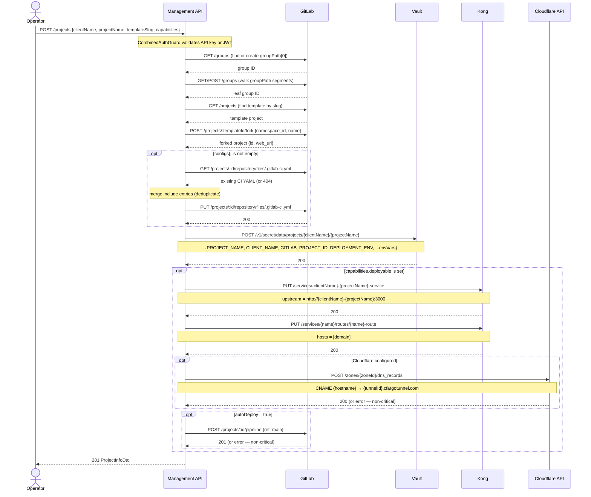
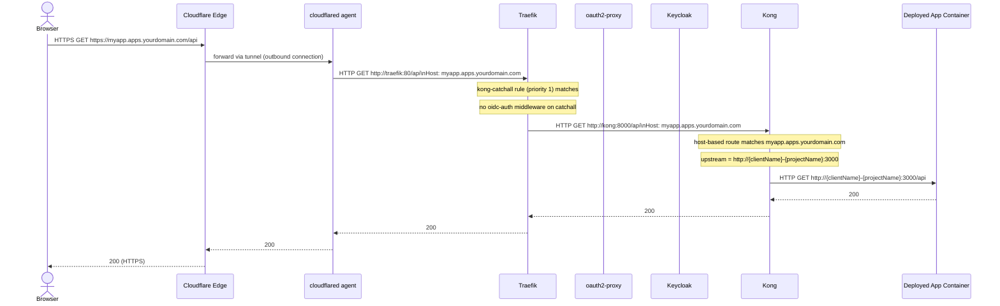
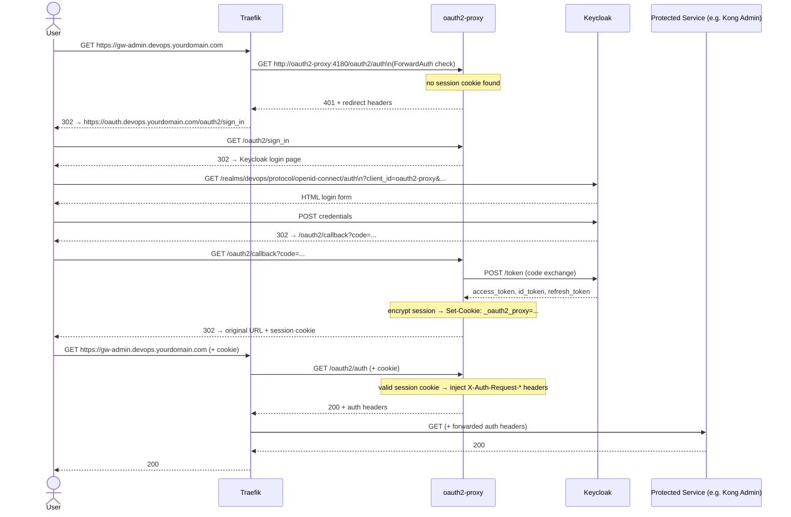
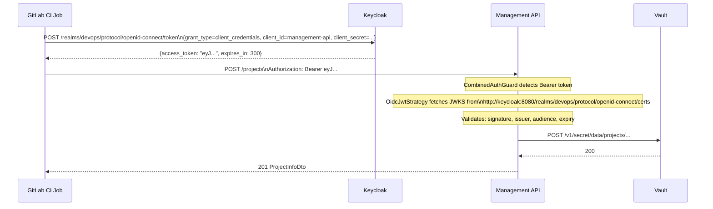
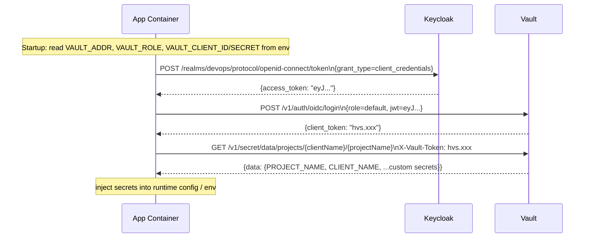
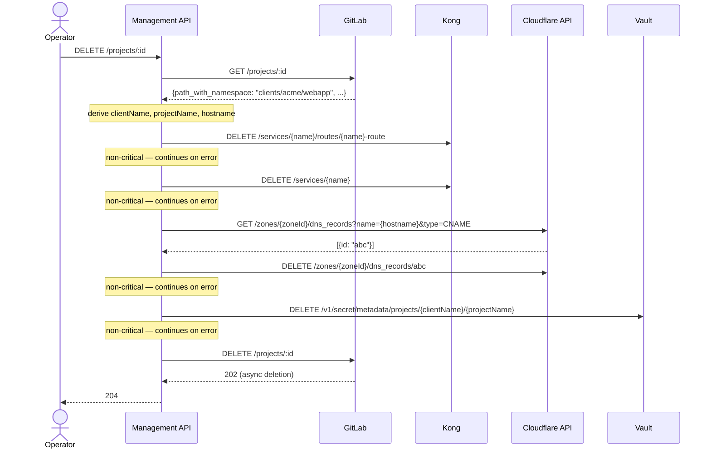

# Data Flows

This document traces the key runtime flows through the platform using sequence diagrams. Each flow shows the exact services involved, the protocol used, and what happens at each step.

---

## 1. Project provisioning (`POST /projects`)

This is the central flow of the platform. An operator (or automated system) calls the Management API to create a new project, which cascades into GitLab, Vault, Kong, and optionally Cloudflare.

**Key behaviors:**
- The group hierarchy walk is idempotent. If the group already exists, it is reused.
- The fork operation is not idempotent. If a project with the same name already exists in the group, GitLab returns 409 and the provisioning fails.
- Vault write is always performed regardless of capabilities.
- Cloudflare and pipeline trigger failures are logged as warnings and do not fail the overall request.

---

## 2. Inbound request routing (browser → deployed app)

How an HTTP request from a developer's browser reaches a deployed application.

**Notes:**
- The `kong-catchall` router does **not** have the `oidc-auth` middleware attached. Only the Traefik dashboard and Kong Admin routes are OIDC-protected. Deployed applications must implement their own authentication.
- TLS is terminated at the Cloudflare edge (CDN mode) or by Traefik (if using direct DNS). In both cases, internal traffic is plain HTTP.
- The deployed app container must be on the `devops-network` and use the naming convention `{clientName}-{projectName}` as the container name.

---

## 3. Authentication flow (browser → OIDC-protected service)

How a user authenticates to a platform service protected by the `oidc-auth` ForwardAuth middleware (e.g. Traefik dashboard, Kong Admin).

---

## 4. Management API JWT authentication flow

How a CI/CD pipeline or automated tool authenticates to the Management API using a Keycloak-issued JWT.

**Notes:**
- The `management-api` Keycloak client has service accounts enabled, allowing `client_credentials` grant.
- The JWT `iss` claim is the external issuer URL. The JWKS are fetched from the internal URL for efficiency. These two URLs can differ; the strategy is configured with both explicitly.
- Token TTL is 300 seconds by default (Keycloak default for access tokens). For long-running CI jobs, implement token refresh.

---

## 5. Vault secrets access from a deployed app

How an application container retrieves its secrets from Vault at runtime.

**Notes:**
- This flow requires the application to implement Vault OIDC authentication. The `nestjs-app` template does not include this by default; it would need to be added per project.
- The `vault-oidc-init` one-shot container configures the `oidc` auth method and creates the `default` role. Applications should bind to this role.
- If the project uses a simpler approach (e.g. GitLab CI injects secrets as masked variables before pipeline runs), the Vault OIDC flow is not needed at runtime.

---

## 6. Project deletion (`DELETE /projects/:id`)

**Note:** GitLab project deletion is asynchronous. The API returns 202 from GitLab and the Management API immediately returns 204. The actual deletion completes in the background. The Vault path deletion (`/metadata/`) removes all versions of the secret permanently.
