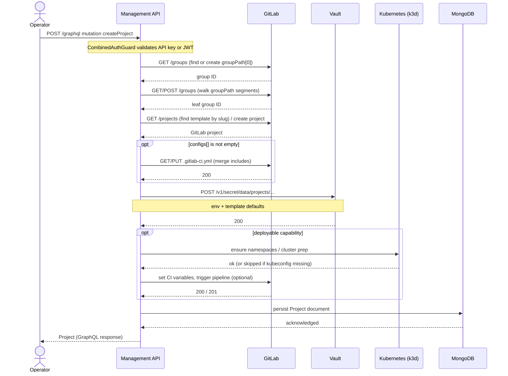
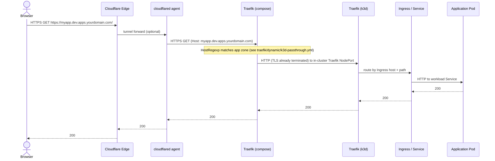
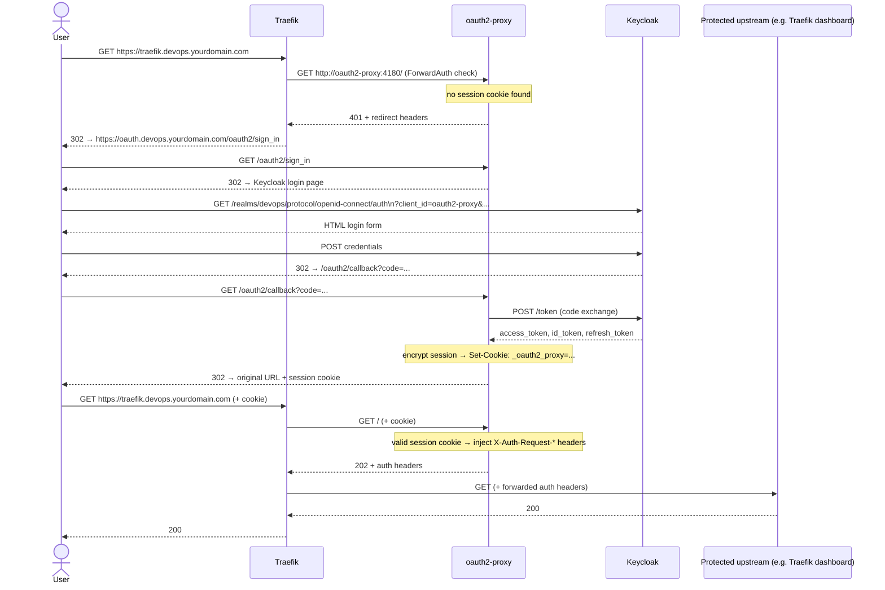
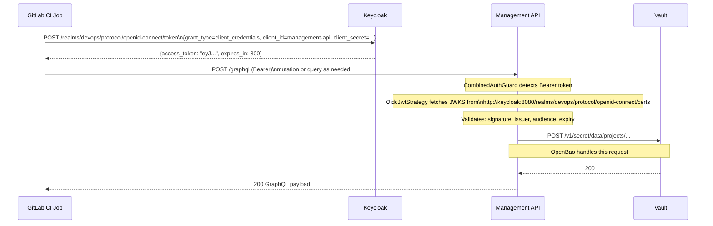
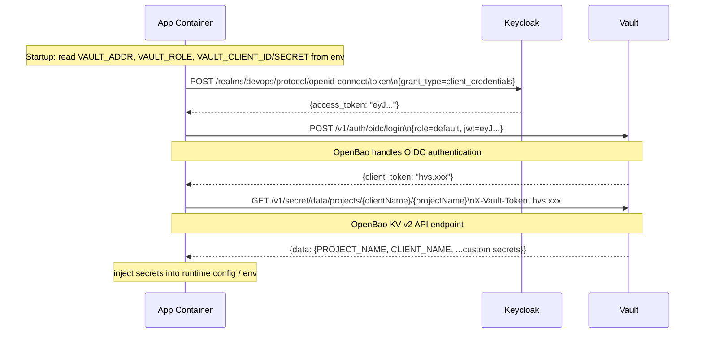
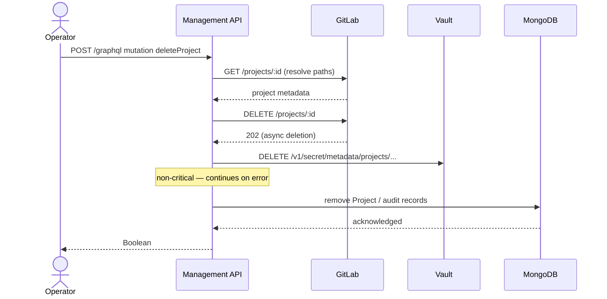

# Data Flows

← [Back to Maintainer Guide](index.md)

This document traces the key runtime flows through the platform using sequence diagrams. Each flow shows the exact services involved, the protocol used, and what happens at each step.

---

## 1. Project provisioning (GraphQL `createProject`)

This is the central flow of the platform. An operator (or automated system) calls the Management API via **`POST /graphql`** with the `createProject` mutation, which cascades into GitLab, OpenBao (Vault), Kubernetes (k3d), and MongoDB.

**Key behaviors:**
- The group hierarchy walk is idempotent. If the group already exists, it is reused.
- GitLab project creation or fork must succeed; duplicate names in the same namespace still fail with GitLab `409`.
- Vault write is always performed for the project secret path.
- Kubernetes steps degrade gracefully when an environment's kubeconfig is absent.

---

## 2. Inbound request routing (browser → deployed app on k3d)

How an HTTPS request reaches an application pod when using the **outer Traefik → k3d passthrough → inner Traefik → Ingress** path.

**Notes:**
- App-zone routers generally do **not** attach `oidc-auth@file`; applications implement their own auth. Operator tools (Traefik dashboard, MinIO console, etc.) attach ForwardAuth via Docker labels.
- When not using Cloudflare Tunnel, traffic can reach Traefik directly on `10443` with the same Host-based routing model.
- Inner routing is standard Kubernetes; the platform CI templates produce the Ingress and Helm release.

---

## 3. Authentication flow (browser → OIDC-protected operator UI)

How a user authenticates to a platform surface protected by the `oidc-auth` ForwardAuth middleware (for example the Traefik dashboard).

---

## 4. Management API JWT authentication flow

How a CI/CD pipeline or automated tool authenticates to the Management API using a Keycloak-issued JWT.

**Notes:**
- The `management-api` Keycloak client has service accounts enabled, allowing `client_credentials` grant.
- The JWT `iss` claim is the external issuer URL. The JWKS are fetched from the internal URL for efficiency. These two URLs can differ; the strategy is configured with both explicitly.
- Token TTL is 300 seconds by default (Keycloak default for access tokens). For long-running CI jobs, implement token refresh.

---

## 5. OpenBao secrets access from a deployed app

How an application container retrieves its secrets from OpenBao at runtime.

**Notes:**
- This flow requires the application to implement OpenBao OIDC authentication. The `nestjs-app` template does not include this by default; it would need to be added per project.
- The `vault-oidc-init` one-shot container configures the `oidc` auth method and creates the `default` role. Applications should bind to this role.
- If the project uses a simpler approach (e.g. GitLab CI injects secrets as masked variables before pipeline runs), the OpenBao OIDC flow is not needed at runtime.

---

## 6. Project deletion (GraphQL `deleteProject`)

**Note:** GitLab project deletion is asynchronous. The API receives `202` from GitLab while MongoDB and Vault cleanup are attempted in the service implementation; callers should treat the mutation as logically complete once the API returns.

---