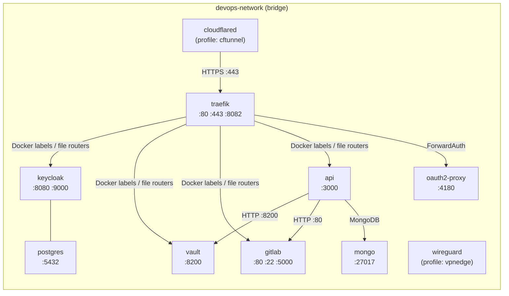
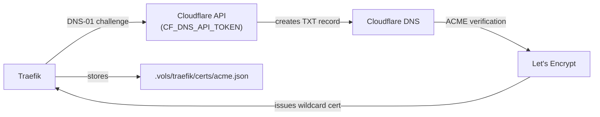
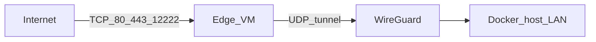

# Networking

← [Back to Maintainer Guide](index.md)

This document covers the Docker network topology, Traefik static and dynamic configuration (Docker provider + file provider), k3d application ingress, and the DNS/domain strategy.

---

## Docker network topology

All services share a single Docker bridge network. The network name is driven by `${DOCKER_NETWORK}` (default: `devops-network`).



**Host-exposed ports** (for local management, not public):

| Port | Service | Purpose |
|---|---|---|
| `10080` | traefik | HTTP (redirects to HTTPS) |
| `10443` | traefik | HTTPS entry |
| `18080` | traefik | Dashboard (no TLS on host) |
| `15433` | postgres | PostgreSQL (Keycloak + Sonar databases) |
| `18200` | vault | API |
| `12222` | gitlab | SSH |
| `13000` | api | Management API |

---

## DNS and domain naming conventions

All service domains follow the pattern `<service>.devops.<DOMAIN>`. Deployed application hostnames use the app zones routed by **`traefik/dynamic/k3d-passthrough.yml`** into the k3d cluster (for example `*.dev.apps.<DOMAIN>`, `*.stg.apps.<DOMAIN>`, `*.apps.<DOMAIN>`).

```
*.devops.<DOMAIN>
  ├── traefik.devops.<DOMAIN>        → Traefik dashboard
  ├── auth.devops.<DOMAIN>           → Keycloak
  ├── vault.devops.<DOMAIN>          → Vault UI
  ├── gitlab.devops.<DOMAIN>         → GitLab
  ├── registry.devops.<DOMAIN>       → GitLab container registry
  ├── api.devops.<DOMAIN>            → Management API
  └── oauth.devops.<DOMAIN>          → oauth2-proxy (callback / auth)

*.dev.apps.<DOMAIN>                  → k3d / dev Ingress (via Traefik passthrough)
*.stg.apps.<DOMAIN>                  → k3d / staging Ingress
*.apps.<DOMAIN>                      → k3d / prod Ingress
```

**Network aliases strategy:** Every service's public domain is added as an alias on `devops-network` in `docker-compose.yml`. This means that when the Management API or any internal service resolves `auth.devops.yourdomain.com`, Docker's built-in DNS returns Traefik's internal IP directly — no round-trip through the public internet.

```yaml
# Example from docker-compose.yml (traefik service networks block)
networks:
  devops-network:
    aliases:
      - ${KEYCLOAK_DOMAIN}     # auth.devops.yourdomain.com
      - ${VAULT_DOMAIN}        # vault.devops.yourdomain.com
      - ${GITLAB_DOMAIN}       # gitlab.devops.yourdomain.com
      # ... etc
```

All aliases are attached to the `traefik` service, which acts as the single ingress point. Internal services that talk to each other directly use their Docker service names (e.g. `http://keycloak:8080`), not their public domains.

---

## Traefik configuration

### Static configuration (`traefik/traefik.yml` — template)

The file on disk is a **template** with `__DOMAIN__` and `__ACME_EMAIL__` placeholders. The Traefik container's entrypoint runs `sed` to substitute these values from environment variables before starting Traefik.

```yaml
api:
  dashboard: true
  insecure: true    # dashboard served on :8080 without TLS internally

ping:
  entryPoint: ping  # :8082/ping used for health checks

entryPoints:
  web:
    address: ":80"
    http:
      redirections:
        entryPoint:
          to: websecure
          scheme: https
          permanent: true

  websecure:
    address: ":443"
    http:
      tls:
        certResolver: letsencrypt
        domains:
          - main: "devops.__DOMAIN__"        # e.g. devops.yourdomain.com
            sans:
              - "*.devops.__DOMAIN__"        # e.g. *.devops.yourdomain.com

certificatesResolvers:
  letsencrypt:
    acme:
      email: "__ACME_EMAIL__"
      storage: /etc/traefik/certs/acme.json
      dnsChallenge:
        provider: cloudflare
        propagation:
          delayBeforeChecks: 60     # wait 60s for DNS propagation
        resolvers:
          - "1.1.1.1:53"
          - "1.0.0.1:53"

providers:
  docker:
    endpoint: "unix:///var/run/docker.sock"
    exposedByDefault: false
    network: devops-network   # only use this network for routing
    watch: true
  file:
    directory: /etc/traefik/dynamic
    watch: true

log:
  level: INFO
  format: json

accessLog:
  format: json
  filters:
    statusCodes:
      - "400-599"   # only log errors
```

**Why a template?** Traefik's environment variable override mechanism can only modify existing YAML keys — it cannot create new nested structures like `domains[0].main`. The `sed` approach ensures the TLS domains and email are always correctly embedded in the YAML structure.

### Dynamic configuration (file provider)

Traefik merges every `*.yml` from `traefik/dynamic/` after the container entrypoint substitutes `__DOMAIN__` / `__ACME_EMAIL__`.

**`traefik/dynamic/forward-auth.yml`** — shared `oidc-auth` ForwardAuth middleware used by Docker labels (Traefik dashboard, MinIO console, and other protected operator surfaces):

```yaml
http:
  middlewares:
    oidc-auth:
      forwardAuth:
        address: "http://oauth2-proxy:4180/"
        trustForwardHeader: true
        authResponseHeaders:
          - "X-Auth-Request-User"
          - "X-Auth-Request-Email"
          - "X-Auth-Request-Access-Token"
```

**`traefik/dynamic/k3d-passthrough.yml`** — `HostRegexp` routers for `*.dev.apps`, `*.stg.apps`, and `*.apps` hostnames forwarding to the in-cluster Traefik entrypoint. Workloads inside k3d use Kubernetes Ingress (and Helm releases) for HTTP routing.

### Docker label routing (defined per-service in `docker-compose.yml`)

Per-hostname routes use `traefik.*` labels on the backing containers. Typical fields: `traefik.enable`, `Host(\`…\`)` rules, `websecure`, `letsencrypt`, and the container `loadbalancer.server.port`.

**Traefik dashboard** attaches `oidc-auth@file` from the file provider plus a small redirect middleware to land users on `/dashboard/`.

**Router overlap:** File-provider routes (for example k3d passthrough) set explicit `priority` so app-zone hostnames win over broader rules. When you add routers, align priorities with existing entries in the same dynamic files.

---

## Application traffic (compose → k3d)

Public operator tools terminate TLS at the compose Traefik instance and reach containers via Docker routing. Application zones (`*.dev.apps`, `*.stg.apps`, `*.apps`) are forwarded into the k3d cluster; inner Traefik and Ingress objects route to pods. Provisioning is performed by the Management API together with GitLab CI — there is no separate API gateway service in this compose stack.

---

## TLS certificate lifecycle



- Certificate covers `devops.<DOMAIN>` (main) + `*.devops.<DOMAIN>` (SAN).
- Renewal is automatic (Traefik handles it ~30 days before expiry).
- The `acme.json` file persists across container restarts via the volume mount.
- On Windows Docker, `chmod 600` doesn't persist on bind mounts — the Traefik entrypoint re-applies it on every start.
- Traefik waits 60 seconds (`propagation.delayBeforeChecks`) after creating the DNS TXT record before asking Let's Encrypt to verify.
- If you change the domain or want to force renewal, delete `acme.json` and restart Traefik.
- `CF_DNS_API_TOKEN` requires `Zone:DNS:Edit` + `Zone:Zone:Read` permissions on the target zone.

---

## Cloudflare Tunnel routing

The `cloudflared` service is **profile-gated** — it only starts when you use `docker compose --profile cftunnel up -d`. The tunnel routing table is configured in the **Cloudflare Zero Trust dashboard** (Networks → Tunnels), not in any file in this repository. The typical configuration:

| Public hostname | Path | Origin service | TLS settings |
|---|---|---|---|
| `*.devops.yourdomain.com` | — | `https://traefik:443` | No TLS Verify |
| `*.apps.yourdomain.com` | — | `https://traefik:443` | No TLS Verify |

"No TLS Verify" is required because Traefik's certificate is issued for the public domain, and the tunnel connects via the Docker internal DNS name (`traefik`), which doesn't match the certificate subject.

All hostnames are routed to Traefik, which dispatches to the correct upstream containers or k3d passthrough routers.

The `cloudflared` container connects to Cloudflare's edge using the `TUNNEL_TOKEN` and then forwards traffic for each configured public hostname to the origin you set in the Zero Trust dashboard (typically `https://traefik:443`).

---

## Public ingress modes (Compose profiles)

| Mode | When to use | Command |
|------|-------------|---------|
| **Direct** | Your network exposes host ports `10080` / `10443` (and optionally others) to the internet | `docker compose up -d` |
| **Cloudflare Tunnel** | You use Cloudflare Tunnel for ingress (dashboard routing) | `docker compose --profile cftunnel up -d` |
| **VPN edge** | Home ISP blocks inbound `80`/`443`; a cloud VM terminates TCP and forwards over WireGuard to this stack | `docker compose --profile vpnedge up -d` |

Do not use **`cftunnel`** and **`vpnedge`** for the **same** public DNS names at the same time unless you intentionally split hostnames; pick one path per domain.

---

## VPN edge ingress (WireGuard)

Use this when a **cloud edge VM** (for example Ubuntu on GCP) holds your public IP and listeners on **TCP 80, 443, 12222**, while the stack stays at home behind CGNAT or an ISP that blocks inbound HTTP(S).

**Pieces:**

1. **Home:** `wireguard` service (`lscr.io/linuxserver/wireguard`), profile **`vpnedge`**, UDP `${WIREGUARD_SERVER_PORT:-51820}` published to the host. Config and generated peer files live under **`.vols/wireguard/`** (e.g. `peer_edge/peer_edge.conf`).
2. **Home router:** Forward **UDP** `51820` (or your chosen port) to the machine that runs Docker (on **Docker Desktop + WSL2**, you may also need Windows / WSL port forwarding so the packet reaches the listener).
3. **Edge VM:** Install **`wireguard-tools`** and **`nftables`**. Copy `peer_edge.conf` from the home volume to `/etc/wireguard/wg0.conf` (or merge keys with `edge/vpn-edge/wg0.client.conf.sample`). Enable **`net.ipv4.ip_forward=1`** (see `edge/vpn-edge/sysctl-ip-forward.conf`). Run `wg-quick up wg0`.
4. **Edge NAT:** From the repo, use **`edge/vpn-edge/apply-nat.sh`** with a **`forward-ports.env`** derived from **`edge/vpn-edge/forward-ports.sample.env`**. Set **`HOME_TRAFFIC_IP`** to the **IPv4 of the Docker host on the LAN** where Traefik publishes **`10080`/`10443`** and GitLab SSH **`12222`**. The script DNATs public ports to that IP and SNATs out **`wg0`** so return traffic works. Traefik and GitLab will see the **edge’s WireGuard IP** as the client address (double SNAT: internet → edge → tunnel).

**Default TCP map (edge public → home host port):** `80→10080`, `443→10443`, `12222→12222`. Add more `public:dest` pairs in **`FORWARD_TCP`** if you expose extra services.

**Git over SSH:** Use port **12222** on the edge as well (do not steal **TCP 22** on the edge VM unless you move admin `sshd` to another port). Example: `ssh -p 12222 git@<GITLAB_DOMAIN>`.

**Split tunnel / `AllowedIPs`:** The compose defaults set **`WIREGUARD_PEER_ALLOWEDIPS`** so the edge peer can reach RFC1918 ranges and the VPN subnet; adjust if your home LAN uses only one `/24`. **`WIREGUARD_SERVER_URL`** should be your home public IP or DDNS (passed through to the image as **`SERVERURL`**).

**DNS:** While using **vpnedge**, point **`A`/`AAAA`** records for `*.devops.<DOMAIN>`, `*.apps.<DOMAIN>`, and related names to the **edge VM’s public IP**, not your home IP. **Let’s Encrypt** can stay on **DNS-01** via Cloudflare (`CF_DNS_API_TOKEN`); HTTP reachability to home is not required for issuance.

**Cloud firewall (example GCP):** Allow **inbound** **TCP 80, 443, 12222** (and any extra ports you added). Allow **outbound UDP** to home **`51820`**.

**Home-side hardening (ideal):** Allow **TCP 10080, 10443, 12222** only from the **WireGuard subnet** (e.g. `10.8.0.0/24`) on the Docker host firewall, not from the public WAN. On Windows this is often **Windows Defender Firewall** advanced rules; exact steps depend on your layout.

**Docker Desktop + WSL2:** If inbound UDP to the `wireguard` container fails, run **WireGuard in the WSL2 distro** that backs Docker, reuse the same keys/subnet from `.vols/wireguard`, and forward UDP from the router to the WSL IP.

**Reusable edge kit:** All edge scripts and samples live under **`edge/vpn-edge/`** so you can reprovision another VM or cloud provider with the same steps.

### Edge VM bootstrap (fresh Ubuntu)

Assume a new cloud VM (e.g. Ubuntu on GCP) and that **VPC firewall** already allows **inbound TCP 80, 443, 12222** and **outbound UDP** to your home **`51820`**. Replace `EDGE_USER`, `EDGE_HOST`, and paths as needed.

**1. Packages and IP forwarding**

```bash
sudo apt-get update
sudo apt-get install -y wireguard wireguard-tools nftables iproute2
```

Install the sysctl drop-in from the repo (or create the same file manually):

```bash
# If you cloned the repo on the edge:
sudo install -m 644 edge/vpn-edge/sysctl-ip-forward.conf /etc/sysctl.d/99-vpn-edge-ip-forward.conf
sudo sysctl --system
```

Equivalent one-liner if you only have the file contents:

```bash
echo 'net.ipv4.ip_forward = 1' | sudo tee /etc/sysctl.d/99-vpn-edge-ip-forward.conf
sudo sysctl --system
```

**2. Copy the kit and WireGuard client config from your workstation**

On the machine where the repo lives (after `docker compose --profile vpnedge up -d` has generated keys):

```bash
scp -r edge/vpn-edge/ EDGE_USER@EDGE_HOST:~/vpn-edge/
scp .vols/wireguard/peer_edge/peer_edge.conf EDGE_USER@EDGE_HOST:/tmp/wg0.conf
```

**3. On the edge: install config, env, and NAT script**

```bash
sudo install -m 600 /tmp/wg0.conf /etc/wireguard/wg0.conf
chmod +x ~/vpn-edge/apply-nat.sh
cp ~/vpn-edge/forward-ports.sample.env ~/vpn-edge/forward-ports.env
# Edit HOME_TRAFFIC_IP (Docker host LAN IP); set WAN_IFACE / WG_IFACE only if detection fails
nano ~/vpn-edge/forward-ports.env
```

**4. Bring up WireGuard and apply nftables**

```bash
sudo wg-quick up wg0
sudo ~/vpn-edge/apply-nat.sh apply ~/vpn-edge/forward-ports.env
```

**5. Verify**

```bash
sudo wg show
sudo nft list table ip vpnedge
```

**6. Persistence across reboots (edge VM)**

**WireGuard client (`wg0`):**

```bash
sudo systemctl enable wg-quick@wg0
sudo systemctl start wg-quick@wg0
```

Requires a valid **`/etc/wireguard/wg0.conf`** (from `peer_edge.conf`).

**nftables NAT (`apply-nat.sh`):** rules are **not** saved automatically. Use the **systemd** unit in the repo so NAT is reapplied **after** `wg0` is up on every boot.

From the repo directory on the edge (or copy `edge/vpn-edge/systemd/` onto the VM):

```bash
cd ~/vpn-edge/systemd
sudo chmod +x install.sh
sudo ./install.sh
sudo nano /etc/default/vpn-edge-nat
# Set VPN_EDGE_APPLY_SCRIPT and VPN_EDGE_ENV_FILE to absolute paths (no ~).
sudo systemctl daemon-reload
sudo systemctl enable --now wg-quick@wg0.service vpn-edge-nat.service
```

Verify:

```bash
systemctl status wg-quick@wg0.service vpn-edge-nat.service
sudo nft list table ip vpnedge
```

**Unit files:** [`edge/vpn-edge/systemd/vpn-edge-nat.service`](../../edge/vpn-edge/systemd/vpn-edge-nat.service), [`edge/vpn-edge/systemd/vpn-edge-nat.default.sample`](../../edge/vpn-edge/systemd/vpn-edge-nat.default.sample), [`edge/vpn-edge/systemd/install.sh`](../../edge/vpn-edge/systemd/install.sh).

**Spot / preemptible VMs:** A **new** instance may get a **new public IP** unless you use a **static external IP**. Update **DNS A records** to the new address after recreation. Reinstall **`/etc/wireguard/wg0.conf`** and **`forward-ports.env`** (or keep them on a **persistent disk** / config management).

### GCP load balancer (passthrough) in front of the edge VM

Inbound traffic from a Google **External passthrough Network Load Balancer** still hits the edge VM’s **primary NIC** (same path as direct access). **WireGuard `AllowedIPs` on the edge client does not block** those inbound connections — that knob only affects **what you route through the tunnel outbound**.

**1. VPC firewall — health check probers (required)**  
Google’s probes use **`35.191.0.0/16`** and **`130.211.0.0/22`**. Without **ingress allow** rules to your backend **tag** (and **ports** used by the health check), backends stay **unhealthy** and the LB sends no traffic. See [Health check concepts — probe IP ranges](https://cloud.google.com/load-balancing/docs/health-check-concepts#ip-ranges) and [Firewall rules for health checks](https://cloud.google.com/load-balancing/docs/health-checks#fw-rule). Restrict to the **exact probe ports** your health check uses.

**2. HTTP(S) health checks vs redirects**  
For **HTTP**, **HTTPS**, or **HTTP/2** health checks, Google treats **any response other than `200 OK` as unhealthy**, including **`301`/`302` redirects**. Traefik and many apps redirect `/` — so the LB marks the backend **unhealthy** even when the app “works.” Prefer a **TCP** or **SSL** health check on **`443`** (or the serving port) if you only need connectivity, or point an **HTTP** health check at a path that returns **200** (e.g. a small static endpoint).

**3. `apply-nat.sh` / `WAN_IFACE`**  
Rules match **`iifname $WAN`**. If the LB or a **second NIC** changes which interface receives traffic, re-detect the default route interface and set **`WAN_IFACE`** in **`forward-ports.env`**, then re-run **`apply-nat.sh apply`**.

**4. Home WireGuard server — narrow `[Peer] AllowedIPs` for the edge**  
On the **home** `wireguard` container, the **`[Peer]`** entry for the edge should **not** use **`0.0.0.0/0`** unless you intentionally want the **server** to treat the entire internet as reachable **via that peer** (it breaks normal routing). Use the edge’s tunnel address only (e.g. **`10.8.0.2/32`**) plus any **LAN CIDRs** you route over the tunnel (see linuxserver **`SERVER_ALLOWEDIPS_PEER_*`** / templates). Regenerate or edit **`wg0.conf`** and restart the **`wireguard`** service after changes.

**Home PC:** Docker Compose services use **`restart: unless-stopped`**; after reboot, start **Docker Desktop** (and WSL2 if you use it), then confirm **`docker compose --profile vpnedge ps`** shows **`wireguard`** running. Your **router** UDP **51820** forward is unchanged.

### VPN edge troubleshooting (e.g. HTTP 503)

**503 means something spoke HTTP** (often Traefik) but treated the request as “no healthy backend” or “service unavailable.” The tunnel can be “up” for WireGuard while **TCP to `HOME_TRAFFIC_IP:10443` still fails** or backends are unhealthy.

1. **Confirm the tunnel actually carries data** — On both sides, `sudo wg show` should show **`latest handshake: …` (recent)** and **`transfer`** bytes **increasing** when you load a page. If handshake is missing or **rx/tx stay at 0**, fix routing / firewall first (GCP rules, home UDP `51820`, `HOME_TRAFFIC_IP`, `AllowedIPs`).

2. **Use the correct `HOME_TRAFFIC_IP` (Docker Desktop + WSL2)** — Prefer the **WSL2 instance’s primary IPv4** (where Docker listens), not only the Windows Wi‑Fi/LAN address:
   - In WSL: `hostname -I` or `ip -4 route get 1.1.1.1 | awk '{print $7; exit}'`
   - That address is usually inside **`172.16.0.0/12`**, which is already covered by the default **`WIREGUARD_PEER_ALLOWEDIPS`** in Compose. Put **that** IP in **`forward-ports.env`** on the edge, re-run **`apply-nat.sh apply`**.

3. **IP forwarding in the WireGuard container** — The `wireguard` Compose service sets **`net.ipv4.ip_forward=1`** so decrypted traffic can be forwarded from **`wg0`** toward the Docker host. After changing Compose, run **`docker compose --profile vpnedge up -d`** again.

4. **Isolate HTTP vs VPN** — On the **home** host (same machine as Docker):
   ```bash
   curl -vk https://127.0.0.1:10443/ -H "Host: YOUR_REAL_HOSTNAME"
   ```
   If this already returns **503**, fix **Traefik / upstream health** (`docker compose ps`, `docker logs traefik`, inner ingress logs), not the edge.

5. **From the edge VM** (after `wg0` is up), reach Traefik through the tunnel:
   ```bash
   curl -vk "https://${HOME_TRAFFIC_IP}:10443/" -H "Host: YOUR_REAL_HOSTNAME"
   ```
   Use a hostname that matches a Traefik route (e.g. `gitlab.devops.example.com`). If this fails with timeout or TLS errors but step 4 works, the problem is **VPN path or `HOME_TRAFFIC_IP`**. If this returns **503** as well, the problem is **application health** (same as step 4).

6. **Optional: MTU** — Rarely, WireGuard MTU causes odd TLS or large-response failures. If small `curl` works but browsers fail, try lowering MTU on the edge **`[Interface]`** (e.g. `MTU = 1280`) and restart `wg-quick`.



### Intermittent failures on stacked-VPN clients (ProtonVPN, etc.)

**Symptoms:**

- Some clients (typically those routed through a consumer VPN like ProtonVPN) fail to load pages while normal clients succeed.
- The tunnel itself is healthy: `sudo wg show` on the edge has a recent handshake with `transfer` counters growing, and `sudo conntrack -L -p tcp` on the edge shows `ESTABLISHED [ASSURED]` entries for working users on the same `dport=443` path.
- For affected browsers, SYN/SYN-ACK and small responses complete, but pages with large TLS handshakes or large bodies (e.g. the GitLab sign-in page) stall or render half-loaded.

**Cause:** stacked VPN tunnels (the client's VPN wrapped around this WireGuard tunnel) reduce the effective TCP MSS. If any hop between the client and the edge filters ICMP `Type 3 Code 4` ("fragmentation needed"), Path-MTU Discovery silently fails for those paths only — which presents as "intermittent / some users".

**Fix (already in `edge/vpn-edge/apply-nat.sh`):** bidirectional TCP MSS clamping on the edge's forward chain, ordered **before** the ACCEPT rules so nftables' first-`accept`-wins semantics still allow the modification to apply. After `apply-nat.sh` runs, the table looks like:

```nft
table ip vpnedge {
    chain forward {
        type filter hook forward priority filter; policy drop;
        oifname "wg0" tcp flags syn / syn,rst counter tcp option maxseg size set rt mtu
        iifname "wg0" tcp flags syn / syn,rst counter tcp option maxseg size set rt mtu
        iifname "ens4" oifname "wg0" accept
        iifname "wg0" oifname "ens4" ct state established,related accept
    }
    ...
}
```

**Verification:**

```bash
sudo nft list table ip vpnedge | grep -E "maxseg|counter"
```

Expected: two rules, both with their `counter` field incrementing within a few seconds of any new TCP flow over the tunnel.

If you have an existing edge VM that was provisioned before these rules existed, just re-run the kit:

```bash
sudo ~/vpn-edge/apply-nat.sh apply ~/vpn-edge/forward-ports.env
```

**Browser test (do this on the affected client VPN):**

1. Small response: open `https://traefik.devops.<DOMAIN>/dashboard/` (after login if required). You should get a definite HTTP response quickly.
2. Large response: open `https://gitlab.devops.<DOMAIN>/`. The full GitLab sign-in page should render to completion.

If (1) works but (2) still stalls, the residual is the home-side `wg0` MTU; see the next section.

### Home `wireguard` container — healthy state reference

A correctly-running home `wireguard` service (LinuxServer image, server mode driven by `PEERS: edge` in `docker-compose.yml`) requires **no additional configuration beyond what `sample.env` already provides**. The auto-generated `wg0.conf` under `.vols/wireguard/wg_confs/wg0.conf` already includes the canonical `PostUp` rule that masquerades decrypted tunnel traffic onto the Docker bridge so Traefik on `HOME_TRAFFIC_IP` sees the container's `eth0` address as the source — which is what makes return packets land back in the container's network namespace where the tunnel can pick them up.

Verify on a deployed home host with `docker exec` (no shell session required):

```bash
docker exec wireguard sh -c "cat /config/wg_confs/wg0.conf" | head -15
docker exec wireguard iptables -t nat -L POSTROUTING -nv
docker exec wireguard iptables -L FORWARD -nv
docker exec wireguard ip -4 addr show wg0
```

Expected (private keys redacted):

```
[Interface]
Address = 10.8.0.1
ListenPort = 51820
PrivateKey = <…>
PostUp = iptables -A FORWARD -i %i -j ACCEPT; iptables -A FORWARD -o %i -j ACCEPT; iptables -t nat -A POSTROUTING -o eth+ -j MASQUERADE
PostDown = iptables -D FORWARD -i %i -j ACCEPT; iptables -D FORWARD -o %i -j ACCEPT; iptables -t nat -D POSTROUTING -o eth+ -j MASQUERADE

[Peer]
# peer_edge
PublicKey = <…>
PresharedKey = <…>
AllowedIPs = 10.8.0.2/32
PersistentKeepalive = 25
```

```
Chain POSTROUTING (policy ACCEPT 0 packets, 0 bytes)
 pkts bytes target     prot opt in     out     source               destination
 <pkts> <bytes> MASQUERADE  all  --  *      eth+    0.0.0.0/0            0.0.0.0/0
```

```
Chain FORWARD (policy ACCEPT 0 packets, 0 bytes)
 pkts bytes target     prot opt in     out     source               destination
 <pkts> <bytes> ACCEPT     all  --  wg0    *       0.0.0.0/0            0.0.0.0/0
 <pkts> <bytes> ACCEPT     all  --  *      wg0     0.0.0.0/0            0.0.0.0/0
```

```
4: wg0: <POINTOPOINT,NOARP,UP,LOWER_UP> mtu 1420 …
    inet 10.8.0.1/32 scope global wg0
```

If the `MASQUERADE` rule is missing or its counter stays at 0 while `wg0` is seeing traffic, the image's `PostUp` didn't take effect — usually a host-kernel `iptables` module issue. Fixes, in order of preference:

1. Confirm `cap_add: [NET_ADMIN, SYS_MODULE]` is present on the `wireguard` service in `docker-compose.yml` (it is by default).
2. On hosts where the `xt_MASQUERADE` / `nf_nat` modules aren't auto-loaded inside the container, mount the host's modules: add `/lib/modules:/lib/modules:ro` to the `wireguard` service `volumes` and `docker compose --profile vpnedge up -d wireguard`.
3. Recreate the container so `PostUp` re-runs cleanly: `docker compose --profile vpnedge up -d --force-recreate wireguard`.

**Common misdiagnosis to avoid:** an analysis that points at the home container's routing table (specifically the route `10.8.0.2 dev wg0 scope link`) and concludes "the container only knows its own wg0 IP" is reading the route backwards. That entry is the route to the **edge peer**, auto-added by `wg-quick` from the peer's `AllowedIPs = 10.8.0.2/32`. The container's own wg0 address is **`10.8.0.1`** (server side), as shown by the `ip -4 addr show wg0` step above. Symmetric routing is fine; if return traffic is being lost, the cause is almost always MSS/MTU (previous section) or peer `AllowedIPs` (next section), not the routing table inside the container.

### Home `wireguard` container — adjusting `wg0` MTU

Only do this if the bidirectional MSS clamp on the edge (`apply-nat.sh`) plus the browser verification above still shows stalls on stacked-VPN clients.

The LinuxServer image's `/config/templates/server.conf` is the source-of-truth template for the auto-generated `wg0.conf`. Lower the `MTU` there and force a regeneration:

```bash
docker exec wireguard sh -c '
  cp /config/templates/server.conf /config/templates/server.conf.bak
  if grep -q "^MTU =" /config/templates/server.conf; then
    sed -i "s/^MTU = .*/MTU = 1280/" /config/templates/server.conf
  else
    sed -i "/^Address =/a MTU = 1280" /config/templates/server.conf
  fi
  rm -f /config/.donoteditthisfile
'
docker compose --profile vpnedge up -d --force-recreate wireguard
```

Verify:

```bash
docker exec wireguard ip -4 addr show wg0 | grep -o 'mtu [0-9]\+'
docker exec wireguard grep -i mtu /config/wg_confs/wg0.conf
```

Re-run the browser test from the previous section. If stalls persist even with `MTU 1280` on both sides, the residual is almost certainly **not** MTU-related — look at the affected client's VPN provider blocking specific ports/SNIs, or at home-router-level TCP timestamp/window scaling stripping.
