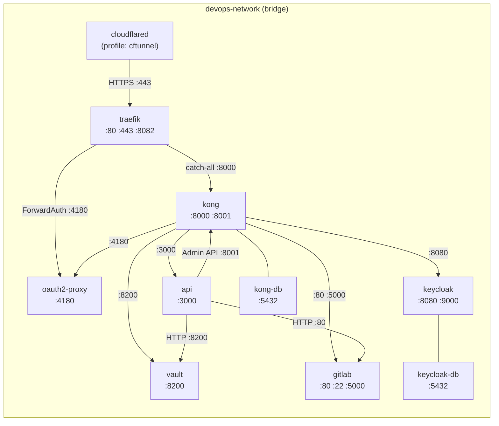
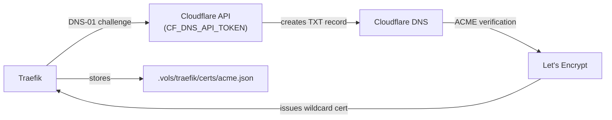

# Networking

← [Back to Maintainer Guide](index.md)

This document covers the Docker network topology, Traefik static and dynamic configuration, Kong declarative routing, and the DNS/domain strategy.

---

## Docker network topology

All services share a single Docker bridge network. The network name is driven by `${DOCKER_NETWORK}` (default: `devops-network`).



**Host-exposed ports** (for local management, not public):

| Port | Service | Purpose |
|---|---|---|
| `10080` | traefik | HTTP (redirects to HTTPS) |
| `10443` | traefik | HTTPS entry |
| `18080` | traefik | Dashboard (no TLS on host) |
| `18000` | kong | Proxy HTTP |
| `18443` | kong | Proxy HTTPS |
| `18001` | kong | Admin API (unauthenticated on host) |
| `15432` | kong-db | PostgreSQL |
| `15433` | keycloak-db | PostgreSQL |
| `18200` | vault | API |
| `12222` | gitlab | SSH |
| `13000` | api | Management API |

---

## DNS and domain naming conventions

All service domains follow the pattern `<service>.devops.<DOMAIN>`. Deployed application domains follow `<projectName>.<APPS_DOMAIN>` (default: `<projectName>.apps.<DOMAIN>`).

```
*.devops.<DOMAIN>
  ├── traefik.devops.<DOMAIN>        → Traefik dashboard
  ├── auth.devops.<DOMAIN>           → Keycloak
  ├── vault.devops.<DOMAIN>          → Vault UI
  ├── gitlab.devops.<DOMAIN>         → GitLab
  ├── registry.devops.<DOMAIN>       → GitLab container registry
  ├── gw.devops.<DOMAIN>             → Kong proxy (public)
  ├── gw-admin.devops.<DOMAIN>       → Kong admin UI
  ├── api.devops.<DOMAIN>            → Management API
  └── oauth.devops.<DOMAIN>          → oauth2-proxy session endpoint

<projectName>.apps.<DOMAIN>          → Deployed applications (via Kong)
```

**Network aliases strategy:** Every service's public domain is added as an alias on `devops-network` in `docker-compose.yml`. This means that when the Management API or any internal service resolves `auth.devops.yourdomain.com`, Docker's built-in DNS returns Keycloak's internal IP directly — no round-trip through the public internet or Traefik.

```yaml
# Example from docker-compose.yml (traefik service networks block)
networks:
  devops-network:
    aliases:
      - ${KEYCLOAK_DOMAIN}     # auth.devops.yourdomain.com
      - ${VAULT_DOMAIN}        # vault.devops.yourdomain.com
      - ${GITLAB_DOMAIN}       # gitlab.devops.yourdomain.com
      # ... etc
```

All aliases are attached to the `traefik` service, which acts as the single ingress point. Internal services that talk to each other directly use their Docker service names (e.g. `http://keycloak:8080`), not their public domains.

---

## Traefik configuration

### Static configuration (`traefik/traefik.yml` — template)

The file on disk is a **template** with `__DOMAIN__` and `__ACME_EMAIL__` placeholders. The Traefik container's entrypoint runs `sed` to substitute these values from environment variables before starting Traefik.

```yaml
api:
  dashboard: true
  insecure: true    # dashboard served on :8080 without TLS internally

ping:
  entryPoint: ping  # :8082/ping used for health checks

entryPoints:
  web:
    address: ":80"
    http:
      redirections:
        entryPoint:
          to: websecure
          scheme: https
          permanent: true

  websecure:
    address: ":443"
    http:
      tls:
        certResolver: letsencrypt
        domains:
          - main: "devops.__DOMAIN__"        # e.g. devops.yourdomain.com
            sans:
              - "*.devops.__DOMAIN__"        # e.g. *.devops.yourdomain.com

certificatesResolvers:
  letsencrypt:
    acme:
      email: "__ACME_EMAIL__"
      storage: /etc/traefik/certs/acme.json
      dnsChallenge:
        provider: cloudflare
        propagation:
          delayBeforeChecks: 60     # wait 60s for DNS propagation
        resolvers:
          - "1.1.1.1:53"
          - "1.0.0.1:53"

providers:
  docker:
    endpoint: "unix:///var/run/docker.sock"
    exposedByDefault: false
    network: devops-network   # only use this network for routing
    watch: true
  file:
    directory: /etc/traefik/dynamic
    watch: true

log:
  level: INFO
  format: json

accessLog:
  format: json
  filters:
    statusCodes:
      - "400-599"   # only log errors
```

**Why a template?** Traefik's environment variable override mechanism can only modify existing YAML keys — it cannot create new nested structures like `domains[0].main`. The `sed` approach ensures the TLS domains and email are always correctly embedded in the YAML structure.

### Dynamic configuration (`traefik/dynamic/kong.yml`)

```yaml
http:
  routers:
    kong-catchall:
      rule: "PathPrefix(`/`)"
      entryPoints: [web, websecure]
      service: kong-proxy
      priority: 1          # lowest priority — matches only if nothing else does

  middlewares:
    oidc-auth:
      forwardAuth:
        address: "http://oauth2-proxy:4180/oauth2/auth"
        trustForwardHeader: true
        authResponseHeaders:
          - X-Auth-Request-User
          - X-Auth-Request-Email
          - X-Auth-Request-Access-Token

  services:
    kong-proxy:
      loadBalancer:
        servers:
          - url: "http://kong:8000"
        healthCheck:
          path: /status
          port: 8001
          interval: 30s
          timeout: 5s
```

### Docker label routing (defined per-service in `docker-compose.yml`)

Higher-priority routes are applied via Docker labels on services that should bypass the `kong-catchall`:

**Traefik dashboard:**
```yaml
labels:
  - "traefik.enable=true"
  - "traefik.http.routers.traefik-dashboard.rule=Host(`${TRAEFIK_DOMAIN}`)"
  - "traefik.http.routers.traefik-dashboard.entrypoints=websecure"
  - "traefik.http.routers.traefik-dashboard.tls.certresolver=letsencrypt"
  - "traefik.http.routers.traefik-dashboard.middlewares=oidc-auth@file"
  - "traefik.http.routers.traefik-dashboard.service=api@internal"
```

**Kong Admin API:**
```yaml
labels:
  - "traefik.enable=true"
  - "traefik.http.routers.kong-admin.rule=Host(`${KONG_ADMIN_DOMAIN}`)"
  - "traefik.http.routers.kong-admin.entrypoints=websecure"
  - "traefik.http.routers.kong-admin.tls.certresolver=letsencrypt"
  - "traefik.http.routers.kong-admin.middlewares=oidc-auth@file"
  - "traefik.http.services.kong-admin-svc.loadbalancer.server.port=8001"
```

**Router priority rules:**
- All Docker-label routes have no explicit priority, which defaults to the length of the `rule` string. `Host(...)` rules are longer than `PathPrefix(/)`, so they always win over `kong-catchall`.
- The `kong-catchall` is explicitly set to `priority: 1` to ensure it never supersedes Host-based routes.

---

## Kong configuration

### Declarative config (`kong/kong.template.yml`)

```
format_version: "3.0"

services:
  - name: keycloak-service
    url: http://keycloak:8080
    routes:
      - name: keycloak-route
        hosts: ["${KEYCLOAK_DOMAIN}"]
        protocols: ["http", "https"]
        strip_path: false
        preserve_host: true

  - name: vault-service
    url: http://vault:8200
    routes:
      - name: vault-route
        hosts: ["${VAULT_DOMAIN}"]
        ...

  - name: kong-proxy-service
    url: http://kong:8001
    routes:
      - name: kong-proxy-route
        hosts: ["${KONG_DOMAIN}"]
        ...

  - name: gitlab-service
    url: http://gitlab:80
    routes:
      - name: gitlab-route
        hosts: ["${GITLAB_DOMAIN}"]
        ...
    # longer timeouts for git operations

  - name: gitlab-registry-service
    url: http://gitlab:5000
    routes:
      - name: gitlab-registry-route
        hosts: ["${GITLAB_REGISTRY_DOMAIN}"]
        ...

  - name: api-service
    url: http://api:3000
    routes:
      - name: api-route
        hosts: ["${API_DOMAIN}"]
        ...

  - name: oauth2-proxy-service
    url: http://oauth2-proxy:4180
    routes:
      - name: oauth2-proxy-route
        hosts: ["${OAUTH_DOMAIN}"]
        ...
```

At startup, `kong-deck-sync` resolves all `${VAR}` placeholders via `sed` and applies the config via `deck gateway sync`. The `kong/deck` image is distroless (no shell), so a custom image is built inline with `dockerfile_inline`: it copies the `deck` binary from `kong/deck:latest` into `alpine:latest`, giving access to `sh` and `sed`.

```sh
sed \
  -e "s|\${KEYCLOAK_DOMAIN}|$KEYCLOAK_DOMAIN|g" \
  -e "s|\${VAULT_DOMAIN}|$VAULT_DOMAIN|g" \
  -e "s|\${KONG_DOMAIN}|$KONG_DOMAIN|g" \
  -e "s|\${GITLAB_DOMAIN}|$GITLAB_DOMAIN|g" \
  -e "s|\${GITLAB_REGISTRY_DOMAIN}|$GITLAB_REGISTRY_DOMAIN|g" \
  -e "s|\${API_DOMAIN}|$API_DOMAIN|g" \
  -e "s|\${OAUTH_DOMAIN}|$OAUTH_DOMAIN|g" \
  /kong/kong.template.yml > /tmp/kong.yml && \
deck gateway sync /tmp/kong.yml --kong-addr http://kong:8001
```

### Dynamically provisioned routes

When the Management API provisions a project with `capabilities.deployable`, it calls `KongService.registerService()` which directly calls the Kong Admin API:

```
PUT http://kong:8001/services/{name}
{
  "url": "http://{clientName}-{projectName}:3000",
  "connect_timeout": 10000,
  "read_timeout": 60000,
  "write_timeout": 60000,
  "retries": 3
}

PUT http://kong:8001/services/{name}/routes/{name}-route
{
  "hosts": ["{hostname}"],
  "protocols": ["http", "https"],
  "strip_path": false,
  "preserve_host": true
}
```

These routes are **not** tracked in `kong.template.yml`. They exist only in Kong's PostgreSQL database. If the Kong database is wiped and `kong-deck-sync` re-runs, these routes will be lost. The Management API does not currently have a mechanism to replay all provisioned routes from GitLab state.

**Implication for maintainers:** If you need to rebuild the Kong database, you must re-invoke `POST /projects` for each existing project to re-register its Kong route (or apply them manually via the Kong Admin API).

---

## TLS certificate lifecycle



- Certificate covers `devops.<DOMAIN>` (main) + `*.devops.<DOMAIN>` (SAN).
- Renewal is automatic (Traefik handles it ~30 days before expiry).
- The `acme.json` file persists across container restarts via the volume mount.
- On Windows Docker, `chmod 600` doesn't persist on bind mounts — the Traefik entrypoint re-applies it on every start.
- Traefik waits 60 seconds (`propagation.delayBeforeChecks`) after creating the DNS TXT record before asking Let's Encrypt to verify.
- If you change the domain or want to force renewal, delete `acme.json` and restart Traefik.
- `CF_DNS_API_TOKEN` requires `Zone:DNS:Edit` + `Zone:Zone:Read` permissions on the target zone.

---

## Cloudflare Tunnel routing

The `cloudflared` service is **profile-gated** — it only starts when you use `docker compose --profile cftunnel up -d`. The tunnel routing table is configured in the **Cloudflare Zero Trust dashboard** (Networks → Tunnels), not in any file in this repository. The typical configuration:

| Public hostname | Path | Origin service | TLS settings |
|---|---|---|---|
| `*.devops.yourdomain.com` | — | `https://traefik:443` | No TLS Verify |
| `*.apps.yourdomain.com` | — | `https://traefik:443` | No TLS Verify |

"No TLS Verify" is required because Traefik's certificate is issued for the public domain, and the tunnel connects via the Docker internal DNS name (`traefik`), which doesn't match the certificate subject.

All hostnames are routed to Traefik. Traefik and Kong handle the per-hostname dispatching.

The `cloudflared` container connects to Cloudflare's edge using the `TUNNEL_TOKEN` and then forwards all tunnel traffic to the configured origins.
