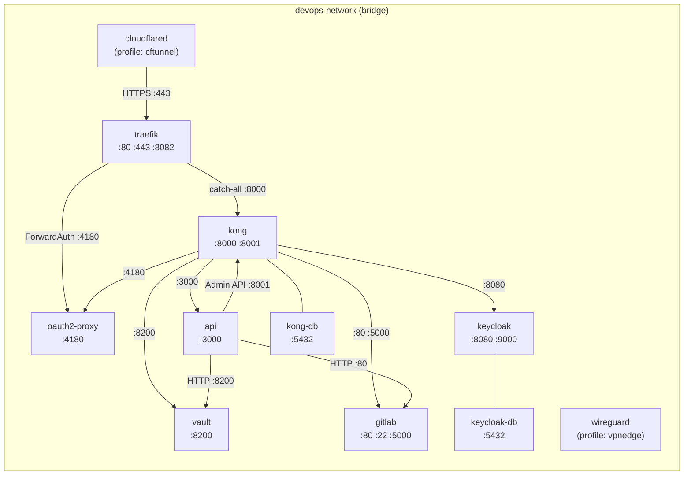
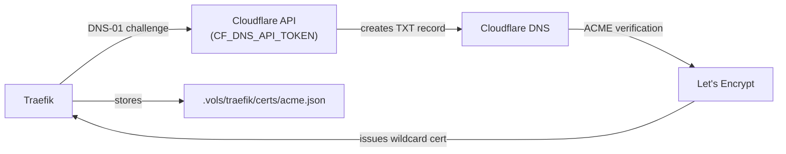
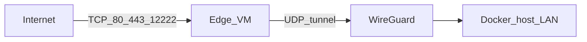

# Networking

← [Back to Maintainer Guide](index.md)

This document covers the Docker network topology, Traefik static and dynamic configuration, Kong declarative routing, and the DNS/domain strategy.

---

## Docker network topology

All services share a single Docker bridge network. The network name is driven by `${DOCKER_NETWORK}` (default: `devops-network`).



**Host-exposed ports** (for local management, not public):

| Port | Service | Purpose |
|---|---|---|
| `10080` | traefik | HTTP (redirects to HTTPS) |
| `10443` | traefik | HTTPS entry |
| `18080` | traefik | Dashboard (no TLS on host) |
| `18000` | kong | Proxy HTTP |
| `18443` | kong | Proxy HTTPS |
| `18001` | kong | Admin API (unauthenticated on host) |
| `15432` | kong-db | PostgreSQL |
| `15433` | keycloak-db | PostgreSQL |
| `18200` | vault | API |
| `12222` | gitlab | SSH |
| `13000` | api | Management API |

---

## DNS and domain naming conventions

All service domains follow the pattern `<service>.devops.<DOMAIN>`. Deployed application domains follow `<projectName>.<APPS_DOMAIN>` (default: `<projectName>.apps.<DOMAIN>`).

```
*.devops.<DOMAIN>
  ├── traefik.devops.<DOMAIN>        → Traefik dashboard
  ├── auth.devops.<DOMAIN>           → Keycloak
  ├── vault.devops.<DOMAIN>          → Vault UI
  ├── gitlab.devops.<DOMAIN>         → GitLab
  ├── registry.devops.<DOMAIN>       → GitLab container registry
  ├── gw.devops.<DOMAIN>             → Kong proxy (public)
  ├── gw-admin.devops.<DOMAIN>       → Kong admin UI
  ├── api.devops.<DOMAIN>            → Management API
  └── oauth.devops.<DOMAIN>          → oauth2-proxy session endpoint

<projectName>.apps.<DOMAIN>          → Deployed applications (via Kong)
```

**Network aliases strategy:** Every service's public domain is added as an alias on `devops-network` in `docker-compose.yml`. This means that when the Management API or any internal service resolves `auth.devops.yourdomain.com`, Docker's built-in DNS returns Keycloak's internal IP directly — no round-trip through the public internet or Traefik.

```yaml
# Example from docker-compose.yml (traefik service networks block)
networks:
  devops-network:
    aliases:
      - ${KEYCLOAK_DOMAIN}     # auth.devops.yourdomain.com
      - ${VAULT_DOMAIN}        # vault.devops.yourdomain.com
      - ${GITLAB_DOMAIN}       # gitlab.devops.yourdomain.com
      # ... etc
```

All aliases are attached to the `traefik` service, which acts as the single ingress point. Internal services that talk to each other directly use their Docker service names (e.g. `http://keycloak:8080`), not their public domains.

---

## Traefik configuration

### Static configuration (`traefik/traefik.yml` — template)

The file on disk is a **template** with `__DOMAIN__` and `__ACME_EMAIL__` placeholders. The Traefik container's entrypoint runs `sed` to substitute these values from environment variables before starting Traefik.

```yaml
api:
  dashboard: true
  insecure: true    # dashboard served on :8080 without TLS internally

ping:
  entryPoint: ping  # :8082/ping used for health checks

entryPoints:
  web:
    address: ":80"
    http:
      redirections:
        entryPoint:
          to: websecure
          scheme: https
          permanent: true

  websecure:
    address: ":443"
    http:
      tls:
        certResolver: letsencrypt
        domains:
          - main: "devops.__DOMAIN__"        # e.g. devops.yourdomain.com
            sans:
              - "*.devops.__DOMAIN__"        # e.g. *.devops.yourdomain.com

certificatesResolvers:
  letsencrypt:
    acme:
      email: "__ACME_EMAIL__"
      storage: /etc/traefik/certs/acme.json
      dnsChallenge:
        provider: cloudflare
        propagation:
          delayBeforeChecks: 60     # wait 60s for DNS propagation
        resolvers:
          - "1.1.1.1:53"
          - "1.0.0.1:53"

providers:
  docker:
    endpoint: "unix:///var/run/docker.sock"
    exposedByDefault: false
    network: devops-network   # only use this network for routing
    watch: true
  file:
    directory: /etc/traefik/dynamic
    watch: true

log:
  level: INFO
  format: json

accessLog:
  format: json
  filters:
    statusCodes:
      - "400-599"   # only log errors
```

**Why a template?** Traefik's environment variable override mechanism can only modify existing YAML keys — it cannot create new nested structures like `domains[0].main`. The `sed` approach ensures the TLS domains and email are always correctly embedded in the YAML structure.

### Dynamic configuration (`traefik/dynamic/kong.yml`)

```yaml
http:
  routers:
    kong-catchall:
      rule: "PathPrefix(`/`)"
      entryPoints: [web, websecure]
      service: kong-proxy
      priority: 1          # lowest priority — matches only if nothing else does

  middlewares:
    oidc-auth:
      forwardAuth:
        address: "http://oauth2-proxy:4180/oauth2/auth"
        trustForwardHeader: true
        authResponseHeaders:
          - X-Auth-Request-User
          - X-Auth-Request-Email
          - X-Auth-Request-Access-Token

  services:
    kong-proxy:
      loadBalancer:
        servers:
          - url: "http://kong:8000"
        healthCheck:
          path: /status
          port: 8001
          interval: 30s
          timeout: 5s
```

### Docker label routing (defined per-service in `docker-compose.yml`)

Higher-priority routes are applied via Docker labels on services that should bypass the `kong-catchall`:

**Traefik dashboard:**
```yaml
labels:
  - "traefik.enable=true"
  - "traefik.http.routers.traefik-dashboard.rule=Host(`${TRAEFIK_DOMAIN}`)"
  - "traefik.http.routers.traefik-dashboard.entrypoints=websecure"
  - "traefik.http.routers.traefik-dashboard.tls.certresolver=letsencrypt"
  - "traefik.http.routers.traefik-dashboard.middlewares=oidc-auth@file"
  - "traefik.http.routers.traefik-dashboard.service=api@internal"
```

**Kong Admin API:**
```yaml
labels:
  - "traefik.enable=true"
  - "traefik.http.routers.kong-admin.rule=Host(`${KONG_ADMIN_DOMAIN}`)"
  - "traefik.http.routers.kong-admin.entrypoints=websecure"
  - "traefik.http.routers.kong-admin.tls.certresolver=letsencrypt"
  - "traefik.http.routers.kong-admin.middlewares=oidc-auth@file"
  - "traefik.http.services.kong-admin-svc.loadbalancer.server.port=8001"
```

**Router priority rules:**
- All Docker-label routes have no explicit priority, which defaults to the length of the `rule` string. `Host(...)` rules are longer than `PathPrefix(/)`, so they always win over `kong-catchall`.
- The `kong-catchall` is explicitly set to `priority: 1` to ensure it never supersedes Host-based routes.

---

## Kong configuration

### Declarative config (`kong/kong.template.yml`)

```
format_version: "3.0"

services:
  - name: keycloak-service
    url: http://keycloak:8080
    routes:
      - name: keycloak-route
        hosts: ["${KEYCLOAK_DOMAIN}"]
        protocols: ["http", "https"]
        strip_path: false
        preserve_host: true

  - name: vault-service
    url: http://vault:8200  # OpenBao instance
    routes:
      - name: vault-route
        hosts: ["${VAULT_DOMAIN}"]
        ...

  - name: kong-proxy-service
    url: http://kong:8001
    routes:
      - name: kong-proxy-route
        hosts: ["${KONG_DOMAIN}"]
        ...

  - name: gitlab-service
    url: http://gitlab:80
    routes:
      - name: gitlab-route
        hosts: ["${GITLAB_DOMAIN}"]
        ...
    # longer timeouts for git operations

  - name: gitlab-registry-service
    url: http://gitlab:5000
    routes:
      - name: gitlab-registry-route
        hosts: ["${GITLAB_REGISTRY_DOMAIN}"]
        ...

  - name: api-service
    url: http://api:3000
    routes:
      - name: api-route
        hosts: ["${API_DOMAIN}"]
        ...

  - name: oauth2-proxy-service
    url: http://oauth2-proxy:4180
    routes:
      - name: oauth2-proxy-route
        hosts: ["${OAUTH_DOMAIN}"]
        ...
```

At startup, `kong-deck-sync` resolves all `${VAR}` placeholders via `sed` and applies the config via `deck gateway sync`. The `kong/deck` image is distroless (no shell), so a custom image is built inline with `dockerfile_inline`: it copies the `deck` binary from `kong/deck:latest` into `alpine:latest`, giving access to `sh` and `sed`.

```sh
sed \
  -e "s|\${KEYCLOAK_DOMAIN}|$KEYCLOAK_DOMAIN|g" \
  -e "s|\${VAULT_DOMAIN}|$VAULT_DOMAIN|g" \
  -e "s|\${KONG_DOMAIN}|$KONG_DOMAIN|g" \
  -e "s|\${GITLAB_DOMAIN}|$GITLAB_DOMAIN|g" \
  -e "s|\${GITLAB_REGISTRY_DOMAIN}|$GITLAB_REGISTRY_DOMAIN|g" \
  -e "s|\${API_DOMAIN}|$API_DOMAIN|g" \
  -e "s|\${OAUTH_DOMAIN}|$OAUTH_DOMAIN|g" \
  /kong/kong.template.yml > /tmp/kong.yml && \
deck gateway sync /tmp/kong.yml --kong-addr http://kong:8001
```

### Dynamically provisioned routes

When the Management API provisions a project with `capabilities.deployable`, it calls `KongService.registerService()` which directly calls the Kong Admin API:

```
PUT http://kong:8001/services/{name}
{
  "url": "http://{clientName}-{projectName}:3000",
  "connect_timeout": 10000,
  "read_timeout": 60000,
  "write_timeout": 60000,
  "retries": 3
}

PUT http://kong:8001/services/{name}/routes/{name}-route
{
  "hosts": ["{hostname}"],
  "protocols": ["http", "https"],
  "strip_path": false,
  "preserve_host": true
}
```

These routes are **not** tracked in `kong.template.yml`. They exist only in Kong's PostgreSQL database. If the Kong database is wiped and `kong-deck-sync` re-runs, these routes will be lost. The Management API does not currently have a mechanism to replay all provisioned routes from GitLab state.

**Implication for maintainers:** If you need to rebuild the Kong database, you must re-invoke `POST /projects` for each existing project to re-register its Kong route (or apply them manually via the Kong Admin API).

---

## TLS certificate lifecycle



- Certificate covers `devops.<DOMAIN>` (main) + `*.devops.<DOMAIN>` (SAN).
- Renewal is automatic (Traefik handles it ~30 days before expiry).
- The `acme.json` file persists across container restarts via the volume mount.
- On Windows Docker, `chmod 600` doesn't persist on bind mounts — the Traefik entrypoint re-applies it on every start.
- Traefik waits 60 seconds (`propagation.delayBeforeChecks`) after creating the DNS TXT record before asking Let's Encrypt to verify.
- If you change the domain or want to force renewal, delete `acme.json` and restart Traefik.
- `CF_DNS_API_TOKEN` requires `Zone:DNS:Edit` + `Zone:Zone:Read` permissions on the target zone.

---

## Cloudflare Tunnel routing

The `cloudflared` service is **profile-gated** — it only starts when you use `docker compose --profile cftunnel up -d`. The tunnel routing table is configured in the **Cloudflare Zero Trust dashboard** (Networks → Tunnels), not in any file in this repository. The typical configuration:

| Public hostname | Path | Origin service | TLS settings |
|---|---|---|---|
| `*.devops.yourdomain.com` | — | `https://traefik:443` | No TLS Verify |
| `*.apps.yourdomain.com` | — | `https://traefik:443` | No TLS Verify |

"No TLS Verify" is required because Traefik's certificate is issued for the public domain, and the tunnel connects via the Docker internal DNS name (`traefik`), which doesn't match the certificate subject.

All hostnames are routed to Traefik. Traefik and Kong handle the per-hostname dispatching.

The `cloudflared` container connects to Cloudflare's edge using the `TUNNEL_TOKEN` and then forwards traffic for each configured public hostname to the origin you set in the Zero Trust dashboard (typically `https://traefik:443`).

---

## Public ingress modes (Compose profiles)

| Mode | When to use | Command |
|------|-------------|---------|
| **Direct** | Your network exposes host ports `10080` / `10443` (and optionally others) to the internet | `docker compose up -d` |
| **Cloudflare Tunnel** | You use Cloudflare Tunnel for ingress (dashboard routing) | `docker compose --profile cftunnel up -d` |
| **VPN edge** | Home ISP blocks inbound `80`/`443`; a cloud VM terminates TCP and forwards over WireGuard to this stack | `docker compose --profile vpnedge up -d` |

Do not use **`cftunnel`** and **`vpnedge`** for the **same** public DNS names at the same time unless you intentionally split hostnames; pick one path per domain.

---

## VPN edge ingress (WireGuard)

Use this when a **cloud edge VM** (for example Ubuntu on GCP) holds your public IP and listeners on **TCP 80, 443, 12222**, while the stack stays at home behind CGNAT or an ISP that blocks inbound HTTP(S).

**Pieces:**

1. **Home:** `wireguard` service (`lscr.io/linuxserver/wireguard`), profile **`vpnedge`**, UDP `${WIREGUARD_SERVER_PORT:-51820}` published to the host. Config and generated peer files live under **`.vols/wireguard/`** (e.g. `peer_edge/peer_edge.conf`).
2. **Home router:** Forward **UDP** `51820` (or your chosen port) to the machine that runs Docker (on **Docker Desktop + WSL2**, you may also need Windows / WSL port forwarding so the packet reaches the listener).
3. **Edge VM:** Install **`wireguard-tools`** and **`nftables`**. Copy `peer_edge.conf` from the home volume to `/etc/wireguard/wg0.conf` (or merge keys with `edge/vpn-edge/wg0.client.conf.sample`). Enable **`net.ipv4.ip_forward=1`** (see `edge/vpn-edge/sysctl-ip-forward.conf`). Run `wg-quick up wg0`.
4. **Edge NAT:** From the repo, use **`edge/vpn-edge/apply-nat.sh`** with a **`forward-ports.env`** derived from **`edge/vpn-edge/forward-ports.sample.env`**. Set **`HOME_TRAFFIC_IP`** to the **IPv4 of the Docker host on the LAN** where Traefik publishes **`10080`/`10443`** and GitLab SSH **`12222`**. The script DNATs public ports to that IP and SNATs out **`wg0`** so return traffic works. Traefik and GitLab will see the **edge’s WireGuard IP** as the client address (double SNAT: internet → edge → tunnel).

**Default TCP map (edge public → home host port):** `80→10080`, `443→10443`, `12222→12222`. Add more `public:dest` pairs in **`FORWARD_TCP`** if you expose extra services.

**Git over SSH:** Use port **12222** on the edge as well (do not steal **TCP 22** on the edge VM unless you move admin `sshd` to another port). Example: `ssh -p 12222 git@<GITLAB_DOMAIN>`.

**Split tunnel / `AllowedIPs`:** The compose defaults set **`WIREGUARD_PEER_ALLOWEDIPS`** so the edge peer can reach RFC1918 ranges and the VPN subnet; adjust if your home LAN uses only one `/24`. **`WIREGUARD_SERVER_URL`** should be your home public IP or DDNS (passed through to the image as **`SERVERURL`**).

**DNS:** While using **vpnedge**, point **`A`/`AAAA`** records for `*.devops.<DOMAIN>`, `*.apps.<DOMAIN>`, and related names to the **edge VM’s public IP**, not your home IP. **Let’s Encrypt** can stay on **DNS-01** via Cloudflare (`CF_DNS_API_TOKEN`); HTTP reachability to home is not required for issuance.

**Cloud firewall (example GCP):** Allow **inbound** **TCP 80, 443, 12222** (and any extra ports you added). Allow **outbound UDP** to home **`51820`**.

**Home-side hardening (ideal):** Allow **TCP 10080, 10443, 12222** only from the **WireGuard subnet** (e.g. `10.8.0.0/24`) on the Docker host firewall, not from the public WAN. On Windows this is often **Windows Defender Firewall** advanced rules; exact steps depend on your layout.

**Docker Desktop + WSL2:** If inbound UDP to the `wireguard` container fails, run **WireGuard in the WSL2 distro** that backs Docker, reuse the same keys/subnet from `.vols/wireguard`, and forward UDP from the router to the WSL IP.

**Reusable edge kit:** All edge scripts and samples live under **`edge/vpn-edge/`** so you can reprovision another VM or cloud provider with the same steps.

### Edge VM bootstrap (fresh Ubuntu)

Assume a new cloud VM (e.g. Ubuntu on GCP) and that **VPC firewall** already allows **inbound TCP 80, 443, 12222** and **outbound UDP** to your home **`51820`**. Replace `EDGE_USER`, `EDGE_HOST`, and paths as needed.

**1. Packages and IP forwarding**

```bash
sudo apt-get update
sudo apt-get install -y wireguard wireguard-tools nftables iproute2
```

Install the sysctl drop-in from the repo (or create the same file manually):

```bash
# If you cloned the repo on the edge:
sudo install -m 644 edge/vpn-edge/sysctl-ip-forward.conf /etc/sysctl.d/99-vpn-edge-ip-forward.conf
sudo sysctl --system
```

Equivalent one-liner if you only have the file contents:

```bash
echo 'net.ipv4.ip_forward = 1' | sudo tee /etc/sysctl.d/99-vpn-edge-ip-forward.conf
sudo sysctl --system
```

**2. Copy the kit and WireGuard client config from your workstation**

On the machine where the repo lives (after `docker compose --profile vpnedge up -d` has generated keys):

```bash
scp -r edge/vpn-edge/ EDGE_USER@EDGE_HOST:~/vpn-edge/
scp .vols/wireguard/peer_edge/peer_edge.conf EDGE_USER@EDGE_HOST:/tmp/wg0.conf
```

**3. On the edge: install config, env, and NAT script**

```bash
sudo install -m 600 /tmp/wg0.conf /etc/wireguard/wg0.conf
chmod +x ~/vpn-edge/apply-nat.sh
cp ~/vpn-edge/forward-ports.sample.env ~/vpn-edge/forward-ports.env
# Edit HOME_TRAFFIC_IP (Docker host LAN IP); set WAN_IFACE / WG_IFACE only if detection fails
nano ~/vpn-edge/forward-ports.env
```

**4. Bring up WireGuard and apply nftables**

```bash
sudo wg-quick up wg0
sudo ~/vpn-edge/apply-nat.sh apply ~/vpn-edge/forward-ports.env
```

**5. Verify**

```bash
sudo wg show
sudo nft list table ip vpnedge
```

**6. Persistence across reboots**

WireGuard:

```bash
sudo systemctl enable wg-quick@wg0
sudo systemctl start wg-quick@wg0
```

The **`apply-nat.sh`** rules live only in nftables runtime until you re-run the script. After each reboot, run `sudo ~/vpn-edge/apply-nat.sh apply ~/vpn-edge/forward-ports.env` again, or add a small **`systemd` oneshot** / **`@reboot` cron** that runs the same command once **`wg0`** is up.

### VPN edge troubleshooting (e.g. HTTP 503)

**503 means something spoke HTTP** (often Traefik or Kong) but treated the request as “no healthy backend” or “service unavailable.” The tunnel can be “up” for WireGuard while **TCP to `HOME_TRAFFIC_IP:10443` still fails** or backends are unhealthy.

1. **Confirm the tunnel actually carries data** — On both sides, `sudo wg show` should show **`latest handshake: …` (recent)** and **`transfer`** bytes **increasing** when you load a page. If handshake is missing or **rx/tx stay at 0**, fix routing / firewall first (GCP rules, home UDP `51820`, `HOME_TRAFFIC_IP`, `AllowedIPs`).

2. **Use the correct `HOME_TRAFFIC_IP` (Docker Desktop + WSL2)** — Prefer the **WSL2 instance’s primary IPv4** (where Docker listens), not only the Windows Wi‑Fi/LAN address:
   - In WSL: `hostname -I` or `ip -4 route get 1.1.1.1 | awk '{print $7; exit}'`
   - That address is usually inside **`172.16.0.0/12`**, which is already covered by the default **`WIREGUARD_PEER_ALLOWEDIPS`** in Compose. Put **that** IP in **`forward-ports.env`** on the edge, re-run **`apply-nat.sh apply`**.

3. **IP forwarding in the WireGuard container** — The `wireguard` Compose service sets **`net.ipv4.ip_forward=1`** so decrypted traffic can be forwarded from **`wg0`** toward the Docker host. After changing Compose, run **`docker compose --profile vpnedge up -d`** again.

4. **Isolate HTTP vs VPN** — On the **home** host (same machine as Docker):
   ```bash
   curl -vk https://127.0.0.1:10443/ -H "Host: YOUR_REAL_HOSTNAME"
   ```
   If this already returns **503**, fix **Kong / upstream health** (`docker compose ps`, `docker logs traefik`, `docker logs kong`), not the edge.

5. **From the edge VM** (after `wg0` is up), reach Traefik through the tunnel:
   ```bash
   curl -vk "https://${HOME_TRAFFIC_IP}:10443/" -H "Host: YOUR_REAL_HOSTNAME"
   ```
   Use a hostname that matches a Traefik/Kong route (e.g. `gitlab.devops.example.com`). If this fails with timeout or TLS errors but step 4 works, the problem is **VPN path or `HOME_TRAFFIC_IP`**. If this returns **503** as well, the problem is **application health** (same as step 4).

6. **Optional: MTU** — Rarely, WireGuard MTU causes odd TLS or large-response failures. If small `curl` works but browsers fail, try lowering MTU on the edge **`[Interface]`** (e.g. `MTU = 1280`) and restart `wg-quick`.


