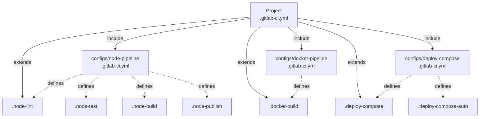
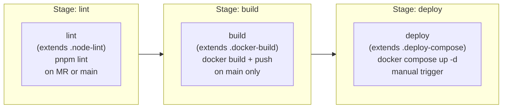

# CI/CD Internals

← [Back to Maintainer Guide](index.md)

This document covers the GitLab Runner setup, shared CI/CD config repository architecture, pipeline template anatomy, and how project pipelines are composed.

---

## GitLab Runner

The platform runs a single GitLab Runner with a **Docker executor** configured for `concurrent: 4` jobs. It uses Docker-in-Docker (DinD) for container builds.

### Registration

On first start, if `.vols/gitlab-runner/config/config.toml` does not exist, the runner entrypoint script auto-registers with GitLab:

```sh
gitlab-runner register \
  --non-interactive \
  --url "http://gitlab" \
  --token "${GITLAB_RUNNER_TOKEN}" \
  --executor "docker" \
  --docker-image "docker:latest" \
  --docker-privileged \
  --docker-volumes "/cache" \
  --docker-volumes "/certs/client" \
  --docker-network-mode "${DOCKER_NETWORK}" \
  --name "docker-runner-1" \
  --clone-url "http://gitlab" \
  --request-concurrency 4
```

The `--token` flag is used (not `--registration-token`) because GitLab 16+ uses runner authentication tokens (`glrt-xxx`) instead of the legacy registration tokens.

The generated `config.toml` is stored at `.vols/gitlab-runner/config/config.toml`. The entrypoint also patches `concurrent = 4` and adds `request_concurrency = 4` to the config after registration.

**To re-register:** Stop the `gitlab-runner` container, delete `.vols/gitlab-runner/config/config.toml`, update `GITLAB_RUNNER_TOKEN` in `.env`, then restart.

### Key configuration parameters

| Parameter | Value | Notes |
|---|---|---|
| `concurrent` | `4` | Max parallel jobs |
| `executor` | `docker` | All jobs run in fresh containers |
| `image` | `docker:latest` | Default job image |
| `privileged` | `true` | Required for DinD builds |
| `network_mode` | `${DOCKER_NETWORK}` | Jobs can reach platform services by DNS name |
| `clone_url` | `http://gitlab` | Internal URL for git clone (avoids public DNS) |
| `volumes` | `/cache`, `/certs/client` | Shared cache and DinD TLS certs |
| `request_concurrency` | `4` | Max concurrent requests to GitLab per runner |

### Why `network_mode` matters

Setting `network_mode` to `devops-network` means every CI job container is automatically on the platform's internal network. This allows:
- Jobs to push/pull from `${GITLAB_REGISTRY_DOMAIN}` (container registry) using the internal hostname.
- Jobs to read Vault secrets at `http://vault:8200`.
- Jobs to publish npm packages to `http://gitlab/api/v4/projects/...`.
- The `docker:dind` service to be reachable by the primary job container.

---

## Shared CI/CD config repositories

Instead of duplicating pipeline logic in every project, the platform uses **shared config repos** stored in the `configs` GitLab group. Projects reference these repos via GitLab's `include:` directive.



### `configs/node-pipeline`

Provides reusable hidden jobs for Node.js (pnpm) projects:

| Job | Stage | Trigger | Description |
|---|---|---|---|
| `.node-lint` | `lint` | MR or default branch | `pnpm run lint` |
| `.node-test` | `test` | MR or default branch | `pnpm run test` (with coverage regex) |
| `.node-build` | `build` | Default branch only | `pnpm run build` — artifacts: `dist/` (1h TTL) |
| `.node-publish` | `deploy` | Tag `v*.*.*` | Publishes to GitLab npm registry via `.npmrc` with `$CI_JOB_TOKEN` |

The `.node-publish` job writes a `.npmrc` at job runtime:
```
//${CI_SERVER_HOST}/api/v4/projects/${CI_PROJECT_ID}/packages/npm/:_authToken=${CI_JOB_TOKEN}
@${CI_PROJECT_ROOT_NAMESPACE}:registry=https://${CI_SERVER_HOST}/api/v4/projects/${CI_PROJECT_ID}/packages/npm/
```

`CI_SERVER_HOST` is a built-in GitLab CI variable (e.g. `gitlab.devops.yourdomain.com`). This avoids hardcoding the domain.

### `configs/docker-pipeline`

Provides two Docker image build and push hidden jobs:

| Job | Stage | Trigger | Description |
|---|---|---|---|
| `.docker-build` | `build` | Default branch only | Builds and pushes `$CI_REGISTRY_IMAGE:$CI_COMMIT_SHORT_SHA` + `$CI_REGISTRY_IMAGE:latest`. Uses `--cache-from latest` for layer caching. |
| `.docker-build-tagged` | `build` | Tag `v*.*.*` | Extends `.docker-build` but tags as `$CI_REGISTRY_IMAGE:$CI_COMMIT_TAG` instead of `latest`. |

Both jobs use `docker:dind` as a service and require `DOCKER_TLS_CERTDIR="/certs"` for DinD TLS communication.

### `configs/deploy-compose`

Provides Docker Compose deployment jobs:

| Job | Trigger | Description |
|---|---|---|
| `.deploy-compose` | Default branch — manual | Pulls image, runs `docker compose up -d` |
| `.deploy-compose-auto` | Default branch — automatic | Same as above but triggers automatically |

**Environment variables used:**

| Variable | Source | Description |
|---|---|---|
| `CI_REGISTRY_USER` | GitLab built-in | Registry auth username |
| `CI_REGISTRY_PASSWORD` | GitLab built-in | Registry auth password |
| `CI_REGISTRY` | GitLab built-in | Registry hostname |
| `CI_REGISTRY_IMAGE` | GitLab built-in | Full image path |
| `CI_PROJECT_NAME` | GitLab built-in | Used as compose project name |
| `COMPOSE_FILE` | Optional CI variable | Override compose file path (default: `docker-compose.yml`) |
| `COMPOSE_PROJECT_NAME` | Optional CI variable | Override compose project name |

---

## Project pipeline anatomy

Projects created from the `nestjs-app` template include a `.gitlab-ci.yml` that composes all three shared configs:

```yaml
include:
  - project: "configs/node-pipeline"
    file: "/.gitlab-ci.yml"
  - project: "configs/docker-pipeline"
    file: "/.gitlab-ci.yml"
  - project: "configs/deploy-compose"
    file: "/.gitlab-ci.yml"

stages:
  - lint
  - build
  - deploy

lint:
  extends: .node-lint

build:
  extends: .docker-build

deploy:
  extends: .deploy-compose
  when: manual
```

This produces the following pipeline:



The `deploy` job pulls the image built in `build`, then runs `docker compose up -d` on the host Docker daemon. Because the runner's `network_mode` is set to `devops-network`, the deployed container is automatically on the platform network and reachable from Traefik, GitLab, Vault, and peer services on `devops-network`.

### How the Management API injects config includes

When `POST /projects` is called with a `configs` array, the Management API reads the forked project's `.gitlab-ci.yml`, merges the new `include:` entries (deduplicating), and commits the updated file back to GitLab. This is performed in `ProjectsService.injectConfigIncludes()`:

```typescript
// Reads existing .gitlab-ci.yml (or creates empty)
// Parses YAML, finds or creates `include:` array
// For each config slug, adds { project: "configs/{slug}", file: "/.gitlab-ci.yml" }
// Serializes back to YAML and commits
```

This allows operators to specify configs at provisioning time without pre-embedding them in every template.

---

## Adding a new shared config repo

1. Create the repo via the Management API:
   ```http
   POST /configs
   {
     "slug": "my-new-config",
     "description": "Reusable jobs for X",
     "ciContent": "# .gitlab-ci.yml content here\n.my-job:\n  ..."
   }
   ```
2. Reference it in a project's provisioning call:
   ```http
   POST /projects
   {
     ...
     "configs": ["my-new-config"]
   }
   ```
3. Or inject it into an existing project's `.gitlab-ci.yml` manually.

---

## Pipeline variable reference

These variables are available in all jobs and are used by the shared configs:

| Variable | Source | Description |
|---|---|---|
| `CI_SERVER_HOST` | GitLab built-in | Hostname of the GitLab instance |
| `CI_PROJECT_ID` | GitLab built-in | Numeric project ID |
| `CI_PROJECT_NAME` | GitLab built-in | Project name (slug) |
| `CI_PROJECT_ROOT_NAMESPACE` | GitLab built-in | Top-level namespace |
| `CI_COMMIT_BRANCH` | GitLab built-in | Current branch name |
| `CI_DEFAULT_BRANCH` | GitLab built-in | Project's default branch |
| `CI_PIPELINE_SOURCE` | GitLab built-in | `push`, `merge_request_event`, etc. |
| `CI_COMMIT_TAG` | GitLab built-in | Tag name (if triggered by tag push) |
| `CI_REGISTRY` | GitLab built-in | Container registry hostname |
| `CI_REGISTRY_IMAGE` | GitLab built-in | Full image path |
| `CI_REGISTRY_USER` / `CI_REGISTRY_PASSWORD` | GitLab built-in | Registry auth |
| `CI_JOB_TOKEN` | GitLab built-in | Short-lived token for package/registry auth |

Project-specific secrets (from OpenBao) are not automatically injected into CI jobs. If a project needs OpenBao secrets in CI, the pipeline must include an explicit step that reads Vault (for example via `vault` CLI in a job image) or uses another approved secret flow.

---

## SonarQube

The shared Auto DevOps template defines **`sonar:scan`** in the `test` stage (before `deploy`). It is **opt-in** per GitLab project:

| Variable | Purpose |
|---|---|
| `SONAR_ALLOWED_BRANCHES` | Comma-separated branch names; empty = job exits 0 without scanning |
| `SONAR_TOKEN` | Masked analysis token |
| `SONAR_HOST_URL` | Public URL for dashboard links in commit status |
| `SONAR_HOST_URL_INTERNAL` | Scanner endpoint (default `http://sonarqube:9000` on `devops-network`) |
| `SONAR_GATE_POLICY_JSON` | Per-tier gate: `optional` does not fail the job on QG failure; `required` fails |

**Tier detection** uses the same refs as deploy jobs: `DEPLOY_DEV_REF`, `DEPLOY_STG_REF`, `DEPLOY_PROD_REF`. Unmatched branches use tier `other`.

**Project keys:** `{CI_PROJECT_PATH_SLUG}_{CI_COMMIT_REF_SLUG}` (sanitized) — one Sonar project per branch (Community Build).

**Commit status:** `POST ${CI_API_V4_URL}/projects/${CI_PROJECT_ID}/statuses/${CI_COMMIT_SHA}` with `JOB-TOKEN: ${CI_JOB_TOKEN}` — mirrors `GitLabService.postCommitStatus` in the Management API.

**Shared config repo:** `configs/sonar-defaults` holds baseline `sonar-project.properties` (exclusions, encoding).

**Management API:** `updateProjectSonarConfig` syncs the variables above and stores tokens in Vault at `projects/<path>/sonar`.

---

## Auto DevOps chart, pipeline, and registry (Phase 6.1)

This section captures **operational constraints** for the GitLab projects under `configs/auto-devops-chart` and `configs/auto-devops-pipeline` and for deploy jobs that run **Helm** inside Kubernetes.

### `CHART_VERSION` and tagged chart releases

The packaged Helm chart (`dsoaas-app`) is versioned in `configs/auto-devops-chart` (`Chart.yaml` / Git tags). The pipeline passes **`CHART_VERSION`** (or equivalent) into `helm upgrade` so cluster installs pick a **released** chart artifact. Keep pipeline defaults aligned with the **tagged** chart version you intend clusters to consume; drifting versions produce confusing diffs or failed installs.

### GitLab Container Registry from CI jobs

- **Application image** pulls in the cluster typically use `CI_REGISTRY_IMAGE` and credentials derived from the job environment.
- **Helm OCI pull** of the platform chart from another project (for example `configs/auto-devops-chart`) often **cannot** use `CI_REGISTRY_USER` / `CI_REGISTRY_PASSWORD` alone, because the job token is scoped to the **running** project. Use a **project deploy token** or **group token** with `read_registry` on the chart project, exposed as masked CI variables (for example `CHART_REGISTRY_USER` / `CHART_REGISTRY_PASSWORD`), and use those in `helm registry login` for the OCI host.
- **Registry host inside CI jobs on `devops-network`:** use the GitLab Omnibus container hostname and the **registry daemon port** (commonly **`gitlab:5000`** for direct registry API). Port **5005** is an internal nginx alias and is **not** a stable target from the runner network. Keep `helm registry login` and `CHART_OCI_REF` consistent with **`gitlab:5000`** when jobs run on `devops-network`.

### YAML gotcha: `helm registry login` line breaks

In GitLab CI YAML, a **plain-scalar** line that ends with `\` for “bash continuation” can be **folded** by YAML into a single line with a space instead of a newline — producing a broken shell command (extra token, HTML 404 from GitLab, etc.). Prefer a **single-line** `helm registry login ...` or use a **block scalar** (`\|`) for real multiline shell scripts.

### `ExternalSecret` and Vault KV paths

The chart’s `ExternalSecret` **`dataFrom.extract.key`** must match the **full KV path** under your Vault layout (for example `secret/data/<projectPath>/<env>`). If `project.path` in values already includes a prefix such as `projects/acme`, do **not** add another hard-coded `projects/` segment in the chart template — you will point ESO at a non-existent path and sync will fail. The Management API seeds per-environment paths when projects are created; ensure every deploy env has at least a **sentinel** secret so sync never targets an empty path.

### Deploy job: image pull secret and `kubectl`

Private images on the cluster require a **`docker-registry`** secret (or equivalent) in the target namespace, built from registry credentials the cluster understands. The deploy job often needs **`kubectl`** (for example an Alpine-based image with `kubectl` + `helm` installed) to create that secret and to run **`helm upgrade`**. Align `imagePullSecrets` in chart values with the secret name the job creates.

### Helm releases stuck in `pending-install` / `pending-upgrade` / `pending-rollback`

If a prior Helm operation was interrupted, the release can remain **pending** and block upgrades. Add a **pre-flight** in the deploy job: detect pending states and **`helm rollback`**, **`helm uninstall`**, or manual cleanup before `helm upgrade --install`.

### Container listen port convention

Standardize application images on **container port 80** (`EXPOSE 80`, `ENV PORT=80` for Node). The `dsoaas-app` chart defaults **`service.targetPort: 80`**, which avoids per-repo `chart-values.yaml` overrides for port. Document this for template authors (see also [Deployments — developer guide](../../03_devs/05_deployments.md)).

### Related infra

- k3d networking and outer Traefik passthrough: [k3d and Kubernetes](../../01_infra/06_k3d_and_k8s.md)
- Vault → Kubernetes auth bootstrap: [`bootstrap/vault-k8s-auth.sh`](../../bootstrap/vault-k8s-auth.sh)