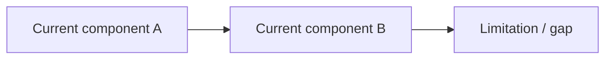
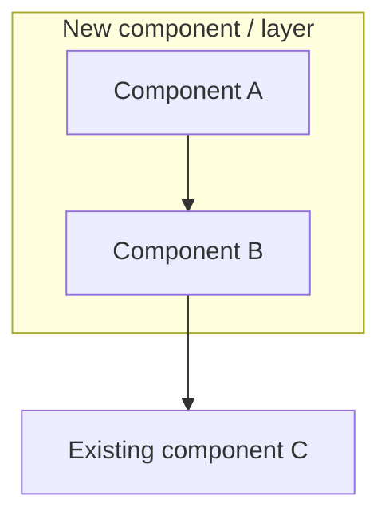

# Milestone — [Short Title]

← [Back to Milestone designs](index.md)

> **Status**: Proposed (not yet scheduled)
> **Audience**: Platform maintainers, future-Phase planners
> **Cross-references**: _link relevant docs here_

One-paragraph framing. Describe what this milestone closes the gap on, why it matters now, and how it relates to the current state of the platform. Avoid bullet points here — this should read like a short technical brief.

---

## Table of contents

1. [Problem & motivation](#1-problem--motivation)
2. [Current state — what's wired up today](#2-current-state--whats-wired-up-today)
3. [Goal & non-goals](#3-goal--non-goals)
4. [Architecture](#4-architecture)
5. [API, schema & config changes](#5-api-schema--config-changes)
6. [Operational considerations](#6-operational-considerations)
7. [Migration & adoption story](#7-migration--adoption-story)
8. [Open questions](#8-open-questions)
9. [Implementation outline](#9-implementation-outline)
10. [Risks & rollback](#10-risks--rollback)
11. [Appendix](#11-appendix)

---

## 1. Problem & motivation

Describe the specific pain point this milestone addresses. Use concrete examples — ideally things that have come up in real operations or development. Answer: "what breaks, slows down, or is impossible today because this doesn't exist?"

Sub-headings are fine here if there are multiple distinct problems that motivate the same solution.

---

## 2. Current state — what's wired up today

Describe the existing behaviour precisely. Use a diagram, table, or code excerpt if it helps. The goal is to make it clear what the baseline is so that the "after" state in §3 and §4 is unambiguous.



| Layer | Current behaviour | Gap |
|---|---|---|
| Example layer | What it does today | What it can't do |

---

## 3. Goal & non-goals

### 3.1 Goals

Numbered list. Each goal should be specific enough to be verifiable — if you can't write a test or a smoke-check for it, it's probably too vague.

1. **Goal one** — one sentence.
2. **Goal two** — one sentence.
3. **Goal three** — one sentence.

### 3.2 Non-goals

Be explicit about what this milestone deliberately excludes. This is as important as the goals — it stops scope creep and sets clear expectations for what comes after.

- **Not in scope**: short description of what's being deferred and why.
- **Not in scope**: another exclusion.

---

## 4. Architecture

### 4.1 High-level design

Walk through the proposed architecture. Use one or more diagrams. For each diagram, include a brief prose explanation — the diagram shows structure, the prose explains the reasoning behind the design decisions.



### 4.2 What changes vs. what stays

A table is useful here to show which existing layers are modified, which are untouched, and what is net-new.

| Layer / component | Before | After | Change type |
|---|---|---|---|
| Example | Old behaviour | New behaviour | Modified / New / Unchanged |

---

## 5. API, schema & config changes

Document all interface changes: GraphQL mutations/queries, MongoDB schema additions, Helm chart value additions, CI variable additions, config file changes. Use code blocks with language tags for schema snippets.

If there are no API/schema changes (e.g. for a purely operational milestone), replace this section with whatever the equivalent concrete deliverable is (e.g. "CLI commands", "Helm chart values", "Vault policy definitions").

### 5.1 [Sub-section for first change area]

```typescript
// Example schema addition
```

### 5.2 [Sub-section for second change area]

---

## 6. Operational considerations

Cover anything that operators or developers will need to know about running this feature day-to-day. Include:

- Failure modes and their visibility
- Performance or resource implications
- Security surface changes
- Dependencies on external systems or manual operator actions

---

## 7. Migration & adoption story

### 7.1 Backward compatibility

Describe what happens to existing deployments. The strong default is: **existing behaviour is unchanged**. If this milestone breaks something for existing users, be explicit.

### 7.2 Opt-in / rollout story

How does someone adopt the new capability? Step-by-step if the rollout has ordering constraints.

### 7.3 Rollout for existing [projects / configs / deployments]

If migrating from old behaviour to new behaviour requires active steps from operators or developers, document them here.

---

## 8. Open questions

List decisions that need to be made before implementation begins. Each question should include options with a recommendation. These become the Decision log in the Appendix once resolved.

### Q1 — [Question title]

**Option A**: Description. Trade-off.

**Option B**: Description. Trade-off.

**Recommended**: Which option and why.

### Q2 — [Question title]

---

## 9. Implementation outline

Break the work into tracks or task groups. Each item should be a concrete, assignable unit of work (roughly: something one person can complete in a day or two). Use checkboxes.

### Track A — [Theme]

- [ ] Task description
- [ ] Task description

### Track B — [Theme]

- [ ] Task description
- [ ] Task description

### Track C — Documentation

- [ ] Update `__DOCS__/...` — description of what changes
- [ ] Update this milestone doc: status → Done; record decisions in §11

---

## 10. Risks & rollback

| Risk | Likelihood | Impact | Mitigation | Rollback |
|---|---|---|---|---|
| Description of risk | Low / Medium / High | Low / Medium / High | How to reduce the probability or impact | How to undo if it happens |

**Master rollback strategy**: one sentence describing the overall approach to rolling back the entire milestone if it needs to be reverted.

---

## 11. Appendix

### 11.1 [Comparison / reference table]

Optional. Use for industry comparisons, hostname derivation references, full GraphQL examples, or any supporting material that would clutter the main sections.

### 11.2 Decision log (filled in as decisions are made)

| Question | Choice | Date | Rationale |
|---|---|---|---|
| Q1 — [Title] | _pending_ | — | — |
| Q2 — [Title] | _pending_ | — | — |

### 11.3 Cross-references

- List files, services, or external docs that implementers will need to read alongside this one.

---

*Authored: YYYY-MM-DD · Status: Proposed · See [milestone index](index.md) for graduation criteria.*
