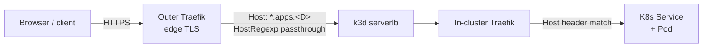
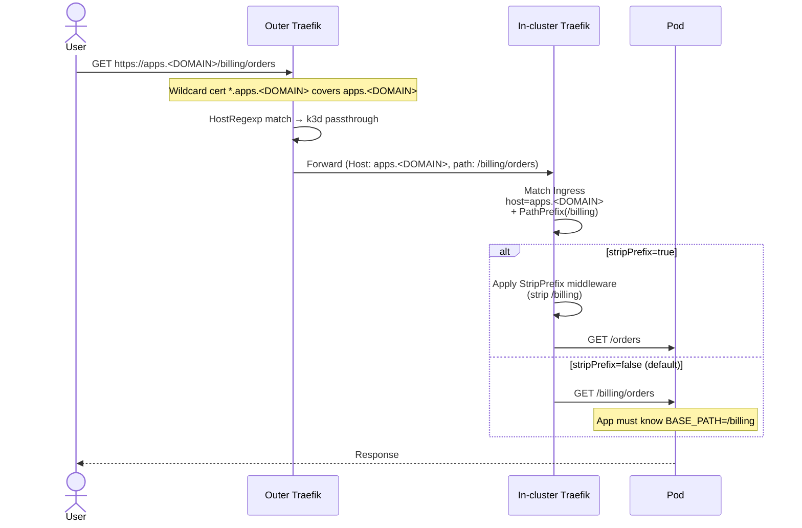

# Milestone — Path-Based Deployment Routing

← [Back to Milestone designs](index.md)

> **Status**: Proposed (not yet scheduled)
> **Audience**: Platform maintainers, future-Phase planners
> **Cross-references**: [Deployments](../03_devs/05_deployments.md), [Manual onboarding](../03_devs/06_manual_onboarding.md), [Maintainer architecture](../99_maintainers/01_architecture.md)

This milestone documents the design for **opt-in path-based ingress routing** as an alternative to the platform's default subdomain-based routing. Today, every deployable project gets a dedicated hostname per environment (`<slug>.dev.apps.<DOMAIN>`). After this milestone, projects can optionally publish under a shared parent host with a path prefix (`apps.<DOMAIN>/<slug>`) — or a hybrid (`<tenant>.apps.<DOMAIN>/<slug>`) — without changing the default behaviour for anyone else.

---

## Table of contents

1. [Problem & motivation](#1-problem--motivation)
2. [Current state — what's wired up today](#2-current-state--whats-wired-up-today)
3. [Goal & non-goals](#3-goal--non-goals)
4. [Architecture](#4-architecture)
5. [API & MongoDB schema changes](#5-api--mongodb-schema-changes)
6. [Helm chart changes](#6-helm-chart-changes)
7. [Operational considerations](#7-operational-considerations)
8. [Migration & opt-in story](#8-migration--opt-in-story)
9. [Examples](#9-examples)
10. [Open questions](#10-open-questions)
11. [Implementation outline](#11-implementation-outline)
12. [Risks & rollback](#12-risks--rollback)
13. [Appendix](#13-appendix)

---

## 1. Problem & motivation

The platform's default URL scheme — `<slug>.<env>.apps.<DOMAIN>` — is **subdomain-based**. It's clean, gives each app a dedicated origin (so cookies, OAuth callbacks, and CORS are naturally isolated), and benefits from cheap wildcard certs at the outer Traefik edge. For *most* apps, this is the right default.

But not all apps want or need a dedicated subdomain. Three concrete cases come up:

- **Mounting an existing app at a known path**, e.g. a legacy admin tool that the operator wants to expose at `corp.<DOMAIN>/help` rather than relocate to its own subdomain.
- **Tiny services that don't earn a subdomain** — internal dashboards, status pages, demo apps. A subdomain feels like overkill; a path is enough.
- **Microservices behind a façade** — when a single team operates ten small services that all logically belong under one umbrella host (`api.<DOMAIN>/{billing,shop,users,...}`), giving each its own subdomain produces ten unrelated cert SANs and ten unrelated DNS records.

There's also a hybrid case worth supporting: **subdomain *plus* path** (`<tenant>.apps.<DOMAIN>/<service>`) — useful for multi-tenant setups where a tenant gets one subdomain that hosts many services.

Today, none of these are first-class. Operators can hand-craft a `chart-values.yaml` override and bend the platform to do it, but the API doesn't know, MongoDB doesn't record it, and there's no documented way to do it cleanly.

This milestone closes that gap by making path-based routing a **first-class opt-in capability**.

---

## 2. Current state — what's wired up today

The platform routes app traffic through three hops:



Each layer assumes a single host per app:

| Layer | Subdomain assumption | Path support |
|---|---|---|
| **Outer Traefik wildcard SANs** | `*.<D>`, `*.devops.<D>`, `*.apps.<D>`, `*.dev.apps.<D>`, `*.stg.apps.<D>` | The wildcard cert covers any path; no work needed here |
| **Outer Traefik passthrough** (`traefik/dynamic/k3d-passthrough.yml`) | HostRegexp matches each env zone, forwards to k3d on Host header | Same passthrough works — Host header carries to in-cluster |
| **In-cluster Traefik** | Routes by Ingress `host:` rule | Can also route by `PathPrefix(...)` — Traefik fully supports this |
| **`dsoaas-app` Helm chart Ingress template** | `host: $APP_HOST`, `path: /`, `pathType: Prefix` (hardcoded) | ❌ Path hardcoded; no way to set a non-`/` prefix |
| **Chart's StripPrefix middleware** | n/a | ❌ Not in the chart at all |
| **Management API `Project.appHosts`** | `{ dev?, stg?, prod? }` — full hostnames | ❌ No `appPaths` field; no `routingMode` field |
| **Slug uniqueness** | `effectiveSlug` is globally unique because each slug = one subdomain | ❌ With shared hosts, slug uniqueness needs to scope to `(parentHost, slug)` |
| **CI variables set by API** | `APP_HOST` injected per env | ❌ No `APP_PATH` or `BASE_PATH` injection |

So a hand-crafted path-based project is technically possible today via `chart-values.yaml` overrides on a manual-onboarded project — but it's invisible to the API, the slug-uniqueness model doesn't make sense, and the chart can't emit a `PathPrefix` rule because the template doesn't expose the value.

---

## 3. Goal & non-goals

### 3.1 Goals

1. **Opt-in path-based routing per project**, declared at provisioning time.
2. **Backward-compatible**: existing subdomain-based projects continue to work without any change. The default mode stays `subdomain`.
3. **Three modes supported**:
   - `subdomain` (today's behaviour, default): `<slug>.<env>.apps.<DOMAIN>`
   - `path`: `<parent-host>/<prefix>` where `<parent-host>` is a configurable shared host
   - `hybrid` (subdomain + path): `<tenant-sub>.<env>.apps.<DOMAIN>/<prefix>` — still one host per tenant, multiple services per host
4. **First-class in the API and MongoDB**: routing mode and prefix are recorded, queryable, modifiable via mutation.
5. **First-class in the chart**: `ingress.path`, `ingress.pathType`, optional `stripPrefix` middleware.
6. **Self-aware apps**: when path-based, the API injects `BASE_PATH` and `BASE_URL` env vars (via Vault seed) so the app can generate correct absolute URLs.

### 3.2 Non-goals

- **Replacing subdomain mode as default.** Subdomain is cleaner for most cases; this milestone makes path *available*, not preferred.
- **Per-branch review apps at distinct paths.** That's a separate "review apps" milestone; path-based mode here is per-project, per-env.
- **Cluster-scope shared ingress for path mode.** All path-based projects still get their own `Ingress` resource — they just share a host. (Future enhancement could merge them into one Ingress for efficiency, but that's not in scope here.)
- **Migrating existing projects to path mode.** A new mutation could be added later. For this milestone, mode is fixed at provisioning time. Re-provisioning is the workaround.
- **Path rewriting / regex paths.** Only literal prefixes (`/myapp`, `/billing`). Path rewrites are a chart-template flexibility most apps won't need.

---

## 4. Architecture

### 4.1 The three modes side by side

```mermaid
graph TB
    subgraph "Mode: subdomain (default)"
        S1[Client] -->|"https://acme.dev.apps.&lt;D&gt;"| ST[Outer Traefik]
        ST -->|"Host: acme.dev.apps.&lt;D&gt;"| SIT[In-cluster Traefik]
        SIT -->|"host rule match"| SP[Pod 'acme' in ns dev]
    end
    subgraph "Mode: path"
        P1[Client] -->|"https://apps.&lt;D&gt;/billing"| PT[Outer Traefik]
        PT -->|"Host: apps.&lt;D&gt;"| PIT[In-cluster Traefik]
        PIT -->|"host + PathPrefix(/billing)"| PP[Pod 'billing' in ns prod]
    end
    subgraph "Mode: hybrid"
        H1[Client] -->|"https://acme.dev.apps.&lt;D&gt;/shop"| HT[Outer Traefik]
        HT -->|"Host: acme.dev.apps.&lt;D&gt;"| HIT[In-cluster Traefik]
        HIT -->|"host + PathPrefix(/shop)"| HP[Pod 'shop' in ns dev]
    end
```



### 4.2 Request flow — path mode, in detail



### 4.3 What changes vs what stays

| Layer | Subdomain mode (default) | Path mode | Hybrid mode |
|---|---|---|---|
| Outer Traefik cert SANs | Wildcard on env zones (today) | Wildcard on env zones (today) | Wildcard on env zones (today) |
| Outer Traefik passthrough | HostRegexp (today) | HostRegexp matches **shared parent host** | HostRegexp matches **tenant subdomain** (today's pattern, no change) |
| Chart Ingress `host:` | `<slug>.<env>.apps.<D>` | `<sharedParent>` (e.g. `apps.<D>`) | `<tenantSub>.<env>.apps.<D>` |
| Chart Ingress `path:` | `/` | `/<prefix>` | `/<prefix>` |
| Chart Ingress `pathType:` | `Prefix` | `Prefix` | `Prefix` |
| StripPrefix middleware | n/a | optional | optional |
| App's awareness | None — sees `/...` | Must know `BASE_PATH` (unless stripPrefix=true) | Must know `BASE_PATH` (unless stripPrefix=true) |
| Slug uniqueness scope | Global | Per parent host | Per parent host |

---

## 5. API & MongoDB schema changes

### 5.1 GraphQL: `CreateProjectInput` extension

A new optional `routing` input. Absent → today's subdomain mode.

```graphql
enum RoutingMode {
  SUBDOMAIN     # default — one host per app per env
  PATH          # shared host, app at /<prefix>
  HYBRID        # tenant subdomain + path prefix
}

input RoutingInput {
  mode: RoutingMode!

  """
  Required when mode is PATH or HYBRID. The host that the app shares with others.
  For PATH mode, typically a single platform-wide shared host (e.g. "apps.<DOMAIN>").
  For HYBRID, a tenant-scoped subdomain (e.g. "acme.apps.<DOMAIN>").
  Per-env variants are derived by inserting the env prefix:
  parentHost="apps.<DOMAIN>" → dev="apps.<DOMAIN>" (no prefix mutation, since the host already drops env from prod)
  parentHost="acme.apps.<DOMAIN>" → dev="acme.dev.apps.<DOMAIN>", stg="acme.stg.apps.<DOMAIN>", prod="acme.apps.<DOMAIN>"
  """
  parentHost: String

  """
  Required when mode is PATH or HYBRID. The URL prefix the app is mounted at.
  Must start with '/' and not end with '/'. Must match /^/[a-z0-9][a-z0-9/-]*[a-z0-9]$/.
  Examples: "/billing", "/api/v1", "/shop".
  """
  pathPrefix: String

  """
  Optional. When true, in-cluster Traefik strips the pathPrefix before forwarding
  to the app — the app sees requests at "/...". When false (default), the app
  receives the full path including the prefix and must be path-aware.
  """
  stripPrefix: Boolean
}

input CreateProjectInput {
  # ... existing fields ...
  routing: RoutingInput   # NEW
}
```

Validation rules in the resolver:

- If `routing` is present, `mode` is required.
- If `mode != SUBDOMAIN`, both `parentHost` and `pathPrefix` are required.
- If `mode == SUBDOMAIN`, `parentHost` and `pathPrefix` and `stripPrefix` must be absent.
- `pathPrefix` must validate against the regex; throw a clear validation error otherwise.

### 5.2 MongoDB: `Project` schema additions

```ts
@Prop({ required: true, enum: ['subdomain', 'path', 'hybrid'], default: 'subdomain' })
routingMode!: RoutingMode;

@Prop()
parentHost?: string;        // populated when routingMode != 'subdomain'

@Prop({ type: Object, default: {} })
appPaths!: Partial<Record<DeployEnv, string>>;   // e.g. { dev: '/billing', stg: '/billing', prod: '/billing' }

@Prop({ default: false })
stripPrefix!: boolean;
```

Existing fields keep their meanings:

- `appHosts`: in subdomain mode, the per-env hostnames (today). In path mode, the per-env *parent hosts* (computed from `parentHost`). In hybrid mode, the per-env tenant subdomains.

So `appHosts[env] + appPaths[env]` always produces the full URL the user sees, regardless of mode. UI code stays simple.

### 5.3 Slug uniqueness

`SlugService.resolve()` gains an optional second-axis input:

```ts
async resolve(
  requested: string,
  groupPath: string[],
  options: { slugOverride?: string; routingMode?: RoutingMode; parentHost?: string }
): Promise<string>
```

The `isTaken` check changes from "any project owns this slug" to:

- `routingMode === 'subdomain'` → any project with `effectiveSlug === requested` (today's logic, global uniqueness)
- `routingMode === 'path'` or `'hybrid'` → any project where `effectiveSlug === requested` AND `parentHost === parentHost` (per-host uniqueness)

Hash-suffix collision logic stays the same — only the `isTaken` scoping changes.

### 5.4 Provisioning flow changes

`projects.service.createProject()` step 6 (CI variables) emits different values depending on mode:

| CI variable | Subdomain mode | Path mode | Hybrid mode |
|---|---|---|---|
| `APP_HOST` (env-scoped) | `<slug>.<env-suffix>apps.<D>` | `<parentHost-env>` | `<tenantSub>.<env-suffix>apps.<D>` |
| `APP_PATH` (env-scoped, **new**) | unset (defaults to `/` in chart) | `<pathPrefix>` | `<pathPrefix>` |
| `APP_BASE_URL` (env-scoped, **new**, Vault-seeded) | `https://<APP_HOST>` | `https://<APP_HOST><APP_PATH>` | `https://<APP_HOST><APP_PATH>` |
| `BASE_PATH` (env-scoped, **new**, Vault-seeded) | `/` | `<pathPrefix>` | `<pathPrefix>` |

`BASE_PATH` and `APP_BASE_URL` are written to Vault rather than GitLab CI variables so they reach the application pod at runtime (not just build/deploy time).

---

## 6. Helm chart changes

The `dsoaas-app` chart at `configs/auto-devops-chart/` needs three small additions.

### 6.1 `values.yaml` additions

```yaml
ingress:
  enabled: true
  className: traefik
  host: ""
  path: "/"                      # NEW — preserves current behaviour as default
  pathType: "Prefix"             # NEW
  stripPrefix: false             # NEW — emit a Traefik Middleware CRD that strips ingress.path
  annotations: {}
```

### 6.2 `templates/ingress.yaml` changes

Replace the hardcoded `path: /` with the templated value, and conditionally attach a stripPrefix middleware annotation:

```yaml
{{- if .Values.ingress.enabled }}
{{- if not .Values.ingress.host }}
{{- fail "ingress.host is required; set via --set ingress.host=$APP_HOST" }}
{{- end }}
{{- $path := .Values.ingress.path | default "/" }}
apiVersion: networking.k8s.io/v1
kind: Ingress
metadata:
  name: {{ include "dsoaas-app.fullname" . }}
  namespace: {{ .Release.Namespace }}
  labels:
    {{- include "dsoaas-app.labels" . | nindent 4 }}
  annotations:
    {{- with .Values.ingress.annotations }}
    {{- toYaml . | nindent 4 }}
    {{- end }}
    {{- if and .Values.ingress.stripPrefix (ne $path "/") }}
    traefik.ingress.kubernetes.io/router.middlewares: "{{ .Release.Namespace }}-{{ include "dsoaas-app.fullname" . }}-strip@kubernetescrd"
    {{- end }}
spec:
  ingressClassName: {{ .Values.ingress.className }}
  rules:
    - host: {{ .Values.ingress.host | quote }}
      http:
        paths:
          - path: {{ $path | quote }}
            pathType: {{ .Values.ingress.pathType | default "Prefix" }}
            backend:
              service:
                name: {{ include "dsoaas-app.fullname" . }}
                port:
                  name: http
{{- end }}
```

### 6.3 New `templates/middleware-strip.yaml`

Rendered only when `stripPrefix` is enabled and the path is non-trivial:

```yaml
{{- if and .Values.ingress.enabled .Values.ingress.stripPrefix (ne (.Values.ingress.path | default "/") "/") }}
apiVersion: traefik.io/v1alpha1
kind: Middleware
metadata:
  name: {{ include "dsoaas-app.fullname" . }}-strip
  namespace: {{ .Release.Namespace }}
  labels:
    {{- include "dsoaas-app.labels" . | nindent 4 }}
spec:
  stripPrefix:
    prefixes:
      - {{ .Values.ingress.path | quote }}
{{- end }}
```

### 6.4 Pipeline (`configs/auto-devops-pipeline/.gitlab-ci.yml`) changes

Pass the new `--set` values:

```yaml
helm upgrade --install "${RELEASE_NAME:-$CI_PROJECT_NAME}" "${CHART_OCI_REF}" \
  --version "${CHART_VERSION}" --plain-http \
  --namespace "${KUBE_NAMESPACE:-$DEPLOY_ENV}" \
  --set image.repository="${CI_REGISTRY_IMAGE}" \
  --set image.tag="${CI_COMMIT_SHORT_SHA}" \
  --set ingress.host="${APP_HOST}" \
  --set ingress.path="${APP_PATH:-/}" \
  --set ingress.stripPrefix="${APP_STRIP_PREFIX:-false}" \
  --set project.path="${VAULT_PROJECT_PATH}" \
  --set project.env="${DEPLOY_ENV}" \
  --atomic --timeout 5m \
  ${EXTRA_VALUES} ${EXTRA_HELM_ARGS:-}
```

`APP_PATH` and `APP_STRIP_PREFIX` are unset → defaults preserve current subdomain behaviour. No change for existing apps.

### 6.5 Chart version bump

Cut a `v0.3.0` chart tag after these additions (semver minor: backward-compatible feature).

---

## 7. Operational considerations

### 7.1 App-side base-path awareness

When `stripPrefix: false` (default), the app receives the full path including the prefix and must:

- Configure its router to treat `BASE_PATH` as the root.
- Generate absolute URLs that prepend `BASE_PATH`.
- Set cookie path to `BASE_PATH` so cookies don't leak to other apps on the same host.

When `stripPrefix: true`, the app sees `/`. Simpler, but generated absolute URLs (e.g. in rendered HTML) must read `APP_BASE_URL` for any external link.

The Vault-seeded `BASE_PATH` and `APP_BASE_URL` env vars give apps everything they need; framework-specific glue is documented in `__DOCS__/03_devs/06_manual_onboarding.md` (extension TBD).

### 7.2 Cookies & sessions

Two apps on the same host can leak cookies if not careful. Mitigations, in order of preference:

1. **Scope cookie paths to BASE_PATH**. Most frameworks support `cookie.path = process.env.BASE_PATH`.
2. **Use distinct cookie names** per app (e.g. `acme_billing_session`).
3. **Add a per-app cookie domain attribute** — not possible when host is shared, so this option doesn't help here.

The platform documentation must call this out — operators should expect to do work here, not assume cookies "just work" like in subdomain mode.

### 7.3 OAuth callbacks

OAuth callback URLs are absolute. Each path-mode client needs to register its callback as `https://<sharedHost>/<prefix>/oauth/callback` in Keycloak. The Keycloak admin can register multiple callback URLs per client, or each app can have its own Keycloak client — typically the latter is cleaner.

Manual provisioning task: when onboarding a path-mode app, add its callback URL to its Keycloak client config. The API does **not** automate this today; future enhancement could.

### 7.4 WebSockets

Traefik supports WebSocket upgrade by default. With path-based routing + `stripPrefix`, the WebSocket handshake still works because the upgrade headers pass through middleware. Verify per app — some servers reject upgrades on non-root paths.

### 7.5 Health probes

Kubernetes liveness/readiness probes use the pod's cluster IP directly (not Traefik), so they hit `/health` on the pod regardless of routing mode. Keep the chart's `probes.liveness.path` / `probes.readiness.path` at `/health` (or whatever the app serves internally) — these are pod-internal paths and don't include `BASE_PATH`.

### 7.6 Outer Traefik configuration

The outer Traefik passthrough router (`traefik/dynamic/k3d-passthrough.yml`) already routes by HostRegexp on the three env zones. For path mode where `parentHost` is `apps.<DOMAIN>` (which is already matched), no new outer Traefik config is needed.

For path mode with a different shared host (e.g. `corp.<DOMAIN>`), you'd need to:

- Add the host's wildcard SAN to outer Traefik's ACME config.
- Add a new HostRegexp rule (or expand the existing one) to route `corp.<DOMAIN>` to the k3d passthrough.

This is a one-time operator action per shared parent host, documented separately.

---

## 8. Migration & opt-in story

### 8.1 Backward compatibility

- Projects created before this milestone have `routingMode` defaulted to `subdomain` (via Mongoose schema default + a one-time backfill script if needed).
- The chart's new values default to today's behaviour (`ingress.path: "/"`, `ingress.stripPrefix: false`, `ingress.pathType: "Prefix"`).
- The pipeline's `APP_PATH` defaults to `/` if not set.

Net effect: deploying an existing project after this milestone behaves identically to before. No existing apps need to change.

### 8.2 Opting in (new project)

```graphql
mutation {
  createProject(input: {
    groupPath: ["clients", "acme"]
    projectSlug: "billing"
    routing: {
      mode: PATH
      parentHost: "apps.<DOMAIN>"
      pathPrefix: "/billing"
      stripPrefix: true
    }
  }) { id appHosts { prod } appPaths { prod } }
}
```

Resulting state:

- Mongo `Project` has `routingMode='path'`, `parentHost='apps.<DOMAIN>'`, `appPaths={prod: '/billing'}`, `stripPrefix=true`.
- GitLab project gets env-scoped CI vars `APP_HOST=apps.<DOMAIN>`, `APP_PATH=/billing`, `APP_STRIP_PREFIX=true`.
- Vault gets seeded with `BASE_PATH=/billing` and `APP_BASE_URL=https://apps.<DOMAIN>/billing`.
- First deploy creates Ingress with `host: apps.<DOMAIN>`, `path: /billing`, plus a StripPrefix middleware.

### 8.3 Opting in (existing manual-onboarded project)

For a hand-rolled project, the developer overrides chart values in `chart-values.yaml`:

```yaml
ingress:
  path: /billing
  stripPrefix: true
```

…and sets project-level CI variables `APP_HOST=apps.<DOMAIN>`, `APP_PATH=/billing`. The deploy job picks them up. This works today as a "manual recipe" pre-milestone, just without API support.

### 8.4 Switching modes on an existing project

**Not supported in v1** of this milestone. Mode is fixed at provisioning time. To switch:

1. Delete the existing project (or migrate its data first).
2. Re-create with the new `routing` input.

A future mutation `setRoutingMode(id, routing: RoutingInput)` could be added — see [Open questions](#10-open-questions).

### 8.5 Removing path routing

Same restriction: delete + recreate. Or hand-edit Mongo + the chart values, accepting a one-time downtime as the Ingress is replaced.

---

## 9. Examples

### 9.1 Single tenant, dedicated subdomain (today's default — no change)

```graphql
createProject(input: {
  groupPath: ["clients", "acme"]
  projectSlug: "billing"
})
```

URLs: `billing.dev.apps.<D>`, `billing.stg.apps.<D>`, `billing.apps.<D>`.

### 9.2 Microservices behind one umbrella host

Three projects, all under `api.<D>`:

```graphql
createProject(input: {
  groupPath: ["clients", "acme"]
  projectSlug: "billing"
  routing: { mode: PATH, parentHost: "api.<D>", pathPrefix: "/billing", stripPrefix: true }
})
createProject(input: {
  groupPath: ["clients", "acme"]
  projectSlug: "shop"
  routing: { mode: PATH, parentHost: "api.<D>", pathPrefix: "/shop", stripPrefix: true }
})
createProject(input: {
  groupPath: ["clients", "acme"]
  projectSlug: "users"
  routing: { mode: PATH, parentHost: "api.<D>", pathPrefix: "/users", stripPrefix: true }
})
```

URLs: `https://api.<D>/billing/...`, `https://api.<D>/shop/...`, `https://api.<D>/users/...`. Three apps share `api.<D>`; slug uniqueness is enforced per parent host.

### 9.3 Hybrid — tenant subdomain + service path

A multi-tenant SaaS where each tenant gets a subdomain that hosts multiple services:

```graphql
createProject(input: {
  groupPath: ["tenants", "acme"]
  projectSlug: "shop"
  routing: { mode: HYBRID, parentHost: "acme.apps.<D>", pathPrefix: "/shop", stripPrefix: false }
})
```

URLs: `acme.dev.apps.<D>/shop`, `acme.stg.apps.<D>/shop`, `acme.apps.<D>/shop`. The app must know its `BASE_PATH=/shop` because `stripPrefix=false`.

### 9.4 Mounting a legacy app at a fixed path

```graphql
createProject(input: {
  groupPath: ["legacy", "help"]
  projectSlug: "help"
  routing: { mode: PATH, parentHost: "corp.<D>", pathPrefix: "/help", stripPrefix: false }
})
```

URL: `https://corp.<D>/help`. The app was originally written to live at `/help`, so `stripPrefix=false` matches its expectations.

---

## 10. Open questions

These need decisions before implementation begins. Each is independent of the others.

### Q1 — Shared parent host scope: single or multi?

**Option A**: Single platform-wide shared host (e.g. `apps.<D>`). Operationally simple — one cert SAN, one passthrough rule. All path-mode apps live under one umbrella.

**Option B**: Multiple shared hosts, each declared at provisioning time. More flexible (per-tenant, per-team, per-purpose). Requires operator to add each new shared host to outer Traefik's ACME SANs + passthrough config.

**Recommended**: B. Single shared host is too restrictive for the microservices and hybrid cases — both need different parent hosts. The operator-side cost (one Traefik config addition per parent host) is small and one-time.

### Q2 — Slug uniqueness scope

**Option A**: Global, like today. Even path-mode slugs must be globally unique. Simple, predictable, but means two tenants can't both have `/shop` even if their parent hosts differ.

**Option B**: Scoped to `(parentHost, slug)` for path/hybrid; remains global for subdomain. More expressive but requires careful resolver logic.

**Recommended**: B. The whole point of path mode is to allow same-name services under different umbrellas. Resolver complexity is contained inside `SlugService`.

### Q3 — `stripPrefix` default

**Option A**: `false` (current behaviour for hand-rolled chart overrides). App must be path-aware. Closer to "raw" Kubernetes Ingress.

**Option B**: `true`. App sees `/`, doesn't need to care. But generated HTML links must read `APP_BASE_URL`.

**Recommended**: `false`. Path-mode adoption is usually motivated by *deliberate* mounting at a specific path — apps in that mode tend to know their base path. Defaulting to `true` would mask the requirement to set `APP_BASE_URL` in templates that emit absolute links, which is a worse failure mode.

### Q4 — Switching modes mid-project

**Option A**: Disallow. Mode is fixed at provisioning. Switching requires delete + recreate.

**Option B**: Add `setRoutingMode(id, routing: RoutingInput)` mutation that updates Mongo + CI vars + triggers a redeploy. Has migration concerns (slug uniqueness scope might change, existing Ingress gets replaced with downtime).

**Recommended**: A for v1 of this milestone. Add B later if real-world demand emerges. Saves complexity now.

### Q5 — OAuth callback automation

**Option A**: Leave manual. Operator registers callback URLs in Keycloak per app.

**Option B**: API automates — when `routing` is set, generate a Keycloak client with the right callback URL.

**Recommended**: A for v1. Keycloak integration in the API is out of scope today; adding it for this case alone is overreach. Add B as a separate milestone if multiple features end up wanting it.

### Q6 — Single Ingress or per-app Ingress for path mode

**Option A**: Per-app Ingress (one per Helm release, today's pattern just with path: prefix). Simple, isolated, scales naturally.

**Option B**: Single shared Ingress per parent host, with multiple `paths:` entries (one per app). More "efficient" but creates a shared resource that has to be coordinated across many Helm releases.

**Recommended**: A. Helm releases are independent units; sharing a single Ingress across releases requires either a separate "ingress aggregator" chart (heavyweight) or `kustomize`-style patching (fragile). Per-app Ingress costs nothing.

---

## 11. Implementation outline

Once decisions on §10 are made, the work decomposes as below. Sized roughly equivalent to a Phase 4.5-style hardening pass.

### T1 — Helm chart additions

- [ ] Add `ingress.path`, `ingress.pathType`, `ingress.stripPrefix` to `values.yaml` with backward-compatible defaults
- [ ] Update `templates/ingress.yaml` to consume `ingress.path` + emit middleware annotation when stripPrefix
- [ ] Add new `templates/middleware-strip.yaml` (conditional)
- [ ] Bump `Chart.yaml` version to `0.3.0`
- [ ] Tag chart repo `v0.3.0`; publish via existing CI
- [ ] Bump `CHART_VERSION` in `auto-devops-pipeline/.gitlab-ci.yml` to `0.3.0`
- [ ] Add `--set ingress.path=$APP_PATH` and `--set ingress.stripPrefix=$APP_STRIP_PREFIX` to the deploy job

### T2 — API & schema additions

- [ ] Add `RoutingMode` enum + `RoutingInput` type to `project.inputs.ts`
- [ ] Extend `CreateProjectInput` with optional `routing` field
- [ ] Validate routing input (mode/parentHost/pathPrefix/stripPrefix consistency, regex on prefix)
- [ ] Add `routingMode`, `parentHost`, `appPaths`, `stripPrefix` to `Project` schema (`schemas/project.schema.ts`)
- [ ] Extend `SlugService.resolve()` to scope uniqueness by `(parentHost, slug)` when routing mode is path/hybrid
- [ ] In `projects.service.createProject()`:
  - [ ] Derive `appHosts[env]` from `parentHost` per env (handle prod-no-prefix convention)
  - [ ] Set CI vars `APP_HOST`, `APP_PATH`, `APP_STRIP_PREFIX` per env scope
  - [ ] Seed Vault with `BASE_PATH` and `APP_BASE_URL` per env
- [ ] Mirror the changes in `migrateProjectToAutoDevops()` so legacy migrations work end-to-end

### T3 — GraphQL output additions

- [ ] Add `routingMode`, `parentHost`, `appPaths`, `stripPrefix` to `ProjectType`
- [ ] Add a derived `appUrls` field that combines host + path so UI doesn't have to concatenate

### T4 — Outer Traefik (if Option B on Q1)

- [ ] Document the operator process to add a new parent host: extend Traefik ACME SANs, add HostRegexp rule, restart Traefik
- [ ] Optionally: add `bootstrap/add-parent-host.sh` to automate

### T5 — Tests

- [ ] Unit: `SlugService` uniqueness scoping under different modes
- [ ] Unit: `projects.service.createProject` emits correct CI vars for each mode
- [ ] Unit: `buildAppHosts()` derives env hostnames correctly for each mode
- [ ] e2e: provision projects in each mode; assert MongoDB record, CI vars, Vault seed
- [ ] Chart: `helm template` snapshot tests for each mode + stripPrefix combinations

### T6 — Documentation

- [ ] Update `__DOCS__/03_devs/05_deployments.md`: section on routing modes, with diagrams
- [ ] Update `__DOCS__/03_devs/06_manual_onboarding.md`: chart-values.yaml example for path mode
- [ ] Add `__DOCS__/02_admin/09_routing_modes.md` or similar: operator-side guide (parent host setup, Keycloak callback URLs)
- [ ] Update `__DOCS__/99_maintainers/01_architecture.md`: routing model section
- [ ] Update this milestone doc: status → Done; eventually retire to docs once stable

### T7 — Decision log + done criteria

- [ ] Record Q1–Q6 decisions in this doc's appendix
- [ ] Tag platform repo `v2.x.0` reflecting the chart minor bump
- [ ] Smoke test: provision one project per mode end-to-end on a clean platform

---

## 12. Risks & rollback

| Risk | Likelihood | Impact | Mitigation | Rollback |
|---|---|---|---|---|
| Existing apps break after chart bump | Very low | High | Chart additions are purely additive with defaults preserving current behaviour. `helm template` diff against existing values should produce no changes. | Pin pipeline `CHART_VERSION` back to `0.2.x`. |
| Two path-mode apps collide on cookie path (same parent host) | Medium | Low | Document cookie-scoping requirement; surface in `BASE_PATH` env var so framework configs can use it. | Per-app fix; no rollback needed. |
| StripPrefix middleware fails for a specific app (e.g. server rejects rewritten WebSocket upgrade) | Low | Medium | Default `stripPrefix: false` so app gets full path; only opt in to stripping when proven safe. | Toggle the chart value off; redeploy. |
| Slug uniqueness scope change breaks queries that assume global slugs | Low | Medium | Audit `findProject(effectiveSlug:)` callers; require `effectiveSlug + parentHost` for path/hybrid lookup, or add a `findProject(routingKey:)` helper. | Revert the scope change; accept duplicate-rejection cost. |
| OAuth callbacks unregistered for path-mode apps → users hit 400 from Keycloak | Medium | Medium | Document during onboarding; emit a clear warning from the chart's deployment notes (`NOTES.txt`). | Operator manually adds callback URL in Keycloak. |
| Outer Traefik cert SAN missing for a new parent host | Low | High | Operator runbook for adding a parent host. CI check that warns if a project's `parentHost` isn't in the configured SAN list. | Add SAN, wait for ACME renewal, redeploy. |

Master rollback strategy: `git revert` the milestone commits + pin pipeline to a pre-milestone `CHART_VERSION`. The MongoDB schema additions are *additive* (existing docs read fine with the new fields undefined), so no data migration is needed.

---

## 13. Appendix

### 13.1 Hostname derivation reference

Given `routing.parentHost = "<x>.apps.<D>"` (a host that follows the platform's app-zone convention), per-env hostnames are derived by inserting the env subdomain:

| Env | Derivation rule | Example (parentHost = `acme.apps.<D>`) |
|---|---|---|
| `dev` | `<parentHost-stem>.dev.apps.<D>` | `acme.dev.apps.<D>` |
| `stg` | `<parentHost-stem>.stg.apps.<D>` | `acme.stg.apps.<D>` |
| `prod` | `<parentHost-stem>.apps.<D>` | `acme.apps.<D>` |

Where `<parentHost-stem>` is the parent host with the `.apps.<D>` suffix stripped.

For a parent host that *doesn't* follow this convention (e.g. `corp.<D>`):

| Env | Derivation rule | Example (parentHost = `corp.<D>`) |
|---|---|---|
| `dev` | `dev.<parentHost>` | `dev.corp.<D>` |
| `stg` | `stg.<parentHost>` | `stg.corp.<D>` |
| `prod` | `<parentHost>` | `corp.<D>` |

The implementation should default to the second rule (always prefix with env) and special-case the first when the parent host matches `^.*\.apps\.<DOMAIN>$`. Alternatively, expose a `parentHostPattern` field on the routing input so operators choose explicitly.

### 13.2 GraphQL example — full path-mode project

```graphql
mutation CreateBilling {
  createProject(input: {
    groupPath: ["clients", "acme"]
    projectSlug: "billing"
    displayName: "Billing API"
    provisioning: AUTO_DEVOPS
    capabilities: { deployable: true, publishable: false }
    routing: {
      mode: PATH
      parentHost: "api.<D>"
      pathPrefix: "/billing"
      stripPrefix: true
    }
    envScopedVars: {
      dev: "{\"LOG_LEVEL\":\"debug\"}"
      prod: "{\"LOG_LEVEL\":\"info\"}"
    }
  }) {
    id
    effectiveSlug
    routingMode
    parentHost
    appHosts { dev stg prod }
    appPaths { dev stg prod }
    stripPrefix
  }
}
```

Response:

```json
{
  "data": {
    "createProject": {
      "id": "...",
      "effectiveSlug": "billing",
      "routingMode": "PATH",
      "parentHost": "api.<D>",
      "appHosts": {
        "dev": "api.<D>",
        "stg": "api.<D>",
        "prod": "api.<D>"
      },
      "appPaths": {
        "dev": "/billing",
        "stg": "/billing",
        "prod": "/billing"
      },
      "stripPrefix": true
    }
  }
}
```

### 13.3 Comparison with industry conventions

| Platform | Default routing model | Path-mode supported? |
|---|---|---|
| Heroku | Subdomain (`<app>.herokuapp.com`) | Custom-domains only |
| Vercel / Netlify | Subdomain | Edge functions can rewrite paths; not first-class |
| AWS API Gateway | Path-based on a shared domain | First-class |
| Kong (legacy of this stack) | Either; configurable per route | First-class |
| K8s vanilla Ingress | Both — `host:` and `paths:` are siblings | First-class |
| This platform (today) | Subdomain only (via slug) | Manual override only |
| This platform (after milestone) | Subdomain default, path opt-in, hybrid possible | First-class |

Net: industry pattern is "subdomain as default for tenant isolation, path as opt-in for service composition" — exactly what this milestone implements.

### 13.4 Decision log (filled in as decisions are made)

| Question | Choice | Date | Rationale |
|---|---|---|---|
| Q1 — Shared parent host scope | _pending_ | — | — |
| Q2 — Slug uniqueness scope | _pending_ | — | — |
| Q3 — `stripPrefix` default | _pending_ | — | — |
| Q4 — Switching modes mid-project | _pending_ | — | — |
| Q5 — OAuth callback automation | _pending_ | — | — |
| Q6 — Single vs per-app Ingress | _pending_ | — | — |

### 13.5 Cross-references

- Existing chart: `configs/auto-devops-chart/values.yaml` and `templates/ingress.yaml`
- Existing pipeline: `configs/auto-devops-pipeline/.gitlab-ci.yml` (`.deploy-helm` job)
- Existing API: `api/src/projects/projects.service.ts` (`createProject`, `buildAppHosts`)
- Existing schema: `api/src/projects/schemas/project.schema.ts` (`appHosts`, `Capabilities`)
- Earlier discussion thread in chat that proposed this milestone (paraphrased in §1)

---

*Authored: 2026-05-12 · Status: Proposed · See [milestone index](index.md) for graduation criteria.*
