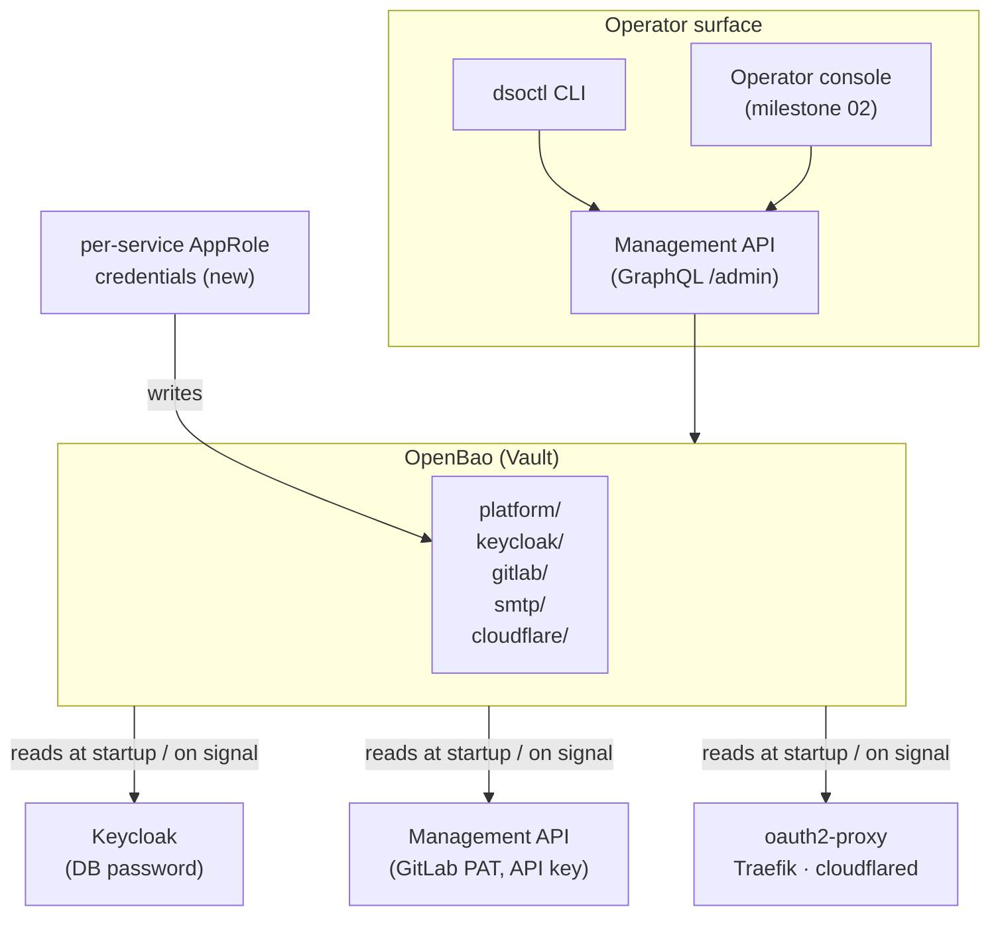
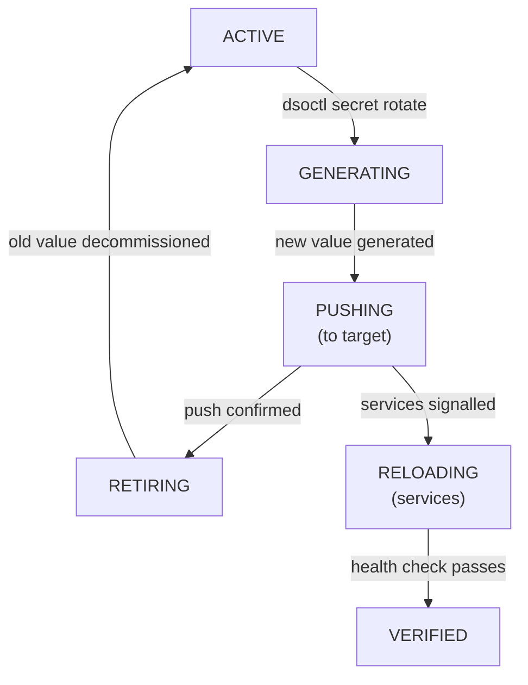

# Milestone — Platform Operability: From Config Stack to Deliverable Product

← [Back to Milestone designs](index.md)

> **Status**: Proposed (not yet scheduled)
> **Audience**: Platform maintainers, future-Phase planners
> **Cross-references**: [Environment config](../01_infra/02_env.md), [OpenBao admin](../02_admin/04_vault.md), [Operator console](02_frontend_console.md), [Management API](../99_maintainers/03_management_api.md), [Secrets (devs)](../03_devs/04_secrets.md)

Today the platform is a **collection of correctly wired stacks**. Everything works, but the operational surface is a flat text file (`.env`) and a mental model of which services depend on which variables. This milestone redesigns the operator experience so that the platform behaves like a **product**: one with a CLI, sealed config, and a credential lifecycle that doesn't require opening a text editor to rotate a key.

The OpenStack / OpenShift analogy is apt: those platforms also sit on top of many interconnected services, and they still use environment variables internally — but they expose *operator-facing abstractions* that hide the plumbing. A user of OpenShift doesn't edit etcd files to rotate a secret; they run `oc create secret` and the platform handles propagation. That's the target state.

---

## Table of contents

1. [Problem & motivation](#1-problem--motivation)
2. [Current state — what's wired up today](#2-current-state--whats-wired-up-today)
3. [Goal & non-goals](#3-goal--non-goals)
4. [Architecture](#4-architecture)
5. [Config & secrets model changes](#5-config--secrets-model-changes)
6. [Operator CLI — `dsoctl`](#6-operator-cli--dsoctl)
7. [Credential lifecycle — rotation without restarts](#7-credential-lifecycle--rotation-without-restarts)
8. [Migration & adoption story](#8-migration--adoption-story)
9. [Open questions](#9-open-questions)
10. [Implementation outline](#10-implementation-outline)
11. [Risks & rollback](#11-risks--rollback)
12. [Appendix](#12-appendix)

---

## 1. Problem & motivation

The platform boots from a single `.env` file that currently holds:

- Raw infrastructure secrets (Vault root token, Keycloak DB password, SMTP credentials)
- Service-to-service shared secrets (OIDC client secrets for GitLab, Vault, oauth2-proxy)
- Long-lived access tokens (GitLab root PAT, Cloudflare API token, Tunnel token)
- Ephemeral bootstrap values that need to be filled in *after* first startup (`GITLAB_RUNNER_TOKEN`)
- Non-secret public configuration (domain names, ports, log levels, feature flags)

Everything is in one place, flat, with no hierarchy, no policy, and no lifecycle. The operational consequences:

**Credential rotation is painful.** Rotating any secret requires:
1. Opening `.env` in a text editor.
2. Knowing which service(s) depend on that variable.
3. If the secret lives in two places (e.g., OIDC client secrets in both `.env` *and* `keycloak/realm-export.json`), updating both.
4. Restarting the affected containers — with downtime.
5. Verifying nothing broke.

There is no CLI, no API endpoint, no audit trail. The operator *is* the rotation system.

**The Vault root token lives in `.env`.** This is the conceptual equivalent of storing your safe's combination on a sticky note attached to the safe. OpenBao *is* the secrets store; its root credential shouldn't live in the place it's designed to replace.

**No scoped access.** All platform services share the same Vault root token, so a compromised Management API has the same Vault access as a compromised GitLab runner token. The infrastructure for per-service policies exists (Vault AppRole, Vault policies) but isn't wired up.

**Bootstrapping is manual and context-dependent.** The `GITLAB_RUNNER_TOKEN` value can't be known before GitLab starts — so the `.env` file has a placeholder that the operator must fill in post-boot, then restart the runner manually. This works, but it's friction that scales badly when onboarding a new operator who has no prior context.

**There is no operator interface.** Administering the platform today means knowing: `docker compose`, the internal Vault CLI, the Keycloak admin UI, and the raw GraphQL API over HTTP. These tools are correct and powerful — but they require the operator to *already know the platform internals* rather than working at the level of *platform intent* (e.g., "rotate the GitLab integration credential").

---

## 2. Current state — what's wired up today

### 2.1 Config topology

```
.env  (single flat file, read at container startup)
  ├── Public config: DOMAIN, APPS_DOMAIN, LOG_LEVEL, API_PORT, ...
  ├── Service credentials: KEYCLOAK_ADMIN_PASSWORD, KC_DB_PASSWORD, SMTP_PASSWORD, ...
  ├── OIDC client secrets: KC_CLIENT_SECRET_GITLAB, KC_CLIENT_SECRET_VAULT, KC_CLIENT_SECRET_OAUTH2_PROXY
  ├── Access tokens: GITLAB_ROOT_TOKEN, CLOUDFLARE_API_TOKEN, CLOUDFLARE_TUNNEL_TOKEN
  └── Bootstrap placeholders: GITLAB_RUNNER_TOKEN=FILL_AFTER_STARTUP
      
keycloak/realm-export.json  (static JSON imported at first boot)
  └── OIDC client secrets duplicated here — must match .env manually
```

There is no single source of truth for secrets. `.env` and `realm-export.json` are two separate sources that must be kept in sync.

### 2.2 Vault's actual role today

OpenBao is deployed and running. The Management API uses it as a per-project secrets store (path `secret/projects/<client>/<project>`). It runs in **dev mode** with a root token from `.env`. Its current capabilities:

| Capability | In use? | Notes |
|---|---|---|
| KV v2 secrets engine | ✅ | Used for per-project secrets |
| OIDC auth (`login with Keycloak`) | ✅ | Admin access via SSO works |
| AppRole auth | ❌ | Not configured |
| Per-service policies | ❌ | Root token used everywhere |
| Secret rotation | ❌ | Manual; no automation |
| Audit logging | ❌ | Not enabled in dev mode |

In other words: **Vault is already here, underutilized.** This milestone is largely about wiring the existing infrastructure together properly — not introducing new components.

### 2.3 Service restart model

Container configurations are static. When a secret in `.env` changes:

```
operator edits .env
  → docker compose up -d <service>   # container recreated, reads new env
  → service downtime during restart
  → dependent services may need restart too (if token was validated, etc.)
```

There is no signaling, no graceful reload, no staged rollout.

---

## 3. Goal & non-goals

### 3.1 Goals

1. **Sealed `.env`**: the `.env` (or its successor) carries *only* public, non-secret configuration. Secrets are stored in OpenBao; services pull them at startup via Vault agent or API call.
2. **Single source of truth**: OIDC client secrets, DB passwords, and access tokens live in exactly one place (Vault), not duplicated across `.env` and `realm-export.json`.
3. **Credential rotation without restarts**: rotating a secret triggers a platform-managed cycle — generate → push to target service → verify — and causes at most a graceful reload, not a hard container restart with downtime.
4. **Operator CLI (`dsoctl`)**: a thin, installable CLI that speaks the platform's language. Operators run `dsoctl secret rotate --service keycloak-gitlab` rather than knowing internal variable names.
5. **Scoped Vault access**: each platform service gets its own AppRole credential and policy. A compromised Management API token cannot read Keycloak's DB password.
6. **Bootstrap automation**: the multi-step "fill in `GITLAB_RUNNER_TOKEN` after boot" flow is replaced by a first-run wizard or `dsoctl bootstrap` command that handles the sequencing.
7. **Audit trail**: all secret reads and writes go through Vault with audit logging enabled, producing a record of who touched what and when.

### 3.2 Non-goals

- **Replacing Docker Compose with Kubernetes for platform services.** The platform's own service mesh stays on Docker Compose. (Applications deployed *by* the platform still run on k3d — that's already the case.)
- **External secrets management (AWS Secrets Manager, Azure Key Vault).** OpenBao *is* the secrets manager; this milestone hardens how it's used, it doesn't replace it.
- **Zero-secrets in container environment entirely.** Some services (especially third-party containers like GitLab Omnibus) don't support runtime Vault integration. The goal is to *eliminate manual editing* and *add audit*, not to achieve perfect secret injection for all containers.
- **HSM / auto-unseal.** Moving OpenBao out of dev mode (non-dev server config, KMS-backed auto-unseal) is a desirable hardening step but is its own milestone. This milestone assumes dev mode continues while adding policy and lifecycle management on top.
- **Multi-operator RBAC.** Fine-grained per-operator permissions for `dsoctl` commands are out of scope for v1 of this milestone.

---

## 4. Architecture

### 4.1 The operator experience after this milestone

Before:
```
operator wants to rotate the Keycloak OIDC client secret for GitLab
  → manually generate a random string
  → edit .env (KC_CLIENT_SECRET_GITLAB)
  → edit keycloak/realm-export.json (or use Keycloak admin UI)
  → docker compose up -d keycloak  (downtime)
  → restart GitLab or oauth2-proxy if needed
  → verify SSO still works
```

After:
```bash
dsoctl secret rotate keycloak-client --service gitlab
# Platform generates a new secret, pushes it to Vault,
# updates the Keycloak client via admin API, signals the
# affected containers, and verifies the OIDC handshake.
# No editor. No manual restart. Audit log entry written.
```

### 4.2 Component map



### 4.3 The split between `.env` and Vault

After this milestone, `.env` (or a renamed `platform.conf`) contains *only* non-secret configuration:

| Currently in `.env` | After milestone |
|---|---|
| `DOMAIN`, `APPS_DOMAIN`, `*_DOMAIN` vars | Stays in `platform.conf` (public) |
| `LOG_LEVEL`, `API_PORT`, `API_HOST` | Stays in `platform.conf` (public) |
| `NODE_ENV`, `KC_HOSTNAME_STRICT`, etc. | Stays in `platform.conf` (public) |
| `KEYCLOAK_ADMIN_PASSWORD` | Moves to Vault `platform/keycloak/admin` |
| `KC_DB_PASSWORD` | Moves to Vault `platform/keycloak/db` |
| `VAULT_DEV_ROOT_TOKEN_ID` | Special case — see §9, Q1 |
| `KC_CLIENT_SECRET_*` | Moves to Vault `platform/oidc/<service>` |
| `GITLAB_ROOT_TOKEN`, `GITLAB_ROOT_PASSWORD` | Moves to Vault `platform/gitlab/` |
| `CLOUDFLARE_API_TOKEN`, `CLOUDFLARE_TUNNEL_TOKEN` | Moves to Vault `platform/cloudflare/` |
| `SMTP_PASSWORD` | Moves to Vault `platform/smtp/` |
| `API_KEY`, `OAUTH2_PROXY_COOKIE_SECRET` | Moves to Vault `platform/management-api/` |
| `GITLAB_RUNNER_TOKEN` | Bootstrap-managed (see §8.2) |

### 4.4 How services read secrets at startup

Services that support it read secrets from Vault at startup using one of two patterns:

**Pattern A — Vault agent sidecar (preferred for containers with file-based config).** A `vault-agent` container in the same Docker Compose service block renders a config file template at startup:

```yaml
# docker-compose.yml (conceptual — see §5.2)
services:
  keycloak:
    depends_on:
      vault-agent-keycloak:
        condition: service_healthy
    volumes:
      - vault-rendered:/run/secrets/keycloak  # vault-agent writes here
```

**Pattern B — Management API as broker.** For services that accept env vars injected at container launch (most services), the Management API's `bootstrap` step reads secrets from Vault and produces a `.runtime-env` file that `docker compose up` injects. The secrets never persist to disk long-term; they're injected at container creation time and read from memory in the running container.

**Pattern C — Native Vault SDK (Management API itself).** The management API already calls Vault for project secrets. Under this milestone, it additionally reads its *own* credentials (GitLab PAT, SMTP password, API key) from Vault using its AppRole, rather than env vars.

For third-party containers that cannot be modified (GitLab Omnibus, PostgreSQL), Pattern B applies: the `dsoctl apply` or `bootstrap` command re-generates the compose env and recreates affected services when secrets change.

---

## 5. Config & secrets model changes

### 5.1 New Vault path namespace for platform secrets

```
secret/
  platform/
    keycloak/
      admin          { username, password }
      db             { password }
      oidc/
        gitlab       { client_id, client_secret }
        vault        { client_id, client_secret }
        oauth2-proxy { client_id, client_secret }
    gitlab/
      root-pat       { token, expires_at }
      root-password  { password }
      runner         { token }        ← replaces FILL_AFTER_STARTUP pattern
    cloudflare/
      api-token      { token }
      tunnel-token   { token }
    smtp/
      credentials    { host, port, user, password, from_email, from_name, domain }
    management-api/
      api-key        { key }
      cookie-secret  { value }
```

### 5.2 Per-service Vault policies

Each service gets a policy scoped to exactly what it needs:

```hcl
# policy: management-api
path "secret/data/platform/gitlab/*"        { capabilities = ["read"] }
path "secret/data/platform/smtp/credentials" { capabilities = ["read"] }
path "secret/data/platform/management-api/*" { capabilities = ["read"] }
path "secret/data/projects/*"               { capabilities = ["create","read","update","delete"] }

# policy: keycloak
path "secret/data/platform/keycloak/*"      { capabilities = ["read"] }

# policy: oauth2-proxy
path "secret/data/platform/oidc/oauth2-proxy" { capabilities = ["read"] }
```

Compare to today: everything uses the root token, which has `capabilities = ["*"]` on all paths.

### 5.3 AppRole credentials per service

Each platform service gets its own AppRole identity:

| Service | Role name | Policy | Secret ID rotation |
|---|---|---|---|
| Management API | `management-api` | `management-api` | On deploy |
| Keycloak (via vault-agent) | `keycloak` | `keycloak` | On deploy |
| oauth2-proxy | `oauth2-proxy` | `oauth2-proxy` | On deploy |
| cloudflared | `cloudflared` | `cloudflared` | On deploy |
| `dsoctl` operator CLI | `operator` | `operator-admin` | On CLI init |

The `role_id` (non-secret, public identifier) is stored in `platform.conf`. The `secret_id` (the actual credential) is either in Vault itself (for the bootstrap chicken-and-egg problem — see Q1) or injected by `dsoctl init`.

### 5.4 `platform.conf` replaces secrets in `.env`

```ini
# platform.conf  — public, version-controllable, no secrets

[platform]
DOMAIN=yourdomain.com
APPS_DOMAIN=apps.yourdomain.com
NODE_ENV=production
LOG_LEVEL=info

[vault]
VAULT_ADDR=http://localhost:8200
VAULT_AUTH_METHOD=approle
VAULT_ROLE_ID_MANAGEMENT_API=<non-secret role ID>
VAULT_ROLE_ID_KEYCLOAK=<non-secret role ID>

[keycloak]
KC_HOSTNAME_STRICT=false
KC_HTTP_ENABLED=true

[network]
DOCKER_NETWORK=devops-network
API_PORT=3000
```

The `sample.env` becomes `sample.platform.conf` (or stays `.env` for Docker Compose compatibility — see Q2).

---

## 6. Operator CLI — `dsoctl`

### 6.1 Design philosophy

`dsoctl` is a **thin wrapper around the Management API** for platform-level operations, plus a small set of local commands (like `init` and `bootstrap`) that the API can't handle because they run before the API is up.

It is *not* a replacement for `docker compose`. Operators will still use `docker compose` for raw container management. `dsoctl` adds a layer of *intent*: commands express what the operator wants to achieve, not how Docker achieves it.

Analogy: `dsoctl` is to `docker compose` as `kubectl` is to `containerd`. The lower layer still exists and is accessible; the higher layer gives you vocabulary.

### 6.2 Command surface (v1 scope)

```
dsoctl init
  # Interactive first-run: prompts for domain, credentials, writes platform.conf,
  # populates Vault at platform/ paths, writes per-service AppRole secret IDs.

dsoctl bootstrap
  # Day-2 sequencing commands — things that require services to be running before
  # their config can be finalized (e.g., GitLab runner token retrieval).
  # Checks readiness of each dependency, fills in remaining Vault entries.

dsoctl status
  # Health summary: which platform services are up, which Vault paths are populated,
  # whether any credentials are near expiry. Analogous to `kubectl get pods`.

dsoctl secret rotate <target> [--dry-run]
  # Rotate a named credential. Generates a new value, pushes to Vault, updates
  # the target service (Keycloak admin API, GitLab API, etc.), verifies,
  # triggers graceful reload of affected containers.
  # Targets: keycloak-admin, keycloak-db, gitlab-client, vault-client,
  #          oauth2-proxy-client, cloudflare-token, smtp-credentials, api-key, ...

dsoctl secret set <path> [--from-file | --generate]
  # Low-level: write a secret to Vault directly. Escape hatch for secrets
  # that don't have a named rotation target yet.

dsoctl secret get <path>
  # Read a secret from Vault (redacted by default; --reveal to show value).
  # Primarily useful for debugging; output is audit-logged.

dsoctl apply
  # Re-render service env from current Vault state and recreate affected
  # containers. Like `docker compose up -d` but Vault-aware.

dsoctl audit [--since <duration>]
  # Surface Vault audit log entries filtered to platform/ paths.
```

### 6.3 Implementation approach

`dsoctl` is a single Go binary (or a Python click app — see Q3). It:

- Reads `platform.conf` from the current directory (or `~/.dsoctl/config`).
- Authenticates to Vault using the `operator` AppRole.
- For API operations, calls the Management API over GraphQL with an operator token.
- For container operations, shells out to `docker compose` (or uses the Docker SDK).

The binary is distributed as a release artifact from the platform's GitLab CI — operators install it once and use it from any machine with Docker access to the platform host.

---

## 7. Credential lifecycle — rotation without restarts

### 7.1 The rotation state machine

Every credential the platform manages follows this cycle:



If any step fails, the platform retains the old secret (it hasn't been deleted from Vault — only the `ACTIVE` pointer has moved). `dsoctl secret rotate --rollback <target>` restores the previous version.

### 7.2 Reload strategies by service

Not all services support graceful reload. The rotation command picks the least-disruptive option:

| Service | Credential type | Reload strategy |
|---|---|---|
| Management API | Reads from Vault at startup | `SIGHUP` → graceful restart (or zero-downtime if replicated) |
| Keycloak | OIDC client secrets pushed via admin API | Keycloak admin API update — **no restart needed** |
| oauth2-proxy | OIDC client secret + cookie secret | `docker compose up -d oauth2-proxy` — brief restart |
| GitLab | OIDC client (managed by Keycloak) | Keycloak admin API update only |
| cloudflared | Tunnel token | `docker compose up -d cloudflared` |
| Traefik | Cloudflare API token (ACME only) | `docker compose up -d traefik` — cert renewal timing |
| PostgreSQL (Keycloak DB) | DB password | Requires coordinated Keycloak + Postgres restart — scheduled, not online |

The Management API is the coordination layer for all Keycloak-side updates (credentials via admin REST API) and for Vault writes. `docker compose` invocations are handled by `dsoctl` on the operator's machine.

### 7.3 OIDC client secret rotation (the most common case)

Today this is the most painful rotation because it requires editing two files. After this milestone:

```
dsoctl secret rotate keycloak-client --service gitlab
```

Internals:
1. `dsoctl` calls Management API mutation `rotateOidcClient(service: "gitlab")`.
2. API generates a new random secret (32 bytes, hex-encoded).
3. API writes new secret to `platform/keycloak/oidc/gitlab` in Vault (keeping previous version).
4. API calls Keycloak admin REST `PUT /admin/realms/<realm>/clients/<client-id>` to update `secret`.
5. API verifies: calls Keycloak's token endpoint with the new client credentials to confirm they work.
6. API signals affected containers (Management API itself reloads its Keycloak client config; oauth2-proxy is restarted).
7. `dsoctl` reports: "Rotated. Previous version retained in Vault for 24h as rollback window."

`realm-export.json` is no longer the source of truth for running client secrets — it's only used for fresh installs (import at first boot). In-place updates go through the Keycloak admin API.

---

## 8. Migration & adoption story

### 8.1 Backward compatibility

This milestone does **not** break existing deployments. The migration is opt-in and incremental:

- Phase 0 (no change): `.env` continues to work exactly as today.
- Phase 1 (secrets migration): Vault `platform/` paths are populated; services are *optionally* switched to read from Vault. Until switched, they continue reading `.env`.
- Phase 2 (`.env` hardening): once all services read from Vault, secrets are removed from `.env`, leaving only public config.
- Phase 3 (CLI adoption): `dsoctl` is installed and used for new operations; `docker compose` remains available as the escape hatch.

Each phase is independently shippable and reversible.

### 8.2 Bootstrap sequence replacement

The current `GITLAB_RUNNER_TOKEN=FILL_AFTER_STARTUP` pattern becomes a `dsoctl bootstrap` step:

```bash
# After platform first boot:
dsoctl bootstrap gitlab-runner
# Checks that GitLab is reachable, creates a runner registration token
# via the GitLab API, writes it to Vault at platform/gitlab/runner,
# and starts the runner container.
```

No more manual copy-paste of tokens from GitLab UI to `.env`.

### 8.3 Existing operator habits

Operators who prefer `docker compose` + text editor don't have to change immediately. The migration is:

| Today's habit | After milestone (optional) | Forced? |
|---|---|---|
| Edit `.env` for secrets | `dsoctl secret set` or rotation command | No |
| `docker compose up -d` for restarts | `dsoctl apply` | No |
| Check service health in Docker UI | `dsoctl status` | No |
| Curl GraphQL API directly | `dsoctl` subcommands, or keep using curl | No |

The CLI adds a layer; it doesn't remove the floor.

---

## 9. Open questions

These need decisions before implementation begins.

### Q1 — The Vault root token bootstrap problem

Vault needs a root token to initialize and to create AppRole credentials. Where does *that* token come from if not `.env`?

**Option A**: Keep `VAULT_DEV_ROOT_TOKEN_ID` in `platform.conf` but clearly label it as "bootstrap-only" and revoke it after `dsoctl init` completes — replacing it with scoped AppRole credentials. The root token is used once, during init, then gone.

**Option B**: Move it to a local operator keychain (`~/.dsoctl/secrets`) with restricted file permissions (`chmod 600`), keeping it off the project directory entirely.

**Option C**: Accept that in dev mode, the root token is inherently the bootstrap credential. Document it as a known limitation and defer hardening until the "move off dev mode" milestone.

**Recommended**: A + B combined. Option C defers a real problem. During `dsoctl init`, the operator provides the root token once (interactively or via env var); `dsoctl` creates AppRole identities and stores its own operator `secret_id` in `~/.dsoctl/`. The root token is not written to any project file.

### Q2 — `.env` filename vs `platform.conf`

Docker Compose natively reads `.env` at startup. Renaming it to `platform.conf` breaks that convenience.

**Option A**: Keep the filename as `.env` but document that after the migration it contains no secrets. The "sealed .env" is still an `.env` file, just a safe one.

**Option B**: Use `platform.conf` and teach `docker-compose.yml` to read it via `env_file:` declarations explicitly.

**Recommended**: A. `.env` with no secrets is still an `.env`. Renaming it is friction with no benefit.

### Q3 — `dsoctl` implementation language

**Option A**: Go. Single binary, no runtime, easy distribution, strong CLI ergonomics (cobra/viper). More setup to bootstrap.

**Option B**: Python (click/typer). Consistent with existing platform tooling if Python is already in use. Requires Python on the operator's machine.

**Option C**: Node.js / TypeScript. Consistent with the Management API codebase, shared type definitions possible. Requires Node on the operator's machine.

**Recommended**: depends on team preference. If the Management API is already TypeScript, Option C has the lowest context-switch cost. If the team wants a portable binary for distribution, Option A. Avoid Option B if Python version management is a pain point in the team's environment.

### Q4 — Vault dev mode vs production mode scope

Should this milestone also move OpenBao out of dev mode (non-dev config, file-backed storage, manual unseal or auto-unseal)?

**Option A**: Yes, include it. The "no production secrets" goal can't truly be achieved while Vault itself runs in dev mode.

**Option B**: No — scoped separately. Dev mode with proper policies and AppRole is significantly better than root-token-only dev mode. Production Vault mode (KMS, HSM, manual unseal) is a separate operational concern with its own migration cost.

**Recommended**: B. This milestone's value is the *lifecycle and policy* layer. Moving off dev mode is a separate hardening pass that can follow once policies are established and tested.

### Q5 — Rotation scope for v1

Which credentials are in scope for `dsoctl secret rotate` in v1 of this milestone?

**Option A**: OIDC client secrets only (the most painful case today). Start narrow.

**Option B**: All platform-managed credentials (OIDC secrets, GitLab PAT, Cloudflare tokens, SMTP, api-key). Full scope.

**Recommended**: B. The rotation infrastructure (state machine, Vault versioning, reload strategy) is built once; adding targets is additive. Starting narrow risks shipping an infrastructure with one rotation target, then requiring a follow-up milestone just to add more. However, only implement targets for which an **automated push path exists** (Keycloak admin API, GitLab API). For credentials without an automated push path (e.g., Cloudflare tunnel token must be regenerated in the Cloudflare dashboard), `dsoctl` handles the Vault write and container reload but tells the operator "go regenerate this in the Cloudflare dashboard and then run `dsoctl secret set cloudflare-tunnel-token`."

### Q6 — Audit log exposure

Vault audit logs are device/file-level logs. How should `dsoctl audit` surface them to operators?

**Option A**: Parse the Vault audit log file directly (requires file access on the Docker host).

**Option B**: Enable Vault's syslog audit backend; pipe to a log aggregator; `dsoctl audit` queries the aggregator.

**Option C**: Management API reads/tails the Vault audit log and exposes a GraphQL query; `dsoctl audit` calls the API.

**Recommended**: C for consistency with the management API pattern. Option A requires operator SSH access; Option B adds infrastructure.

---

## 10. Implementation outline

Decomposed into four tracks. Tracks A and B can start in parallel; C and D depend on A being mostly complete.

### Track A — Vault hardening (policies + AppRole)

- [ ] Design the `platform/` KV namespace and document it (§5.1)
- [ ] Write per-service Vault policies (§5.2) and commit to `vault/policies/` in the repo
- [ ] Enable Vault audit logging (syslog or file backend)
- [ ] Create AppRole auth method; generate role + secret IDs for each platform service
- [ ] Update `docker-compose.yml` to pass AppRole credentials to each service (via env or mounted file)
- [ ] Populate `platform/` Vault paths with current secrets from `.env` (migration script)
- [ ] Verify each service can start reading secrets from Vault (can be parallel-tested alongside `.env` initially)
- [ ] Remove secrets from `.env` once all services are validated on Vault

### Track B — Management API extensions

- [ ] Add `VaultPlatformService` to Management API: reads/writes `platform/` paths
- [ ] Add `rotateOidcClient(service)` GraphQL mutation
- [ ] Add `rotateGitlabPat(scopes)` mutation (creates new PAT via GitLab API, decommissions old)
- [ ] Add `bootstrapRunner()` mutation: creates GitLab runner token and writes to Vault
- [ ] Add `platformSecrets { list, get, set }` queries/mutations for `dsoctl secret *` CLI commands
- [ ] Add `auditLog(since, filter)` query backed by Vault audit log (Q6, Option C)
- [ ] Write unit + integration tests for all new mutations
- [ ] Update Management API's own startup: read `GITLAB_ROOT_TOKEN`, `API_KEY` etc. from Vault via AppRole instead of env vars

### Track C — `dsoctl` CLI

- [ ] Decide language (Q3) and set up repo / CI
- [ ] Implement `dsoctl init` (interactive, writes `platform.conf` + populates Vault + generates AppRole IDs)
- [ ] Implement `dsoctl bootstrap` (GitLab runner token, any other post-boot sequencing)
- [ ] Implement `dsoctl status` (service health + Vault path completeness check)
- [ ] Implement `dsoctl secret rotate <target>` (calls Management API mutation)
- [ ] Implement `dsoctl secret set/get` (direct Vault writes/reads)
- [ ] Implement `dsoctl apply` (re-render env + `docker compose up -d` for affected services)
- [ ] Implement `dsoctl audit` (calls Management API `auditLog` query)
- [ ] Publish binary via GitLab CI as a versioned release artifact
- [ ] Add install instructions to `__DOCS__/01_infra/01_prereqs.md`

### Track D — Documentation & migration

- [ ] Rewrite `__DOCS__/01_infra/02_env.md`: document `platform.conf` + what moved to Vault
- [ ] New `__DOCS__/02_admin/09_secrets_lifecycle.md`: rotation guide, `dsoctl secret rotate` reference
- [ ] New `__DOCS__/02_admin/10_vault_policies.md`: policy model, AppRole map, audit log access
- [ ] Update `__DOCS__/02_admin/04_vault.md`: note dev mode limitations, point to policy docs
- [ ] Update `__DOCS__/01_infra/03_bootstrap.md`: replace "fill in GITLAB_RUNNER_TOKEN after boot" with `dsoctl bootstrap`
- [ ] Write migration guide for existing deployments (Phase 0 → 1 → 2 → 3, §8.1)
- [ ] Update this milestone doc: status → Done; record Q1–Q6 decisions in §12

---

## 11. Risks & rollback

| Risk | Likelihood | Impact | Mitigation | Rollback |
|---|---|---|---|---|
| Vault unavailability blocks all service startups | Medium | High | Services fall back to `.env` during transition (Phase 1). Only remove `.env` secrets in Phase 2 after Vault startup reliability is proven. | Re-populate `.env` from Vault KV backup; restart services. |
| AppRole secret_id leaks (stored in `~/.dsoctl/`) | Low | High | Restrict file permissions; short-TTL secret IDs; AppRole renewal on `dsoctl init --refresh`. | Revoke the compromised AppRole secret_id via `vault write auth/approle/role/<role>/secret-id/destroy`. |
| Keycloak admin API call fails during OIDC rotation | Medium | Medium | Verify step before decommissioning old secret; keep previous Vault version active for 24h. | `dsoctl secret rotate --rollback keycloak-client --service gitlab` restores previous version. |
| GitLab PAT rotation leaves the API in a state where it can't call GitLab | Low | High | Management API has a health check that validates GitLab connectivity; run it post-rotation. | Vault KV stores previous version; API falls back automatically if new token returns 401. |
| `dsoctl apply` triggers unintended container restarts | Low | Medium | `--dry-run` flag shows which containers would be restarted. Require explicit confirmation for production-scoped services. | `docker compose up -d <service>` with the previous `.env` state. |
| `realm-export.json` diverges from live Keycloak config over time | Medium | Low | Mark `realm-export.json` as "initial import only" in docs; management of client secrets moves fully to admin API. | Re-export realm from Keycloak admin UI if needed. |
| Dev mode Vault loses data on crash (in-memory mode) | Low | High | Platform already uses `.vols/vault/` file-backed persistence even in dev mode; verify this is mounted in `docker-compose.yml`. Add a `dsoctl backup vault` command. | Restore from most recent `.vols/vault/` snapshot or re-populate from `dsoctl init`. |

Master rollback: `dsoctl` operates in a layered model. If any track is rolled back, the underlying `docker compose` + `.env` system still works. The escape hatch is always "fall back to editing `.env` and restarting containers."

---

## 12. Appendix

### 12.1 Comparison with industry patterns

| Platform | Config model | Secret rotation UX |
|---|---|---|
| **OpenShift** | `oc create secret`; secrets mounted into pods via projected volumes | `oc create secret` + rolling restart; or Cert Manager for certs |
| **OpenStack** | Barbican (secrets service) + Heat templates | API-driven; no downtime for Barbican-native services |
| **Kubernetes vanilla** | `kubectl create secret`; secrets mounted or injected as env | Vault Agent Injector or ESO for live rotation; or manual pod restart |
| **Nomad** | Vault-native integration; templates in job HCL; `signal = "SIGHUP"` | Vault dynamic secrets; service reloads without restart |
| **This platform (today)** | Flat `.env`; all services share root Vault token | Manual editor + restart |
| **This platform (after milestone)** | `platform.conf` (public) + Vault KV (secrets); scoped AppRoles | `dsoctl secret rotate`; Keycloak-side changes have zero downtime |

The Nomad pattern (Vault templates + SIGHUP) is the closest model to what Track A implements for Docker Compose services.

### 12.2 Vault AppRole authentication — how it works

AppRole is Vault's machine-to-machine auth method. Each service has:
- **`role_id`** — a non-secret identifier (like a username). Stored in `platform.conf`.
- **`secret_id`** — a credential (like a password). Generated by `dsoctl init`, stored in `~/.dsoctl/` or injected at container startup. Rotatable.

A service authenticates by posting both to `POST /v1/auth/approle/login` and receives a scoped token valid for its policy only. Tokens have a TTL (e.g., 24h); services renew them automatically. If a `secret_id` leaks, it can be revoked without touching other services.

### 12.3 Proposed Vault policy — operator role

The `dsoctl` operator role has write access to `platform/` paths and read access to audit logs, but does *not* have root or sys privileges:

```hcl
# policy: operator-admin
path "secret/data/platform/*"          { capabilities = ["create","read","update","delete","list"] }
path "secret/metadata/platform/*"      { capabilities = ["read","list","delete"] }
path "auth/approle/role/+/secret-id"   { capabilities = ["create","update"] }
path "sys/audit"                        { capabilities = ["read"] }
path "sys/audit/*"                      { capabilities = ["read"] }
```

Root Vault access is not required for day-to-day operations after `dsoctl init`.

### 12.4 `realm-export.json` transition

The file currently serves two purposes:
1. **First-boot import**: Keycloak imports the realm on startup if no realm exists yet.
2. **Source of truth for OIDC client secrets**: secrets are hardcoded here.

After this milestone, purpose 2 is removed. The file retains purpose 1 (with placeholder/dummy secrets). In-place OIDC client secret management goes through the Keycloak admin API only. A comment block in `realm-export.json` documents this:

```json
// NOTE: OIDC client secrets in this file are intentionally placeholder values.
// They are imported on first boot only. Actual client secrets are managed
// via the Management API / dsoctl and stored in Vault at platform/keycloak/oidc/.
// Do not update secrets here to rotate them — use: dsoctl secret rotate keycloak-client
```

### 12.5 Decision log (filled in as decisions are made)

| Question | Choice | Date | Rationale |
|---|---|---|---|
| Q1 — Vault root token bootstrap | _pending_ | — | — |
| Q2 — `.env` vs `platform.conf` filename | _pending_ | — | — |
| Q3 — `dsoctl` language | _pending_ | — | — |
| Q4 — Dev mode scope | _pending_ | — | — |
| Q5 — Rotation scope for v1 | _pending_ | — | — |
| Q6 — Audit log exposure | _pending_ | — | — |

### 12.6 Cross-references

- Existing secrets config: `.env` + `sample.env` in repo root
- Existing Vault setup: `docker-compose.yml` (`vault` service), `.vols/vault/`
- Keycloak realm: `keycloak/realm-export.json`
- Management API: `api/src/` — existing Vault calls in `projects.service.ts`
- Related milestone: [Operator Console (frontend)](02_frontend_console.md) — once `dsoctl` exists, the console can expose the same mutations as a UI

---

*Authored: 2026-05-14 · Status: Proposed · See [milestone index](index.md) for graduation criteria.*
